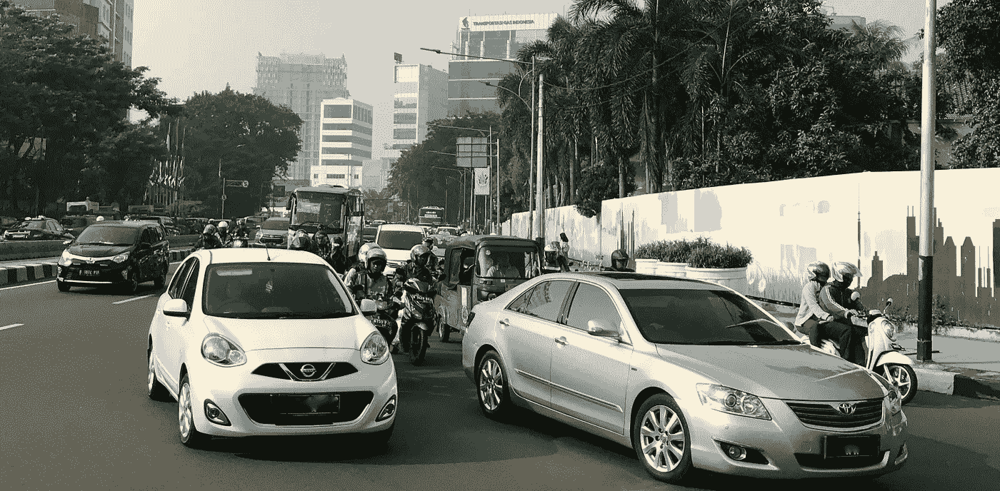
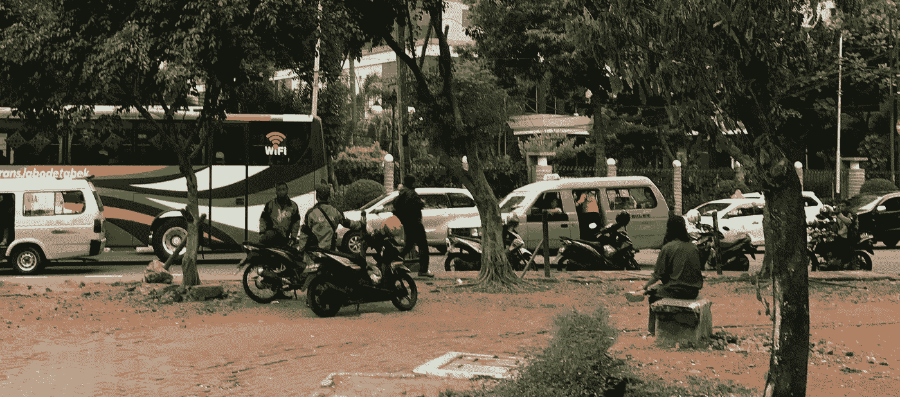
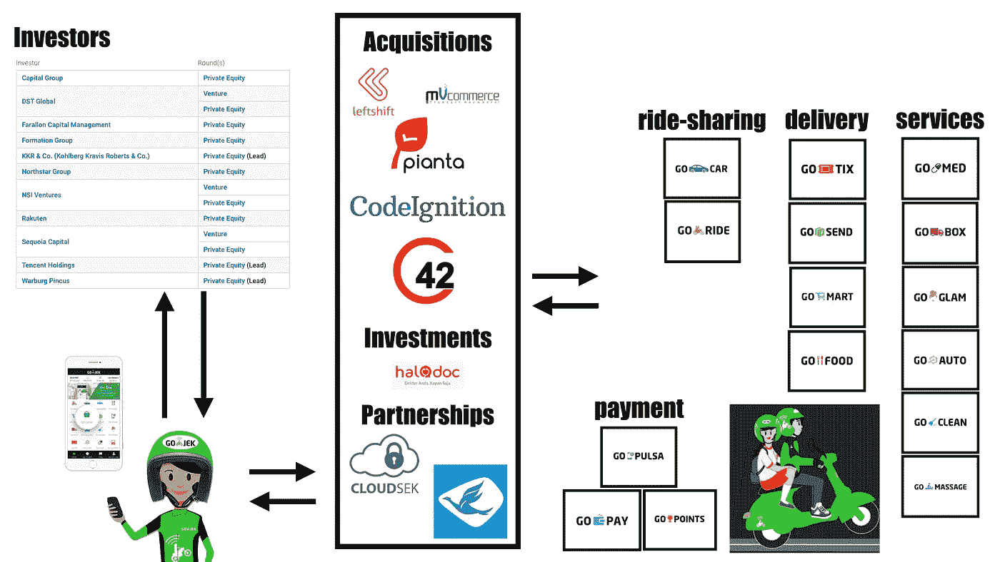

# 在数字时代发展业务的 3 种方式

> 原文：<https://medium.com/hackernoon/3-ways-to-grow-your-business-in-a-digital-age-86e8bb3f33d1>

人们普遍认为，初创公司比老牌公司对数字时代准备得更充分。毕竟，创业公司处于大多数颠覆性创新和突破的最前沿。

但是还有更多。大多数“千禧一代”似乎更喜欢为初创公司或更年轻、快速增长的公司工作。他们的印象是，初创公司只是“有趣”得多。企业家精神、风险偏好、适应力以及“成为比自己更大的事物的一部分”都是吸引人的特征。即使是“不确定性”，也可以成为兴奋和动力的来源。

毫无疑问，“创业文化”是在全球市场、指数级技术增长和更短创新周期的数字世界中生存的必要条件。

然而，更大、更成熟的公司也在数字时代蓬勃发展。想想亚马逊。越来越多的专家预测，这将是第一个“1 万亿美元公司”。

此外，还有许多不同类型的创业。现实情况是，在当前竞争激烈的商业环境中，他们中的大多数都难以扩大规模，或者难以生存。老实说，绝大多数初创公司都不是颠覆性的或创新性的。大多数创业公司只是已经成功的商业模式的糟糕“克隆”

> *那么，为什么有这么多关于**创业公司如何改变我们生活和工作方式的讨论？我们*真的*能从成功的创业公司学到什么？那么，这么多公司迫切想要拥抱的“*创业文化*的精髓是什么？*

# 最成功的创业公司的 3 个特征

我以前写过这种类型的问题，但是——有点出乎意料——我最近在雅加达的一次商务旅行中获得了灵感。

这不是我第一次来印度尼西亚，但是当我一到那里，我就注意到与我以前去过的地方相比，这里更加“绿色”了。

我很快就明白了这些绿色是从哪里来的。

绿色是当地按需摩托车服务 *Go-Jek* (摩托车出租车被称为 *ojek* )的夹克和头盔的主色。Go-Jek 提供了一款拼车应用，在雅加达这样拥挤的大城市非常有意义。

Go-Jek 于 2010 年成立，是一个呼叫中心，通勤者可以在这里按需请求司机。在公司成立的最初几年，公司没有发展壮大。直到 2014 年(在优步和总部位于新加坡的 *Grab* 通过他们的汽车共享服务进入印度尼西亚市场之后)，投资者才对 *Go-Jek* 表现出真正的兴趣。

现在， *Go-Jek* 被认为是印尼最热门的创业公司之一。它拥有独角兽地位，是印尼最大的消费科技公司。

*Go-Jek* 的创始人纳迪姆·马卡里姆获得了*海峡时报*颁发的 2016 年*亚洲年度人物*，该公司最近获得了中国互联网巨头*腾讯*新一轮 12 亿美元的融资。 *Go-Jek* 是 2017 年 7 月印度尼西亚银行颁发的金融科技奖的获奖者。

也许最重要的是，Go-Jek 对印度尼西亚的经济产生了显著的影响。用雅加达政府经济局局长的话说:

> *“Go-Jek 改变了人们的行为，这是肯定的。”*

但是，这些都不能解释为什么我真的对这家公司感到兴奋！

为什么世界其他地方要关心 Go-Jek？这家公司有什么特别之处？它与优步或 *Grab* 有何区别，这两家公司都在印尼推出了摩托车出租车服务？

简短的回答是 *Go-Jek* 已经理解并接受了在数字时代创业和发展的三个最重要的考虑因素:

## **1。** **构建生态系统**

将业务组织成一个开放、包容的生态系统，吸引用户并吸引所有利益相关者。

## **2。** **利用技术实现持续创新**

专注于设计一系列创新产品和服务，这些产品和服务集合了不同的技术来提供“不可抗拒的”和“有粘性的”用户体验。

## **3。** **适应环境**

使公司的产品和服务适应当地环境的特殊需求。

这是“*创业文化*”的精髓，通过采用这三种策略，企业可以建立一种文化——如果你愿意，可以称之为“企业 DNA”——这种文化是创新的、动态的，并在数字时代最大限度地增加成功的机会。

让我们更详细地看看这三个元素中的每一个，因为它们在 *Go-Jek* 的案例中发挥了作用。

# 生态系统

*Go-Jek* 绝对不是“乘车共享公司”。事实上，它不是传统意义上的公司。Go-Jek 与传统组织的不同之处在于，它不根据明确定义的层级和静态流程和程序来管理资产和员工。

Go-Jek 采取了不同的方法。创始人对如何管理和发展企业有着远见卓识。这是一家公司的愿景，希望将那些扼杀精力和创意的东西(想想官僚主义、等级制度、规则)减到最少:

> *“我们发展得越大，我们的控制就越松。我们允许不同的团队和领导者以他们自己的方式管理他们的团队。团队领导可以自由制定自己的管理方法，只要他们能够实现目标。”*

结果是惊人的。 *Go-Jek* 已经成为一个蓬勃发展的动态生态系统，没有固定的垂直或水平区分，甚至没有 Go-Jek 业务内外的明确区分。

Go-Jek 似乎明白，当今的挑战是调动所有利益相关者的能力和资源，让他们参与到更具协作性和包容性的组织中。这导致了更好的选择和产品，但也创造了一个工作环境，让企业招聘和保留最好的员工。

基于自由和责任的领导方法使得新思想、人才和资本在生态系统中持续不断地流动。

这使得 *Go-Jek* 成为一个真正令人兴奋的生态系统，它提供的不仅仅是拼车应用和服务。当在手机上打开应用程序时，用户可以在大量的产品和服务中进行选择。这些目前包括 *Go-Ride、Go-Car、Go-Send、Go-Food、Go-Mart、Go-Box、Go-Glam、Go-Clean、Go-message、Go-Tix、Go-Med。*

2016 年底，该生态系统由超过 250，000 名两轮和四轮车辆驾驶员，3，000 名服务提供商和 35，000 名 Go-Food 商户组成。

生态系统中所有参与者(包括投资者和合作伙伴)的行为和互动模式创造了一种共生互惠的文化。

它不仅仅是关于生态系统中的参与者如何相遇、交谈、信任、分享、互动、协作、团队、实验和共同成长。 *Go-Jek* 在生物学意义上，生态系统是在特定环境中相互作用的“生物群落”。

这种对“双赢”解决方案的推动最终甚至会让 Go-Jek 的竞争对手受益。例如，印尼最大的出租车运营商*蓝鸟*与 *Go-Jek* 合作。其他竞争对手，尤其是物流公司，明白他们也必须发展和改善他们的服务。

Go-Jek’s Ecosystem. *Source: CrunchBase*

# 技术

Go-Jek 了解到，数字时代最成功的生态系统都专注于不断为其平台/品牌设计和提供创新产品和服务。这些产品和服务集合了经济中多个部门的不同技术。

目标？提供一系列易于融入用户日常生活的产品和服务。产品和服务需要足够丰富，以至于用户希望更多的时间使用该平台，并有机会在该平台上做比其他任何地方都多的事情。

Go-Jek 明白了。商业模式是利用技术为他们的平台找到更多的用户，并不断给他们更多的理由与平台进行更激烈的互动。

这样，每个人——不仅仅是用户——都可以被“锁定”在 *Go-Jek* 生态系统中。例如， *Go-Jek* 送货服务不仅让司机和顾客受益。其他服务提供商和商家将 Go-Jek 视为“雅加达交通拥堵的经济”的救世主。

 [## 摩托车送货和乘车共享应用 Go-Jek 促进雅加达交通拥堵的经济

### 三年前，Ferly Aninditya 在雅加达美食街的摊位失去了…

www.cnbc.com](http://www.cnbc.com/2017/07/25/motorbike-delivery-and-ride-sharing-app-go-jek-boosts-jakartas-traffic-clogged-economy.html) 

为了让生态系统对其消费者不可抗拒， *Go-Jek* 提供了一个互动和社交应用程序，其中包括一个忠诚度计划 *Go-Points* 。该算法给予客户间歇且不可预测的奖励(类似于老虎机)，从 *Go-Jek* 服务的代金券到 iPhones、iPads 和笔记本电脑。

> *“Go-Jek 的机遇和挑战不仅仅是激动人心。充分了解其运作后，我们立即意识到我们的资源和技术肯定会补充并加速 Go-Jek 的产品开发。此外，我们的工作将帮助印度尼西亚数百万 Go-Jek 移动应用程序用户，这也是我们非常兴奋的事情。”*

这是应用程序创建者和开发者公司 *Leftshift* (该公司被 *Go-Jek* 收购后)的创始人兼首席执行官的声明。

这句话表明了技术在创造、维护和发展 *Go-Jek* 生态系统中扮演的关键角色。因此， *Go-Jek* 积极投资、合作和收购初创公司也就不足为奇了。

*   为了应对不断创新的需求，Go-Jek 不得不建立一个研发中心。Go-Jek 的投资者之一将 Nadiem Makarim 介绍给了印度初创公司的创始人， *C42 Engineering* 和 *CodeIgnition，*，他们被认为“拯救了 *Go-Jek* 免于内爆”。
*   收购外国初创公司促进了产品创新，改善了生态系统内部的用户体验。例如，收购班加罗尔的医疗保健初创公司 *Pianta，为 *Go-Jek* 的生态系统增加了家庭医疗保健服务。*
*   *Go-Jek* 工程师参与数据挖掘和分析，以了解和保护生态系统。最近，*这些*工程师开始与人工智能和机器学习公司 *CloudSek* 合作，帮助预防和监控对生态系统的网络威胁。
*   不应该孤立地看待技术发展。这一点在 2017 年 3 月 *Go-Jek* 的第一次 *Go-Hackathon* 中变得很明显。黑客马拉松的获胜者活跃在连接、人工智能和物联网领域。

# 环境

第三个要素是适应当地环境的具体需求。这也是 *Go-Jek* 与其直接竞争对手*优步*和 *Grab* 的区别。

 [## 硅谷的极限:印尼的 GoJek 如何击败优步

### 从硅谷的泡沫来看，世界往往看起来像一个单一的无差别市场。有很多…

theconversation.com](http://theconversation.com/the-limits-of-silicon-valley-how-indonesias-gojek-is-beating-uber-69286) 

金融科技服务“Go-Pay”就是一个很好的例子，说明了让商业模式适应当地环境的重要性。Go-Jek 在仍然主要由现金驱动的印尼经济中成功引入了电子和移动支付系统。它于 2016 年 4 月被整合到 *Go-Jek* 的应用程序中，目前占所有交易的一半以上。

纳迪姆·马卡里姆对它的成功非常清楚:

> “我们从未见过像 Go-Pay 这样的市场应用。”

这项服务的推出非常成功，因为 Nadiem 了解当地环境的需求。他知道在印度尼西亚许多家庭没有银行账户。

为了使这些家庭能够参与金融领域并促进金融包容性， *Go-Pay* 不得不允许用户向 *Go-Jek* 司机支付现金。钱会立即被转移到他们的账户。也可以从银行账户或自动柜员机向 *Go-Pay* 账户充值。

显然， *Go-Pay* 为 *Go-Jek* 生态系统中的所有参与者提供了巨大的机会。特别是当 *Go-Pay* 可用于支付其他商家和服务提供商时。

纳迪姆·马卡里姆认为，移动支付可以“转变成一项有利可图的业务”。当然，这只有在 *Go-Jek* 能够跟上技术和创新的情况下才会发生。

# 如何让欣欣向荣的生态系统可持续发展？

毫无疑问，“生态系统”模型正在取代关于组织、企业和市场的传统经济理论。

互联网、算法、在线评级、人工智能，提供了对各种信息的即时获取(不费吹灰之力)。这为公司提供了几乎无限的机会，将用户绑定到生态系统中，建立合作伙伴关系，并在多个经济部门进行持续创新。

Go-Jek (以及其他成功的创业公司)利用数字时代的机遇发展了一种新的组织形式和新的商业模式。

最成功、最具创新精神的公司明白，信任、价值和财富是通过创造动态的生态系统来创造的，而不是对员工和产品进行静态的等级管理。

大型老牌公司也认识到这些机会，但它们继续依赖现有的结构、流程和程序。事实证明，向数字时代的转变对他们来说极具挑战性，这一点也不奇怪。

这就引出了监管者和其他政策制定者的角色。他们还需要重新思考他们一直在做的事情的各个方面，并专注于确保监管环境有利于建立和维护繁荣的商业生态系统。

当然，这说起来容易做起来难。各级政府都在努力适应数字时代快速变化的现实。快速的技术变革使得难以确定和商定一个适当的监管框架。其结果是，监管往往禁止或限制对不断的技术创新所创造的机会进行商业开发。

*Go-Jek* 在 2015 年 12 月经历了这一点，当时印尼交通部长表示“*要求使用私人车辆*付款的服务是非法的。幸运的是，对于 Go-Jek 的生态系统来说，总统介入并撤销了声明。

毫无疑问，这是正确的做法。

生态系统可能是脆弱的——尤其是在早期阶段——笨拙的监管行动可能会产生致命的影响。

教训？监管者在更好地理解自己在这个商业生态系统新世界中的角色之前，不应进行干预。

这个角色是什么？嗯，那是以后的事了。

*感谢您的阅读！请按下“心脏按钮”或留下评论。*

每周都有新的故事。因此，如果你关注我，你不会错过我关于数字时代如何改变我们生活和工作方式的最新见解。