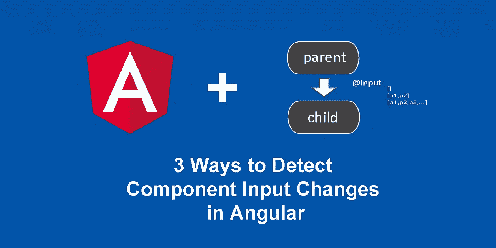
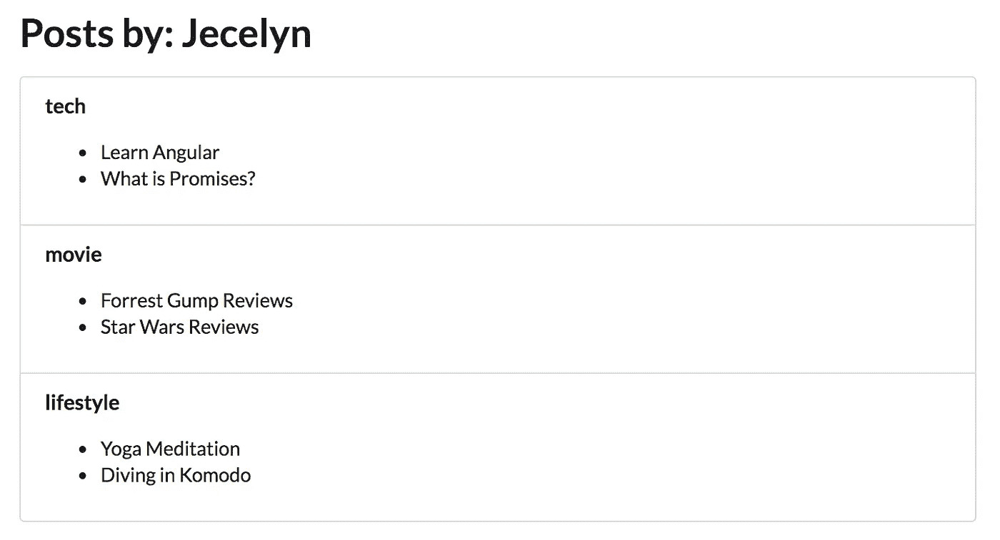

# 向 Angular +子组件传递异步数据的 3 种方式

> 原文：<https://medium.com/hackernoon/3-ways-to-pass-async-data-to-angular-child-components-8b5cb42c3edd>

> 对于 Angularjs 或 Angular 1.x 帖子，将明确声明为 1.x，否则它始终是 Angular 的最新版本。

# 用例

假设您有一个**博主** [**组件**](https://hackernoon.com/tagged/component) ，它将显示博主的详细信息和她的帖子。Blogger 组件将从 API 获取帖子列表。

您不需要编写在 blogger 组件中显示帖子的逻辑，而是想要重用由您的队友创建的**帖子组件**，您需要做的是将帖子[数据](https://hackernoon.com/tagged/data)传递给它。

然后，帖子组件**将帖子**按类别分组并相应显示，如下所示:

blogger component

# 那不是很容易吗？

乍一看，这可能很容易。大多数情况下，我们会在组件初始化期间启动所有流程——在 **ngOnInit** 生命周期挂钩期间(关于组件生命周期挂钩的更多细节，请参考此处的)。

在我们的例子中，您可能认为我们应该在 posts 组件的 **ngOnInit** 期间运行 post 分组逻辑。

然而，因为`posts`数据来自服务器，当 blogger 组件将`posts`数据传递给 posts 组件时，在数据更新之前，posts 组件 **ngOnInit 已经被触发**。您的帖子分组逻辑不会被触发。

我们如何解决这个问题？请继续阅读我的苏格兰邮报。

 [## 向 Angular 2+子组件传递异步数据的 3 种方式

### 让我们从一个常见的用例开始。您有一些从外部来源获得的数据(例如，通过调用 API)。你想…

scotch.io](https://scotch.io/tutorials/3-ways-to-pass-async-data-to-angular-2-child-components) 

> [黑客中午](http://bit.ly/Hackernoon)是黑客如何开始他们的下午。我们是这个家庭的一员。我们现在[接受投稿](http://bit.ly/hackernoonsubmission)并乐意[讨论广告&赞助](mailto:partners@amipublications.com)机会。
> 
> 如果你喜欢这个故事，我们推荐你阅读我们的[最新科技故事](http://bit.ly/hackernoonlatestt)和[趋势科技故事](https://hackernoon.com/trending)。直到下一次，不要把世界的现实想当然！

