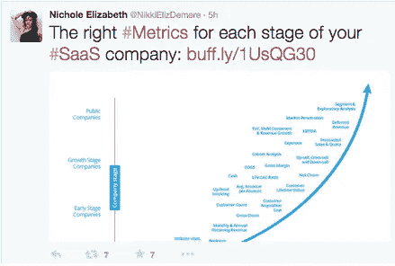
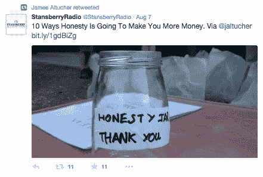
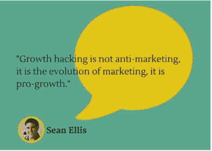
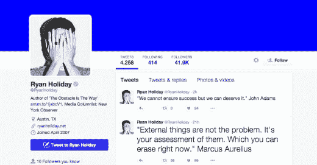
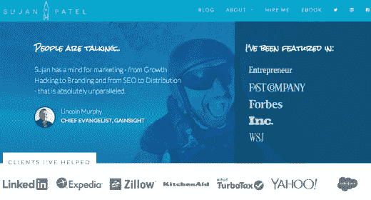

# Twitter 上的 30 个成长黑客相扑

> 原文：<https://medium.com/hackernoon/30-growth-hacking-sumos-to-follow-on-twitter-9542689cc02c>

本帖原载于 2015 年 11 月 13 日[搜索解码器](http://www.searchdecoder.com/30-growth-hackers-to-follow-on-twitter/)

*自从我在 Twitter 上写了* [*22 个成长黑客关注下一个 Web*](http://thenextweb.com/socialmedia/2015/09/03/22-growth-hackers-to-follow-on-twitter/) *之后，我收到了很多来自成长黑客社区的反馈。这份名单很有价值，但我没有提到增长黑客世界中所有关键的大玩家。我在这里称他们为相扑。该清单不完整，需要扩充。因此，这是一个扩展的列表，包括八个新的增长黑客跟进。*

*(特别感谢* [***克拉拉·布坎南***](https://twitter.com/clara_buchanan) *)，原榜单上的成长黑客之一，分享了一份有价值的新名字名单供考虑。克拉拉是*[*Hypergrow*](http://hypergrow.io/)*的创始人，她是一名行业增长策略师，也是纽约 EDGE EdTech accelerator 的导师。她定期在博客上讲述做一名* [*成长型黑客*](/@clarabuchanan/why-growth-hacking-isn-t-just-marketing-4ce13e673c7f) *和* [*对创业者的指导*](http://blog.hypergrow.io/blog/3-scrappy-keys-to-personal-and-professional-success/) *。)*

前几天我查看了我的垃圾邮件文件夹。这很有趣。我收到一封电子邮件，上面写道，“点击一个按钮就能获得 10 万个网站访客。”按钮少了一个‘T’。不是我点的。我就笑了。

如今，互联网已经向任何有键盘和 wifi 连接的人开放。

顺便说一下，我最近在我写的一篇时事通讯中发现了一个错别字。我很尴尬。我想知道有多少我的订户把我放进了垃圾邮件文件夹。

随着网络上围绕“增长黑客”的热潮高涨，出现了一大堆神话、误解和自称的大师。

幸运的是，仍然有很多聪明人定期提供大量的价值。

可惜，现在越来越分不清谁是谁了。

一些前黑帽子让这个新术语尴尬，所以跟上合法增长的黑客专业人士是很重要的。在[GrowthHackers.com](http://growthhackers.com/)加入成长型社区，阅读[这些成长型黑客书籍](http://www.searchdecoder.com/growth-hacking-books/)来提升你的游戏，但不要期望这些策略会永远持续下去。成长型黑客很快就会变成老古董，所以使用 Twitter 获得稳定的实时成长型黑客技巧。

有一些增长惊人的黑客不断在 Twitter 上分享他们的最佳建议。他们的内容没有骗局或谎言，只是纯粹的价值。

以下是 22 位值得关注的成长型黑客(排名不分先后)。他们都有良好的记录，并定期发布有价值的内容。

# 蒋曦儿·伊丽莎白·德梅雷

推特: [@NikkiElizDemere](https://twitter.com/NikkiElizDemere)

如果你去过 [ProductHunt](http://www.producthunt.com/) 、[inbound.org、](http://inbound.org/)或 [GrowthHackers](https://growthhackers.com/) ，你可能会认出这个又长又独特的名字。她在所有这些平台的发展过程中发挥了重要作用，而且她仍然是一名社区版主。[成长指标](http://nicholeelizabethdemere.com/10-growth-hacking-epiphanies-from-a-customer-success-genius/)和 [SaaS](http://nicholeelizabethdemere.com/4-ways-customer-success-pays-for-itself-and-then-some/) 是她的两大特长，她的写作既励志又有价值。

# 尼尔·帕特尔

推特:[@尼尔·帕特尔](https://twitter.com/neilpatel)

尼尔是 [CrazyEgg、](http://www.crazyegg.com/) [KISSmetrics](https://kissmetrics.com/) 和 [HelloBar](https://www.hellobar.com/) 的联合创始人，是在线商务领域的知识宝库。他撰写了关于社交媒体、SEO、数字营销、内容营销、增长黑客等方面的文章。他的简历？他帮助亚马逊、NBC、通用汽车、惠普和维亚康姆等公司成长。不要再找一个 A 级成长黑客了。

# 诺亚·卡根

推特: [@NoahKagan](https://twitter.com/noahkagan)

作为相扑比赛的“首席相扑手”，诺亚也有在薄荷和脸书工作的经历。他的个人博客涵盖了[营销](http://okdork.com/2014/02/05/how-to-create-a-marketing-plan/)，创业和自我探索。他还建立了 [SumoMe](http://sumome.com/) ，拥有一套[博客成长工具](http://www.searchdecoder.com/blog-growth-tools/)每个成长黑客的工具箱里都应该有。

# 詹姆斯·阿尔图彻

推特: [@Jaltucher](https://twitter.com/jaltucher?lang=en)

金融、创意、[企业家精神](http://www.jamesaltucher.com/2011/04/the-100-rules-for-being-an-entrepreneur/)、对冲基金、自我发展、[自助出版、](http://www.jamesaltucher.com/2013/07/how-to-self-publish-a-bestseller-publishing-3-0/)专业博客、创业公司，凡是你能想到的，詹姆斯都会说出他对这个话题的真实看法。他的帖子读起来很有趣，因为他的故事让你觉得你就坐在他旁边。詹姆斯是一个经验丰富的增长黑客，他最著名的是建立 Stockpicker。如果我一天只有五分钟时间查看 Twitter，我会从@jaltucher 开始。

# 兰德·菲什金

推特: [@RandFish](https://twitter.com/randfish)

[MOZ.com](https://moz.com/)和[inbound.org](http://inbound.org/)的联合创始人兰德是搜索引擎优化领域的头号专家。他写了关于 SEO 的所有知识，SEO 是成长黑客方法论的关键支柱之一。

# 内森·巴里

推特: [@NathanBarry](https://twitter.com/nathanbarry)

作为 [ConvertKit](http://convertkit.com/) 的创始人，内森写“*任何我感兴趣的东西。”*除了营销，他还专注于设计，尤其是[的应用程序设计。随着 saas 业务的发展，他公开分解他的项目，让任何人都能了解他的设计策略。](http://nathanbarry.com/3-web-app-design-mistakes/)

# 蒂芙尼·达希尔瓦

推特:[@贝拉斯通](https://twitter.com/bellastone?lang=en)

蒂芙尼是 [PoweredbySearch](http://www.poweredbysearch.com/) 的数字战略总监，专门研究转化率优化。在加入 PowerdbySearch 之前，她曾与几家初创公司合作， [Shopify](http://www.shopify.com/) 是最知名的。如果你想尽快为你的 PPC 活动省钱，[今天就阅读这篇文章](http://unbounce.com/ppc/ignoring-user-intent-costs-you-money-in-adwords/)。

# 杰夫·沃克

推特: [@JeffWalker](https://twitter.com/jeffwalker)

除了是《纽约时报》的头号畅销书作家之外，杰夫现在是最大的营销培训师之一。他的目标不仅是帮助你发展你的业务，也是让你过上你梦想的生活。

# 惠特尼·沃尔夫

推特: [@WLWolfe](https://twitter.com/wlwolfe)

惠特尼帮助 Tinder 从无到有，最近她发布了一款名为 Bumble 的新应用。对于这个雄心勃勃的 25 岁年轻人来说，改变约会游戏一次是不够的。[这篇文章](http://www.racked.com/2015/3/24/8266243/whitney-wolfe-tinder-bumble)讲述了这个新应用的发展计划，以及它如何计划比 tinder 更大更好。

# 迈克·金

推特: [@iPullRank](https://twitter.com/iPullRank)

iPullRank 的创始人，Razorfish abd Publicis Modem 的前 SEO 策略师，Mike 是“一个营销技术专家，营销和技术并重。”

# 考特尼·塞特

推特: [@CourtneySeiter](https://twitter.com/courtneyseiter)

自 2014 年 4 月以来，考特尼一直是 [Buffer](https://buffer.com/) 的内容负责人。她是团队每天制作的令人难以置信的内容背后努力工作的人。她的工作很独特，将日常话题如[自拍](https://blog.bufferapp.com/psychology-of-selfies)和[表情符号](https://blog.bufferapp.com/emojis)应用于营销。

# 希滕·沙阿

推特: [@hnshah](https://twitter.com/hnshah)

希滕·沙阿是尼尔在 KISSmetrics 和 Crazyegg 上的商业伙伴。他实际上帮助创造了“增长黑客”这个术语，当然[关注](https://twitter.com/hnshah)他也是为了获得额外的商业技巧和灵感。

# 肖恩·埃利斯

推特: [@SeanEllis](https://twitter.com/SeanEllis)

如果《增长黑客》是一部星球大战电影，那么肖恩就是尤达。他是 GrowthHackers 和 Qualaroo 的首席执行官。他总是想出新的点子来帮助企业，比如内容营销、电子邮件营销以及天底下任何其他的增长技巧。

# 蒂亚·凯利

推特: [@lil_tea](https://twitter.com/lil_tea)

Tia 在 [Unbounce](http://unbounce.com/) 担任他们的客户成功经理。她经常写自己对登陆页面和社交媒体的热爱。我想生活中还有更糟糕的事情让你困扰，但她的热情鼓舞人心，也相当幽默。

# 乔希·埃尔曼

推特: [@JoshElman](https://twitter.com/joshelman)

现在埃尔曼是“中型”和“T2”超级“T3”的董事会成员，也是“T4”格雷洛克合伙公司的合伙人。此前，他还在 Twitter、脸书和 Linkedin 的发展中发挥了重要作用。

他定期在媒体上发布关于商业的帖子，如[增长黑客](/@joshelman/what-is-growth-hacking-really-f445b04cbd20)和[产品开发](/@joshelman/the-only-metric-that-matters-ab24a585b5ea)。

# 加布里埃尔·温伯格

推特: [@yegg](https://twitter.com/yegg)

温伯格是 [DuckDuckGo](https://duckduckgo.com/) 的首席执行官兼创始人，也是《牵引[一书的合著者。他写了关于营销渠道和在线隐私的文章。](http://tractionbook.com/)

# 达尔梅什·沙阿

推特: [@Dharmesh](https://twitter.com/dharmesh)

沙阿是 [HubSpot](http://www.hubspot.com/) 的联合创始人兼首席技术官，他创办了[OnStartups.com](http://onstartups.com/)并为其撰稿。他关于[领导力](http://onstartups.com/tabid/3339/bid/101969/2-Mental-Exercises-For-Battling-It-Won-t-Work-Syndrome.aspx)和[招聘](http://onstartups.com/tabid/3339/bid/98901/12-unconventional-interview-questions-entrepreneurs-should-ask.aspx)的文章相当独特，也很有帮助。

# 瑞安假日

推特: [@RyanHoliday](https://twitter.com/ryanholiday)

美国服装公司的前营销总监 Ryan 是《相信我，我在撒谎》和《成长黑客营销》的作者。在他的博客上，他写的大多是生活策略技巧，比如[生产率](http://thoughtcatalog.com/ryan-holiday/2015/07/heres-your-productivity-hack-go-the-fck-to-sleep/)和[自我发展。](http://thoughtcatalog.com/ryan-holiday/2015/04/30-things-people-you-need-to-stop-doing-right-now/)

# 克拉拉·布坎南

推特:[@克拉拉 _ 布坎南](https://twitter.com/hypergrow_io)

作为 Hypergrow 公司的创始人，克拉拉是“一个专注于增长的战略家，利用网络心理学支持的产品开发和实验营销技术，以形成创造性和灵活的假设。

# 布莱恩·迪恩

推特: [@BackLinko](https://twitter.com/backlinko)

Brian 是 [Backlinko](http://backlinko.com/) 的创始人，他在这里分享关于链接建设、[内容策略、](http://backlinko.com/content-strategy)和其他 SEO 主题的有价值的内容。看看他在[关键词研究](http://backlinko.com/keyword-research)上的帖子，你一定会有所收获。

# 米凯尔·曹

推特: [@MikaelCho](https://twitter.com/mikaelcho)

迈克尔是《T21》剧组的联合创始人，他在过去的八年里创办了几家公司。他的文笔很有个性，涵盖了[投资](/who-what-why/the-investor-presentation-we-used-to-raise-2-million-f550b18df64f)和[工作文化等话题。](/who-what-why/how-side-projects-saved-our-startup-a83a80f3b3ae)

# 苏扬·帕特尔

推特: [@Sujanpatel](https://twitter.com/sujanpatel)

Sujan 是一位专注于增长的营销人员和企业家。他目前是我在 T1 工作时 T0 公司的营销副总裁，之前在旧金山创办了数字营销机构 Single Grain。他帮助 Sales Force、TurboTax、Sony、Mint 和数百家其他公司获得了更多客户，建立了品牌知名度，并发展了业务。苏扬是《T2 成长 100 天》的合著者。他的新书[内容营销剧本](http://www.amazon.com/Content-Marketing-Playbook-CONTENT-MARKETING-ebook/dp/B013IWFF2Y)在亚马逊 Kindle 上有售。

# 林肯·墨菲

推特: [@lincolnmurphy](https://twitter.com/lincolnmurphy)

Lincoln 对 SaaS 的客户成功、客户获取、客户入职、营销和增长黑客技术了如指掌。他是一个做无关紧要事情的人。还有，林肯发明了[#**bread aband name**](https://twitter.com/hashtag/breadabandname?src=hash)。

# 大卫·阿诺克斯。增长

推特:[@达诺克斯](https://twitter.com/darnocks)

大卫是成长部落学院和 twoodoo 的魔术师。他的一切都是关于增长黑客，分析和 cro。他还沉迷于 gif 和匡威。

# 罗伊·波瓦奇克

推特: [@roypovar](https://twitter.com/Roypovar)

罗伊是初创公司的增长和内容营销顾问。他是“内容增长”机构的创始人。狂热的博客作者和音乐爱好者。

# 梅格·诺德曼

推特:[@梅格诺德曼](https://twitter.com/MegNordmann)

她是 [@ **RiskSense**](https://twitter.com/RiskSense) 的市场总监，网络安全，[http://PickMyBrainMentors.com](https://t.co/chj7G9Y0MQ)的创始人。她总是谈论社交媒体&科技新闻，她是科技领域女性的热情倡导者。

# 安迪·琼斯

推特: [@ibringtraffic](https://twitter.com/ibringtraffic)

安迪帮助脸书、推特和 Quora 成长。前 EIR·格雷洛克。他是 Wealthfront 的现任增长副总裁，他们让世界级的投资变得简单，每个人都可以参与。

# 奥利·加德纳

推特: [@oligardner](https://twitter.com/oligardner)

认识一下 Unbounce 联合创始人奥利。他看过的登陆页面比世界上任何人都多。他也是一个关于注意力驱动设计的固执己见的作家和演讲者。

# 皮埃尔·勒谢尔

推特: [@PierreLechelle](https://twitter.com/PierreLechelle)

Pierre 正在帮助 SaaS 企业通过营销和增长黑客技术获得和发展客户，从而获得更多收入。

# 布莱恩·鲍尔弗

推特: [@bbalfour](https://twitter.com/bbalfour)

他是 HubSpot 的现任增长副总裁，之前是三一投资公司的 EIR，是 unlimited、Viximo 和 PopSignal 的联合创始人。

# 轮到你了

无论你的企业处于增长周期的哪个阶段，你都可以从这份精明的增长黑客列表中获得大量的增长想法。

所以去找“成长交流”

我不确定“*growth hacker ing”*是不是一个词，但现在是了。它涉及到遵循这些聪明的增长黑客的增长黑客技巧。

最后，这个列表不是唯一的。有许多天才的成长黑客。

让我在下面的评论中知道还有谁应该在名单上。

*图片来源:*[*Shutterstock*](http://shutterstock.com/)

> [黑客中午](http://bit.ly/Hackernoon)是黑客如何开始他们的下午。我们是阿妹家庭的一员。我们现在[接受投稿](http://bit.ly/hackernoonsubmission)并乐意[讨论广告&赞助](mailto:partners@amipublications.com)的机会。
> 
> 如果你喜欢这个故事，我们推荐你阅读我们的[最新科技故事](http://bit.ly/hackernoonlatestt)和[趋势科技故事](https://hackernoon.com/trending)。直到下一次，不要把世界的现实想当然！

