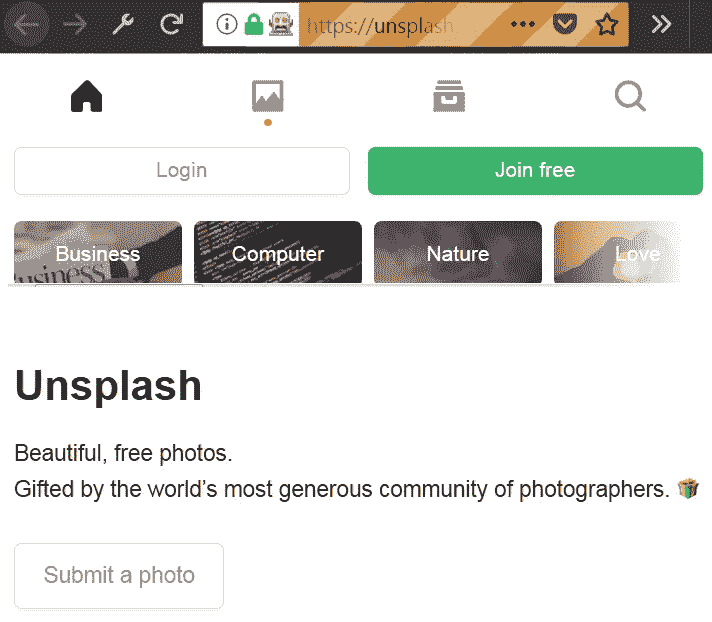

# 30 分钟 Python Web Scraper

> 原文：<https://medium.com/hackernoon/30-minute-python-web-scraper-39d6d038e5da>

我一直想用 Python 和 [Selenium](http://www.seleniumhq.org/) 创建一个 web scraper，但是一直没有时间去做。几天前的晚上，我决定尝试一下。尽管看起来令人生畏，但编写代码从 [Unsplash](https://unsplash.com/) 抓取一些美丽的图像却极其容易。

Image credit: [Blake Connally](https://unsplash.com/@blakeconnally) via [Unsplash.com](https://unsplash.com/photos/B3l0g6HLxr8)

## 简单图像刮刀的成分

*   [Python](https://www.python.org/downloads/) (3.6.3 或更新版本)
*   [Pycharm](https://www.jetbrains.com/pycharm/download/#section=windows) (社区版就好)
*   `pip install [requests](http://docs.python-requests.org/en/master/user/install/#install) [Pillow](https://pillow.readthedocs.io/en/latest/installation.html#basic-installation) [selenium](http://selenium-python.readthedocs.io/installation.html#downloading-python-bindings-for-selenium)`
*   壁虎驱动器(阅读下面的说明)
*   [mozzla Firefox](https://www.mozilla.org/en-US/firefox/new/)(好像你没装)
*   工作互联网连接(显然)
*   你 30 分钟的时间(可能更少)

## 简单图像刮刀的配方

一切都安装好了吗？很好！随着我们继续编写代码，我将解释这些组件的作用。

我们将利用的第一件事是与 **geckodriver** 结合的 **Selenium webdriver** 来打开一个为我们工作的浏览器窗口。首先，在 **Pycharm** 中创建一个项目，为您的操作系统下载最新版本的 geckodriver，打开压缩文件并将 geckodriver 文件拖放到您的项目文件夹中。Geckodriver 基本上是让 Selenium 控制 Firefox 的工具，所以我们需要将它放在项目文件夹中，以便能够使用浏览器。

接下来我们要做的是将 webdriver 从 Selenium 导入到我们的代码中，并连接到我们想要的 URL。让我们就这么做吧:

Opening a new browser window to a specific URL

A remote-controlled Firefox window

很简单，是吧？如果你已经正确地做了所有的事情，那么你已经完成了最难的部分，你应该会看到一个类似于上图所示的浏览器窗口。

接下来，我们应该**向下滚动**,以便在我们开始下载之前可以加载更多的图像。我们还希望**等待几秒钟**，以防连接缓慢且图像未完全加载。由于 Unsplash 是用 React 构建的，等待大约 5 秒钟似乎是一个很长的时间，所以我们应该使用`time`包来这样做。我们还想使用一些 Javascript 代码来滚动页面——我们将使用`[window.scrollTo()](https://developer.mozilla.org/en-US/docs/Web/API/Window/scrollTo)`来完成这个任务。将所有这些放在一起，您最终应该会得到这样的结果:

Scrolling the page and waiting 5 seconds

测试完上面的代码后，您应该会看到浏览器将页面向下滚动了一点。接下来我们需要做的是从网站上找到我们想要下载的图片。在深入研究了 React 生成的代码后，我发现我们可以使用一个 **CSS 选择器**来专门定位页面图库中的图像。页面的具体布局和代码将来可能会改变，但在编写本文时，我可以使用一个`#gridMulti img`选择器来获取出现在我屏幕上的所有``元素。

我们可以使用`[find_elements_by_css_selector()](http://selenium-python.readthedocs.io/api.html#selenium.webdriver.remote.webdriver.WebDriver.find_element_by_css_selector)`得到这些元素的列表，但是我们想要的是每个元素的`src`属性。因此，我们可以遍历列表并获取这些内容:

Selecting image elements and getting the images’ URLs

现在，为了得到我们发现的图像。为此，我们将使用`requests`和`PIL`包的一部分，即`Image`。我们还想使用来自`io`的`BytesIO`将图像写入一个`./images/`文件夹，我们将在我们的项目文件夹中创建这个文件夹。所以，为了把这些放在一起，我们需要发送一个 **HTTP GET 请求**到每张图片的 URL，然后使用`Image`和`BytesIO`，我们将**存储我们在响应中得到的图片**。有一种方法可以做到这一点:

Downloading the images

这几乎就是你下载一堆免费图片所需要的全部。显然，除非你想设计原型，你只是需要随机的图像，这个小刮刀没有多大用处。因此，我花了一些时间来改进它，增加了一些新功能:

*   命令行参数允许用户指定一个**搜索查询**，以及一个用于滚动的数值，这允许页面显示更多的图片供下载。
*   可定制的 CSS 选择器。
*   基于搜索查询定制的**结果文件夹**。
*   根据需要，通过裁剪缩略图的 URL 获得完整的**高清图像**。
*   命名图像，基于它们的 URL。
*   在过程结束时关闭浏览器窗口。

您可以(或许应该)尝试自己实现其中的一些特性。web scraper 的全功能版本在[这里](https://github.com/Chalarangelo/unscrape)有售。记得单独下载 [geckodriver](https://github.com/mozilla/geckodriver/releases/latest) 并将其连接到您的项目，如本文开头所述。

## 局限性、考虑因素和未来的改进

这整个项目是一个非常简单的概念验证，看看网页抓取是如何完成的，这意味着有很多事情可以做，以改善这个小工具:

*   不承认图片的原始上传者是一个非常糟糕的主意。Selenium 肯定能够解决这个问题，因此每张图片都带有作者的名字。
*   Geckodriver 不应该放在项目文件夹中，而是全局安装，并且是系统变量`PATH`的一部分。
*   搜索功能可以很容易地扩展到包括多个查询，这样就可以简化下载大量图像的过程。
*   默认浏览器可以从 Firefox 改为 Chrome，甚至是 [PhantomJS](http://phantomjs.org/) ，这对这类项目来说会好得多。