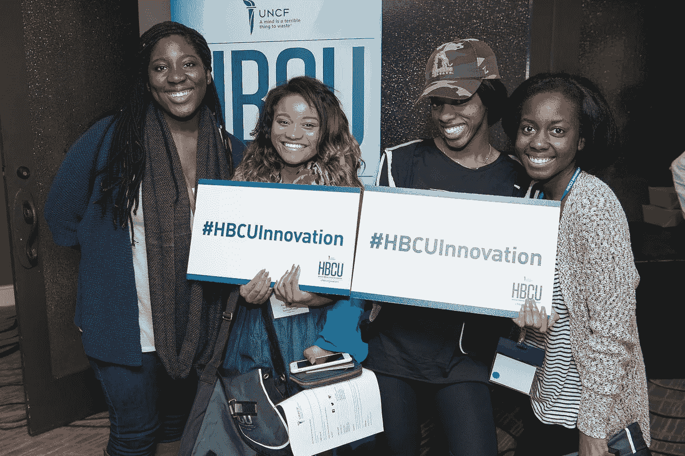
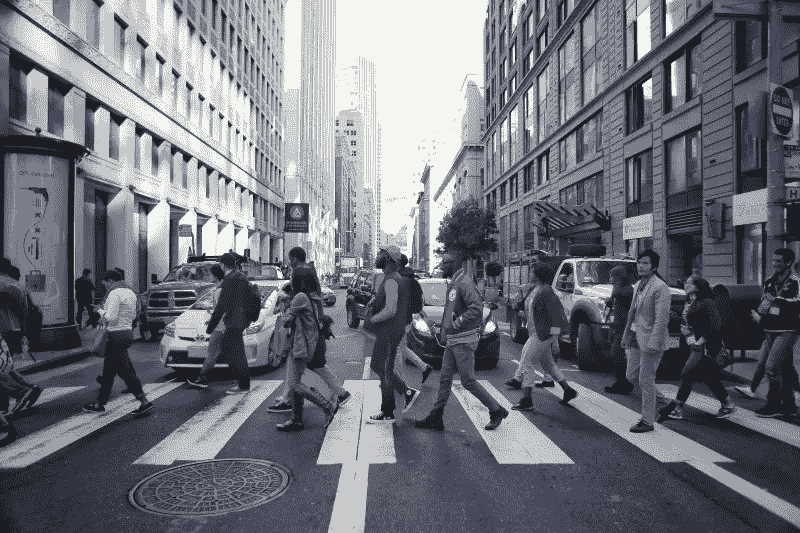
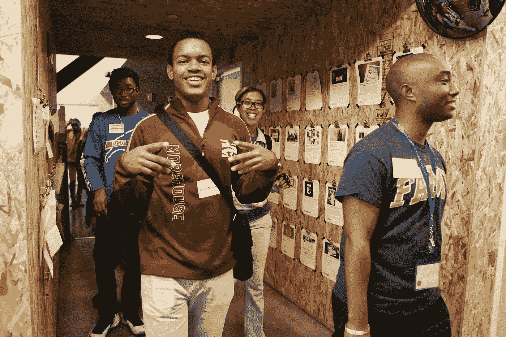
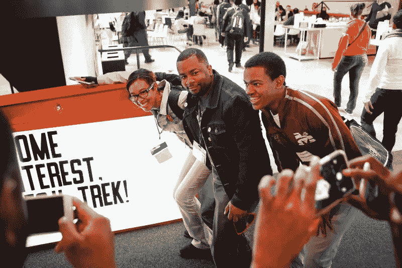

# 结果:30 名 UNCF HBCU 创新峰会研究员现在有技术角色

> 原文：<https://medium.com/hackernoon/30-uncf-hbcu-innovation-summit-fellows-now-have-technical-roles-2e656b79271b>

过去三年来，我们一直在硅谷举办 UNCF HBCU 创新峰会。我们的数据显示出明显的上升趋势。结果是积极和令人满意的。我们的学生正在走向全国科技生态系统的新视野…

他们现在不仅在向硅谷转移，还在向包括奥斯汀、得克萨斯、波特兰、俄勒冈和西雅图华盛顿在内的新兴生态系统转移。

想一想，来自历史上的黑人学院和大学(HBCUs)的“技术人员”，大多数在南部和中西部，正在全国各地前进，为科技公司带来新鲜、强大的新想法和观点，使他们的劳动力多样化。这是强大的东西！

来自 25 个哈佛商学院的 118 名学生参加了 [2014 年和 2015 年 UNCF 哈佛商学院创新峰会](http://www.hbcuinnovation.org/my-product_category/i-c-e-recap/)。93%的学生是计算机科学、[工程](https://hackernoon.com/tagged/engineering)和信息[技术](https://hackernoon.com/tagged/technology)专业。在这 118 名 HBCU 技术人员中，有 30 名受访者现在在美国的科技公司实习或全职工作……继续关注#HBCUInnovation，我们将继续捕捉和记录更多的学生成功故事。

让我们来看看我们的几个伙伴:以 2015 年峰会伙伴[艾莉雅·格里芬](https://www.linkedin.com/in/aaliyah-griffin-33637094)为例，他是佐治亚州亚特兰大市斯佩尔曼学院即将毕业的学生。今年夏天，格里芬获得了加州奥克兰潘多拉公司的实习机会。[安东尼·华盛顿](https://www.linkedin.com/in/anthony-washington-2689bb5a)，阿拉巴马州塔斯基吉大学的应届毕业生，现在是德克萨斯州圣安东尼奥市英特尔公司的全职云软件工程师。[理查德·斯库特·泰勒](https://www.linkedin.com/in/scootertaylor)，亚特兰大莫尔豪斯学院的应届毕业生，加入了硅谷一家新成立的公司，管理营销和品牌。

毕业于摩根州立大学的 Babatunde Fashola 是 Twitter 的全职软件工程师。[霍华德大学的阿提亚·拉尼尔](https://www.linkedin.com/in/attiyahlanier?authType=NAME_SEARCH&authToken=E1id&locale=en_US&trk=tyah&trkInfo=clickedVertical%3Amynetwork%2CclickedEntityId%3A374650187%2CauthType%3ANAME_SEARCH%2Cidx%3A1-1-1%2CtarId%3A1466986690827%2Ctas%3Aatt)今年夏天将在亚利桑那州凤凰城的英特尔公司实习，担任软件工程师。 [Ifreke Okpokowuruk](https://www.linkedin.com/in/ifreke?authType=NAME_SEARCH&authToken=Myqc&locale=en_US&srchid=500597571466986733961&srchindex=1&srchtotal=1&trk=vsrp_people_res_name&trkInfo=VSRPsearchId%3A500597571466986733961%2CVSRPtargetId%3A203030557%2CVSRPcmpt%3Aprimary%2CVSRPnm%3Atrue%2CauthType%3ANAME_SEARCH) ，一名[2014](http://www.hbcuinnovation.org/my-product_category/innovation-summit-recap/)&[2015](http://www.hbcuinnovation.org/my-product/2015-hbcu-innovation-summit/)HBCU 创新峰会参与者除了[在亚特兰大大学中心的 HBCU ICE Hack，](http://www.hbcuinnovation.org/my-product/hbcu-ice-hackathon-academy/)现在在谷歌做全职软件工程师。斯佩尔曼学院计算机科学专业的大三学生陈伶俐·富盖特现在是英特尔的 Code2040 研究员。

旧金山 Adobe 网站开发实习生 Lusenii Kromah 为旧金山湾区的所有黑人实习生创建了一个名为*Black Valley*的 GroupMe 小组。该组织现在有 300 多名与技术相关的成员。有 300 名非裔美国人随时可供科技公司雇佣，会员们也准备创建自己的公司。这个小组是硅谷草根努力弥合多样性鸿沟的一个例子。

哈佛商学院有大量的技术人才，像这样的学生需要接触、导师和职业发展。最重要的是，他们需要访问他们力所不及的网络。我们继续充当进入这些网络的纽带。

你可以看看 30 名哈佛商学院学生在科技公司和全国各地的角色。

UNCF HBCU Innovation Summit recap video

[*2014 & 2015 HBCU 创新峰会*](http://www.hbcuinnovation.org/my-product_category/innovation-summit-recap/) *Recaps。*

*感谢我们所有的技术合作伙伴、赞助商、发言人和倡导者:Airbnb、Chevron、Code2040、DigitalunDivided* 、*易贝、脸书、谷歌、Intuit、Kaiser Permanente、Kapor Center for Social Impact、NetApp、Oracle Academy、Pandora、Pacific Gas + Electric Co、Pinterest、Qeyno Labs、Salesforce、SpaceX、Square、Stanford d . School+University Innovation Fellows Program、STEMBoard、德州仪器、Towns Group、Twilio、优步、UBS、ZeeMee 和*

*UNCF HBCU 创新峰会是 HBCU 创新、商业化和企业家精神(HBCU I.C.E .)的一部分。我们 HBCU I.C.E .的使命是将 HBCU 校园转变为高性能的 S.T.E.M .创新和创业的中心和节点，这将增加非裔美国人社区的经济影响。*

*关于 UNCF: UNCF 成立于 1944 年，旨在帮助更多的非裔美国学生就读大学并从大学毕业。从那以后，我们帮助上大学的少数民族人数增加了一倍多。多亏了 UNCF 和***[*共计 1100 万美元的大学文凭学生奖学金颁发给了我们排名前五的城市的学生:纽约市、亚特兰大、芝加哥、费城、华盛顿州、DC*](http://uncf.org/our-impact) *。***

**#创新**

****

**-丙**

************

> **[黑客中午](http://bit.ly/Hackernoon)是黑客如何开始他们的下午。我们是 [@AMI](http://bit.ly/atAMIatAMI) 家庭的一员。我们现在[接受投稿](http://bit.ly/hackernoonsubmission)并乐意[讨论广告&赞助](mailto:partners@amipublications.com)机会。**
> 
> **如果你喜欢这个故事，我们推荐你阅读我们的[最新科技故事](http://bit.ly/hackernoonlatestt)和[趋势科技故事](https://hackernoon.com/trending)。直到下一次，不要把世界的现实想当然！**

****