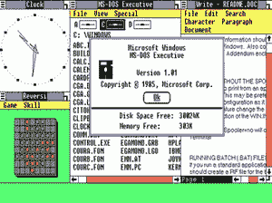

# 30 年，45000 名工程师却没有创新！

> 原文：<https://medium.com/hackernoon/30-years-45-000-engineers-and-no-innovation-42ee5e6491f7>

Windows 现在已经 30 岁了。今天，微软有大约 45，000 名工程师来开发 Windows 8，跳过 9 名，现在是 10 名。我花了几天时间才找到一个创新的功能——至少是一些微小的东西……就是找不到任何东西。在我看来，管理 45，000 名软件工程师而不让他们做一些创新的事情绝对是令人惊讶的。我想这需要一种特殊的工程师才能做到。日复一日地走进办公室，开发下一个版本，这个版本改变了很多东西，让用户忙个不停，却没有创造任何附加价值。

好的——在微软内部，做一些与众不同的事情总是很困难的。所有的东西要么是从竞争对手那里购买的，要么是从竞争对手那里复制的——但是

> **在过去的 10 年里，该公司已经没有竞争对手可以模仿了**

可怜的微软。我认为，抱怨 Windows、Office 和数据库等其他副产品，而不提供一个真正向他们展示该做什么的竞争对手，是不公平的——就像过去的美好时光一样。

# 请帮助微软继续生存

帮助微软继续走下去的唯一方法就是为他们创新，让他们像过去一样复制或者收购。有成千上万的创新创业公司准备这样做。到目前为止，他们找不到风投来支持他们，因为他们都还有很多微软的股份。但是我想我们需要找到一种方法来实现它

1.  **操作系统**但是智能操作系统的架构是数据总线、安全系统和智能 api 引擎。
2.  看到人们仍在购买一个比一些较新的主机应用程序还旧的系统，而且和我们 20 年前用来键入文本、制作电子表格和演示文稿的系统一样，这是很痛苦的。而且电子邮件甚至不能用现代营销流程整合创造出好看的新闻信函。我们仍然需要商业软件，但没有办公软件。为人们提供当今真正需要的应用程序，如通信、社会互动、市场营销、销售、项目和团队协作以及我们真正需要的东西，这有多酷？
3.  **工具和材料**
    我想我们可以跳过它——它从来都不重要，有价值的工具可以从其他供应商那里获得。
4.  **开发工具**甚至 Java 也不是很有用，更现代的工具如 Node.js 仍然没有必要的强大的基础设施、测试工具和 ide。

回到如何融资的问题上来？我觉得我们可以从世界各地召集大约 2 万名天使投资者，投资潜力约为 5 万美元，以筹集 10 亿美元的种子资金。

我想知道:**你是什么意思**:我们是否应该像“安全的微软”一样，通过创建一些他们可以复制或再次购买的创新公司，在未来 20 年内保持公司的业务？好吧好吧好吧——有一个问题，创业公司可能不会出售，微软需要太长时间来复制——就像在互联网时代或社交网络时代一样，但当下一个[技术](https://hackernoon.com/tagged/technology)到来时，那又会怎样？我猜还是值得一试的。

> [黑客中午](http://bit.ly/Hackernoon)是黑客如何开始他们的下午。我们是 [@AMI](http://bit.ly/atAMIatAMI) 家庭的一员。我们现在[接受投稿](http://bit.ly/hackernoonsubmission)并乐意[讨论广告&赞助](mailto:partners@amipublications.com)机会。
> 
> 如果你喜欢这个故事，我们推荐你阅读我们的[最新科技故事](http://bit.ly/hackernoonlatestt)和[趋势科技故事](https://hackernoon.com/trending)。直到下一次，不要把世界的现实想当然！

[https://upscri.be/hackernoon/](https://upscri.be/hackernoon/)