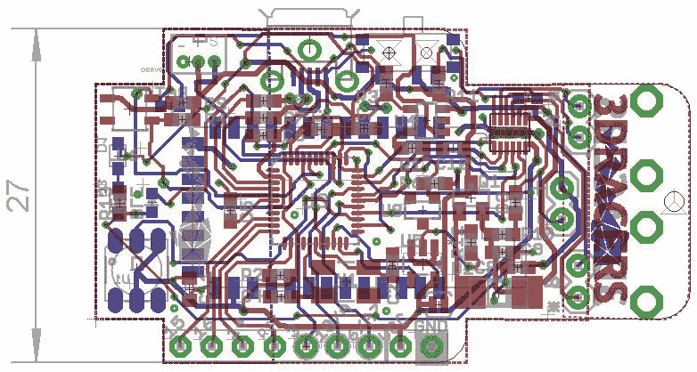
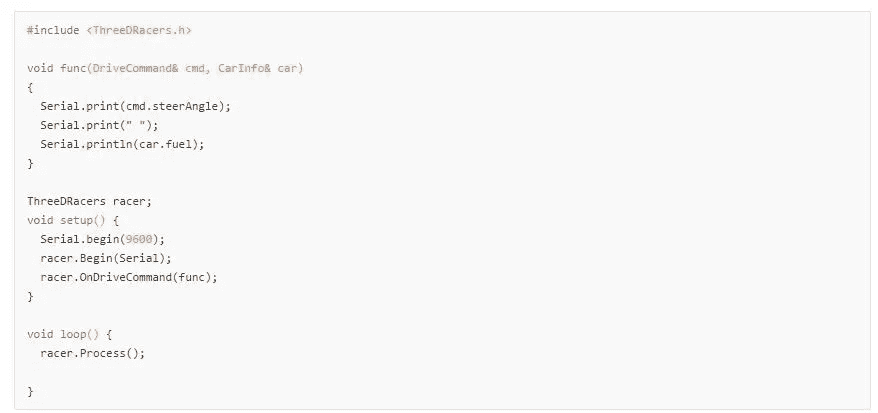
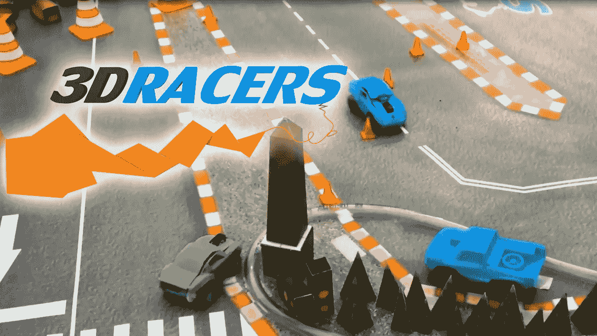

# 3DRacers:首款 3D 打印遥控玩具

> 原文：<https://medium.com/hackernoon/3dracers-the-first-3d-printed-rc-toy-6b805e181364>

3DRacers 是一款 3D 打印赛车游戏，基于 Arduino 和智能手机。

3DRacers 在 2014 年罗马 Maker Faire 上展出，是小型的无线电控制汽车，你可以用手机或定制的 3D 打印遥控器驾驶。玩 3d 赛车很容易:你只需插上电池，在自动计时的帮助下，与你的朋友一起比赛。或者，如果你愿意，你也可以使用开源代码和电子设备侵入源代码，这些也是 Arduino 兼容的。

电子板是由该团队制作的，但原理图也可以在网上找到，供那些想涉足 SMD 焊接领域的人参考:[https://github.com/3DRacers/PilotBoard](https://github.com/3DRacers/PilotBoard)

真正让这款产品与众不同的是，它将是有史以来第一款采用分布式制造的产品:迷你汽车将通过全球数千个打印中心组成的[网络](https://hackernoon.com/tagged/network)生产，完全按照用户在线设计的那样。

这样，每辆车都可以通过免费的在线编辑器(【http://www.3dracers.com/editor】)进行定制，有多种配件、车身和颜色可供选择。所有这些多样性将确保没有人会分享同一个汽车[设计](https://hackernoon.com/tagged/design)。由于有了开源组件，就有可能创造出一种新的设计，甚至是一种全新的交通工具，一个庞大的粉丝群体已经在产品背后成长，每周都有新的内容产生。

完整的 Arduino 代码可以从 Github 仓库下载:[https://github.com/3DRacers/Lib3DRacers](https://github.com/3DRacers/Lib3DRacers)

这个游戏就像马里奥赛车，但在现实世界中——有自动圈速和在线记分牌，允许其他人与你的记录竞争；模拟轮胎和油耗的进站；以及一个有涡轮通道和动力的战斗模式。所有这一切都在你家的地板上上演，在你用 3D 打印或纸艺元素创建的轨道上，或者用官方的轨道垫。

游戏在 Indiegogo 上售价 49 美元，更多信息可以在官方网站找到:[www.3dracers.com](http://www.3dracers.com)

> [黑客中午](http://bit.ly/Hackernoon)是黑客如何开始他们的下午。我们是 [@AMI](http://bit.ly/atAMIatAMI) 家庭的一员。我们现在[接受投稿](http://bit.ly/hackernoonsubmission)，并乐意[讨论广告&赞助](mailto:partners@amipublications.com)机会。
> 
> 如果你喜欢这个故事，我们推荐你阅读我们的[最新科技故事](http://bit.ly/hackernoonlatestt)和[趋势科技故事](https://hackernoon.com/trending)。直到下一次，不要把世界的现实想当然！

