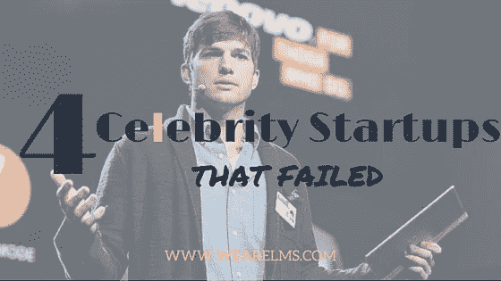
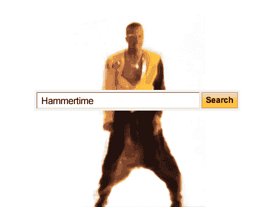
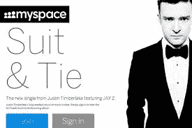
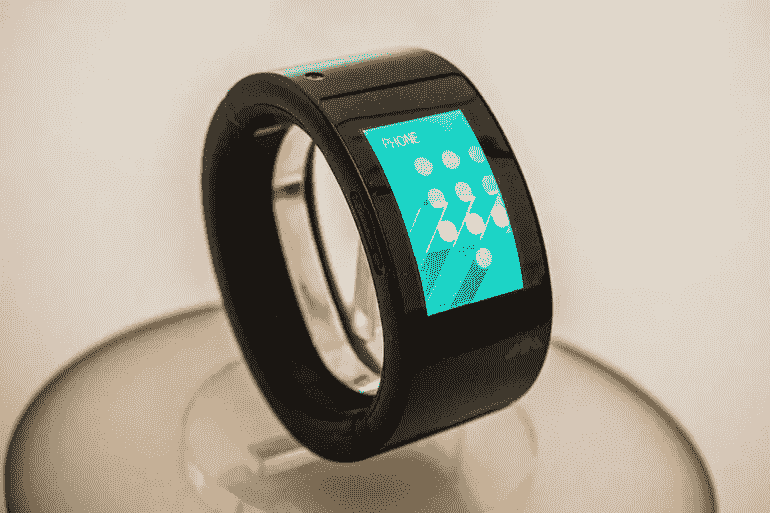
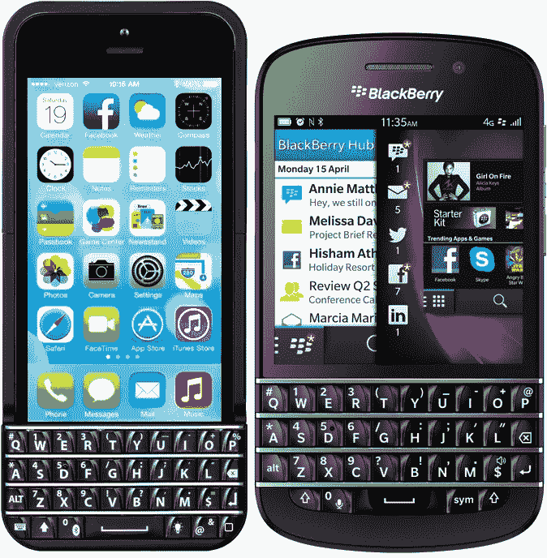

# 4 个名人支持的创业公司失败了

> 原文：<https://medium.com/hackernoon/4-celebrity-endorsed-startups-that-failed-d18b9af65dd>

MC Hammer 有搜索引擎？！？！

# 1.搜索不到这个！

还记得 MC 锤子的搜索引擎初创吗？谷歌也没有。几年前，在 Web 2.0 峰会的舞台上，MC Hammer 宣布了 WireDoo，这是他参与的一项关系搜索引擎的尝试。按照哈默的说法，“你总是可以让事情变得更好，创造下一个版本。”WireDoo 用户可以搜索与关键词相关的东西。不幸的是，您无法搜索 WireDoo。无论在哪里搜索都找不到。也许他们的自我需要一些" O"。

# 2.无法阻止不可避免的事情

贾斯汀·汀布莱克(Justin Timberlake)在好莱坞热门电影《社交网络》(The Social Network)中饰演脸书投资者肖恩·帕克，具有讽刺意味的是，他在 2011 年与在线广告公司 Specific Media 一起入股了 [Myspace](https://www.theguardian.com/technology/myspace) 。Timberlake 在一份声明中说:“粉丝们需要一个地方去和他们最喜欢的艺人互动，[听音乐](https://goo.gl/w8fLgi)，看视频，分享和发现很酷的东西，只是联系。Myspace 有潜力成为那样的地方。”这个社交网络经历了几次品牌和设计的改变，希望达到 Timberlake 的设想。尽管他目前因其夏季热门单曲《停不下来的感觉》而闻名，但他无法阻止 Myspace 的衰落。该公司于今年 2 月被时代公司收购，Timberlake 在这笔交易中是否遭受了损失？为我哭成一条河。

# 3.手表讨厌“环游世界”

我敢肯定，可穿戴技术世界的名人录(who ' s who ' s)遇到过也鄙视过 Will.i.am 在 2015 年发布的智能手表。说真的，谷歌搜索返回的结果纯粹是鄙视。也许你在想，“真的有那么糟糕吗？”。是的，有可能。产品发布非常快。他把它直接提升到苹果或三星发布会的水平，在一个拥有 5000 个座位的著名音乐厅举办了一场免费音乐会，嘉宾名单上星光熠熠。这款手表没有宣传的那么好。它因其笨重的设计、糟糕的界面以及没有人愿意用手表来代替整个手机这一事实而受到憎恨。目前的智能手表只能作为用户智能手机的系绳。从好的方面来看，Puls 非常适合那些对着手表说话时希望引起怀疑的人。不好意思，Will.i.am 称之为智能袖口。只是不够聪明。

# 4.美国的下一个败笔将是…“错别字”

瑞安·西克莱斯特在 iPhone 键盘附件“Typo”上投资了 100 万美元。这似乎是一个伟大的想法，如此之大，如果事实上黑莓已经做到了这一点！键盘的设计如此相似，以至于黑莓两次起诉 Typo 侵犯版权并胜诉。由于黑莓的第一次诉讼，第一款手机的销售在发布后不久就停止了。该公司推出了第二款机型 Typo2，却被另一项黑莓诉讼阻止，声称它看起来仍然太相似。黑莓声明，“虽然我们对将我们的键盘移植到其他智能手机的愿望感到荣幸，但我们不会容忍在没有适当许可的情况下故意使用我们的标志性设计。”#开枪了。回到绘图板，这次不偷看。

# 从右脚开始

不要让这些商业上的不速之客把你赶走。这恰恰说明了坚实的基础对于确保你的初创或成长中的品牌起飞有多么重要。名人代言也不全是坏事，尤其是如果你包括“名人”影响者的话。名人和社交媒体影响者共同参与的[营销](https://hackernoon.com/tagged/marketing)策略可能比只有名人参与的策略更有效。

要了解更多关于名人和影响者营销合作关系的信息或安排免费咨询[请点击此处](http://www.wearelms.com/our-deets/#about)！

> [黑客中午](http://bit.ly/Hackernoon)是黑客如何开始他们的下午。我们是 [@AMI](http://bit.ly/atAMIatAMI) 家庭的一员。我们现在[接受投稿](http://bit.ly/hackernoonsubmission)并乐意[讨论广告&赞助](mailto:partners@amipublications.com)机会。
> 
> 如果你喜欢这个故事，我们推荐你阅读我们的[最新科技故事](http://bit.ly/hackernoonlatestt)和[趋势科技故事](https://hackernoon.com/trending)。直到下一次，不要把世界的现实想当然！

