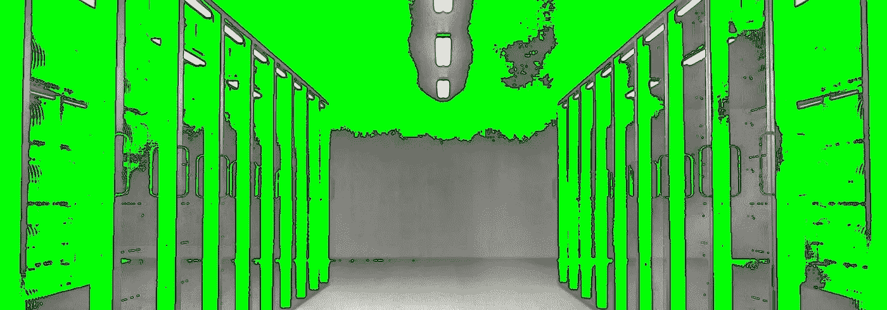

# 超大规模数据中心建设引发的 4 大争议

> 原文：<https://medium.com/hackernoon/4-controversies-that-follow-the-construction-of-hyperscale-data-centers-4d79695921ad>

> 斯坦·汉克斯自 1982 年以来已经建立了 25 个数据中心。[原载](https://www.quora.com/Why-is-the-construction-of-a-hyperscale-data-center-near-some-cities-controversial/answer/Stan-Hanks)于 [Quora](http://quora.com?ref=hackernoon) 。

在探索我的雇主在华盛顿东部拥有的一处房产的退出选项时，我近距离亲自看到了这种争议。该物业本身没有什么特别之处，但它附带了一份 20 年的电力合同，价格远低于大量电力的市场价格。没有人真正关心大部分的财产，一个工业厂房，大部分是预定拆除，但它附带的权力，使它非常有趣的使用数据中心的发展。

它所在的城市已经暂停了数据中心运营的发展。这个城市在这个问题上非常清楚，这不是讨论的问题。

深究起来，他们的理由很熟悉:

创造的就业机会不足。一个大型数据中心的运营可以创造少量的工作岗位，而不是更多。几乎所有这些新工作都是受过高等教育和有技能的专业人士，他们将搬到该地区，而不是已经住在那里的人获得新的就业机会。

**机会成本。**虽然该物业带有不可撤销的电力合同，但如果该电力因数据中心运营而被拆除，将会有效地限制其他人在该地区寻求非常低的市场价格电力来做其他事情的能力。对他们来说，这看起来像是用几乎没有新工作来换取无法创造其他工作的保证，对该地区来说是一种双输的局面。

**害怕改变。这座城市想要以前以农业为导向的工厂和它所代表的 500 个左右的工作岗位。掌权者并没有意识到导致这种情况发生的经济环境早已不复存在，他们一直梦想着经济环境会神奇地回来。面对一个新时代即将到来的现实，意味着放弃让剩余的人充分就业或者让城市增加 1000 多个家庭来支持新的经典工业时代努力的想法。**

**对短暂工作的恐惧。**虽然新数据中心运营的初始建设阶段意味着本地人在该行业的一些短期工作，但这也意味着大量工人从镇外的项目转移到项目。他们需要住的地方，并且害怕给他们带来麻烦。

总而言之，除非有“对他们有利”的东西，否则很难让较小的社区参与到这样的项目中来。这是什么的确切性质各不相同；一些人可以接受更大的税基，但对一些人来说，这不是他们交易的货币。

> 斯坦·汉克斯自 1982 年以来已经建立了 25 个数据中心。[原载](https://www.quora.com/Why-is-the-construction-of-a-hyperscale-data-center-near-some-cities-controversial/answer/Stan-Hanks)于 [Quora](http://quora.com?ref=hackernoon) 。
> 
> 更多来自 Quora 的趋势科技答案，请访问[HackerNoon.com/quora](https://hackernoon.com/quora/home)。