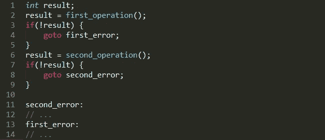
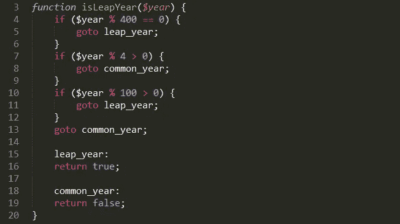
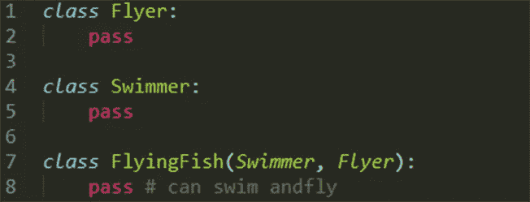
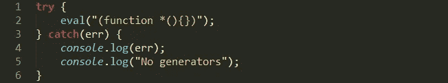

# 4 个被遗忘的代码构造:是时候重温过去了吗？

> 原文：<https://medium.com/hackernoon/4-forgotten-code-constructs-time-to-revisit-the-past-4cb91051065>

编程世界中的一些东西很容易被误用，以至于大多数人宁愿从来不使用它们。这些程序相当于喷火器:你可能很少真正需要一个喷火器，但是偶尔你会发现你需要摧毁一座森林。在这种情况下，没有比在你的代码库上使用[兰博](https://hackernoon.com/tagged/rambo)更简单的方法了。

> “没有一种编程语言——不管它有多结构化——能够阻止程序员编写糟糕的程序。”—拉里·弗伦

这就是一些旧的、被遗忘的代码构造发挥作用的地方。**创造性地使用诸如 *goto* 、多重继承、 *eval* 和 *recursion* 之类的特性，在适当的情况下，对于有经验的开发人员来说，可能是正确的解决方案。**

在软件开发中，你能拥有的最重要的技能之一就是知道如何评估权衡。一旦你更善于选择正确的方法而不是流行的方法，你将在代码清晰性、可读性和减少开发时间方面获得很多。

有时候，衡量一个工具的能力更多的是取决于程序员正确使用它的能力，而不是工具本身的质量。大多数这些被禁止的想法都有特例，它们不仅有用，而且是可用的最佳解决方案。这就是它们的用途。在这种情况下，你会因为不使用它们而错过很多权力。

这里有四个被遗忘的代码构造应该被复活。

# 转到

旧的代码库曾经充斥着 goto 语句。在那些时候，你可以用它直接跳转到特定的代码行。这导致人们编写出最难以理解的代码，充满了数字行引用，类似于汇编语言。

因为它很容易被误用，最终导致的问题比它解决的问题还多。然后 Edsger Dijikstra 的著名论文:[《后藤被认为有害》](http://www.u.arizona.edu/~rubinson/copyright_violations/Go_To_Considered_Harmful.html)出来了，剩下的就是历史了。这些天，如果你试图争辩说它可能是有用的，人们会奇怪地看着你。

尽管 goto 名声不好，但即使在今天仍有一些流行的项目在使用它，包括 Linux 内核本身。例如，看看[这篇内核开发介绍](https://www.youtube.com/watch?v=LLBrBBImJt4)，当听众听到这个消息时，他们集体倒吸一口凉气。然后还有[一个经典的李纳斯·托沃兹的慷慨陈词](http://koblents.com/Ches/Links/Month-Mar-2013/20-Using-Goto-in-Linux-Kernel-Code/)来支持它。

goto 背后的吸引力是能够编写非常紧密的循环，但这种结构的危险并没有被普遍理解。一个常见的错误是在代码中向后跳转，这虽然容易编写，但却使逻辑几乎无法理解。

很少有现代语言支持 goto。最流行的，只有 C，PHP，C#才有。但是在一些实际情况下，它会产生易于维护和阅读的代码。

# 走正确的路

它的主要亮点在于错误处理代码。这里有一个例子，它可以很好地替代多个连续的 if/else 语句。

goto 非常适合错误处理的原因是，它通过简化代码让您立即看到问题。数据处理和清理代码是分开的，很容易看出来。

请记住，gotos 的这种返回值风格更适合底层代码。在 C++中，你可以选择使用 RAII，其他返回值不常见的高级语言通常都有异常支持。

**Goto 对于封装重复的返回语句也很好。**一些方法有多个看起来非常相似的退出路径。在这些情况下，我们可以封装 return 语句，这样就可以轻松地改变函数的输出，而不需要处理数据。

您还可以使用方法调用进行封装。如果您的编译器内联了结果代码，这没什么，但是在这种情况下，作为额外的好处，您还可以将相关代码放在同一个函数中，而不是文件中的其他地方。

# 多重遗传

这种语言特性允许您从多个父类继承一个类，以获得所有父类的功能。通常在 OOP(面向对象编程)代码中，你只能从一个父代继承，但是在某些情况下，从多个父代继承似乎更自然。

这里的危险在于复杂性。由于您可能会影响来自相同父类的应用程序中的多个模块，因此推断代码更改并不容易。任何错误都可能引起连锁反应。

不幸的是，错误的使用使得这个曾经流行的功能几乎完全消失了。如今，它几乎是 OOP 中复杂性的同义词，大多数新语言已经完全抛弃了它。它只能在 C++、Python、Lisp 和其他一些函数式语言中找到。

我对多重继承的抱怨是，这是一个打破单一责任原则的简单方法。每个类应该只负责一个任务，一旦你继承了多个父类，事情就开始变得混乱了。根据我的经验，当最后期限和困难时期到来时，这个原则很快就会被抛弃，所以我不想让它变得更容易。

# 正确的多重继承方式

另一方面，有时你希望从彼此完全分离的父母那里继承。这就是多重继承发挥作用的地方。具有正交行为的类是多重继承的最佳情况。

在这个例子中，Swimmer 和 Flyer 是完全独立的抽象，所以从两者中继承不会导致子类中职责的混淆。

多重继承的另一个好例子是从多个接口而不是类继承。这种情况不太危险，因为继承不会给基类带来额外的功能——它只是扩展了它与外界的联系。

我喜欢构建反映特定行为的界面。这在多重继承中非常自然。例如，你可以有一个*数据库驱动程序*，它是*可查询的*和*持久的*，也许你正在把它实现为一个*MySQL 驱动程序*，这两个行为一起工作。

只要你小心翼翼地清晰定义你的抽象，多重继承可以成为另一个强大的工具。

# evaluate 评价

Eval 是一些语言拥有的工具，它允许你从一个字符串运行任意代码。大多数解释语言都有，比如 JavaScript、Python、PHP 和 Ruby。

它是目前为止最危险的工具，这是因为你可能不小心给了它一个用户输入，这会完全打开你的系统。恶意用户将能够运行代码来删除文件或控制您的计算机。

尽管如此，在某些情况下，它可能是一个非常有效的工具。使用 eval，一些问题变得更容易解决，例如解析动态数量的输入变量和解析模板语言。

尽管想采用这样简单的解决方案是值得称赞的，但危险太大了。要正确地净化随机输入以使 eval 调用不被滥用几乎是不可能的，所以最好只评估您自己生成的代码。

# 以正确的方式评估

评估自己的代码仍然非常有用。一些例子包括:解释 JSON 数据、HTML 模板、数学表达式，以及检测环境和语言特性。

这里有一个例子来检测你的浏览器是否支持 ES6 风格的生成器。

# 递归

被遗忘的比被禁止的多，递归仍然在一些环境中使用，比如在函数式编程和一些库中，尽管在企业环境中更常见的应用并不容易得到。

函数式程序员喜欢递归。有些函数式编程语言，比如 Haskell，甚至直接强迫你使用它，但事实是递归在那个世界之外并不自然。

**尽管如此，还是有办法让它在迭代的世界中发挥作用。**一种方法是通过尾部递归。简单地说，您将递归调用留在方法的末尾，然后编译器将能够优化您的方法以避免堆栈溢出。

不幸的是，一些语言已经决定不支持尾部调用优化。基于网络的语言通常都是如此。据我所知，Python 和 PHP 都不支持它，JavaScript 只在 ES6+引擎上支持。在这些情况下，如果你真的需要，你可以使用像[蹦床](https://en.wikipedia.org/wiki/Trampoline_(computing))这样的东西来绕过你的环境的限制，但是我建议你坚持迭代编程。

# 以正确的方式递归

递归在某些算法中提供了极大的简化和代码缩减。特别是如果你正在处理基于树的数据结构和排序列表，你会发现使用递归实现解决方案要容易得多。在这种情况下，如果你需要简单的代码，那就去做吧。

就性能而言，通常最好将递归函数转换成迭代形式。代码可能不太容易理解，但它更适合于生产环境，因为它将具有更可预测的性能。

# 重新发现你的语言被遗忘的结构

精通你的语言很重要。即使您不打算使用这些特性，也一定要知道它们是一个好选择的用例。不仅要有更多的选择，还要对语言本身有更好的把握。

**务实。如果你还没看的话，** [**查看一下务实程序员**](https://www.amazon.com/Pragmatic-Programmer-Journeyman-Master/dp/020161622X/ref=as_li_ss_tl?ie=UTF8&linkCode=ll1&tag=chrimaiospo06-20&linkId=5c3de0674b934bfcd9286ecf14f338be) **。熟记您的工具及其所有的权衡是经验丰富、久经沙场的开发人员的标志之一。**

注意:这篇文章最初出现在 TechBeacon 上。

> [黑客中午](http://bit.ly/Hackernoon)是黑客如何开始他们的下午。我们是 [@AMI](http://bit.ly/atAMIatAMI) 家庭的一员。我们现在[接受投稿](http://bit.ly/hackernoonsubmission)并乐意[讨论广告&赞助](mailto:partners@amipublications.com)机会。
> 
> 如果你喜欢这个故事，我们推荐你阅读我们的[最新科技故事](http://bit.ly/hackernoonlatestt)和[趋势科技故事](https://hackernoon.com/trending)。直到下一次，不要把世界的现实想当然！

