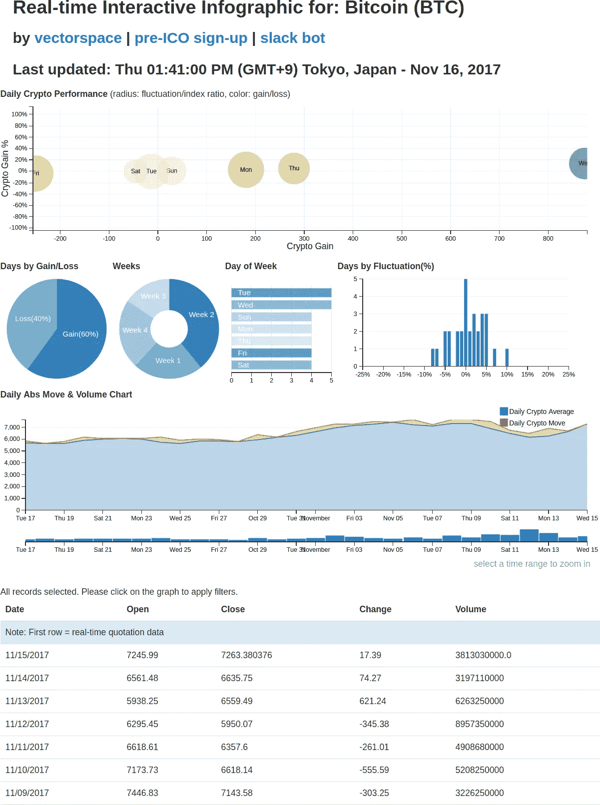
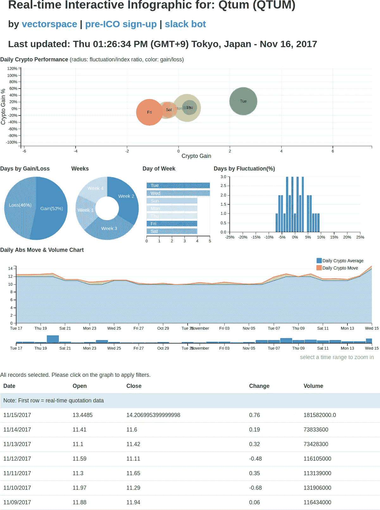
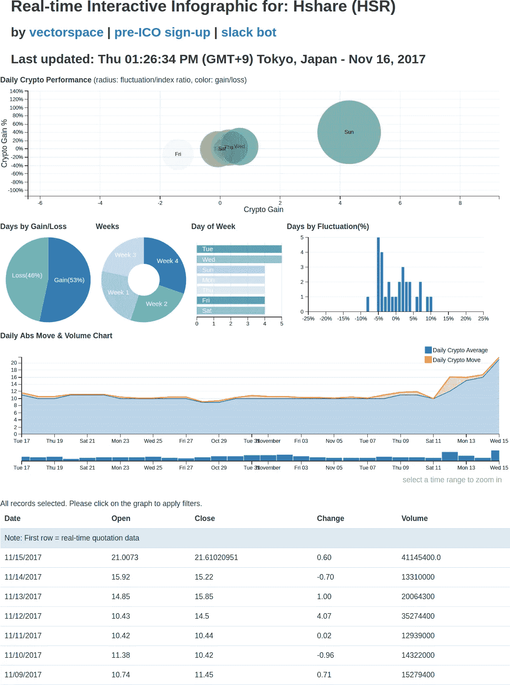
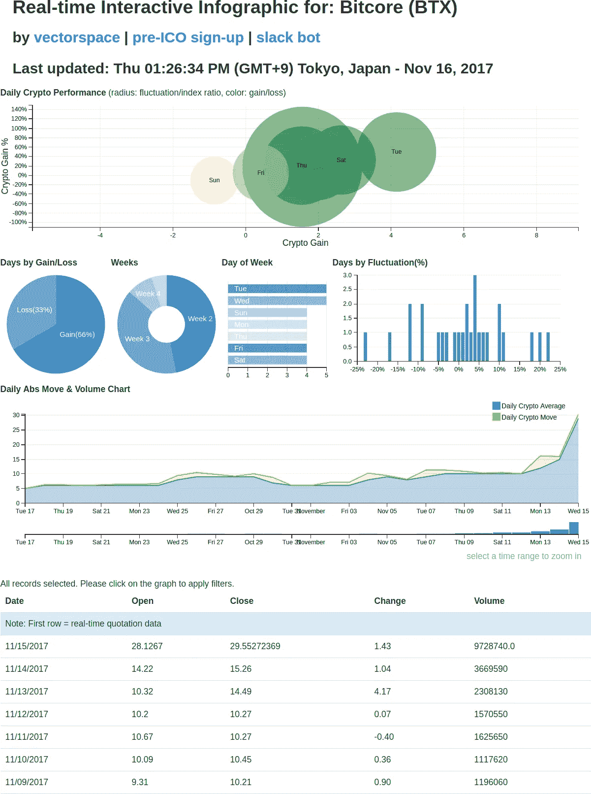

# 加密货币的交互式图表

> 原文：<https://medium.com/hackernoon/4-interactive-infographics-bitcoin-qtum-hshare-bitcore-are-on-the-move-8bf9e906178b>

有句老话叫“不要对抗胶带！”。今天，在加密货币的世界里，如果不想通过建立头寸、摇摆交易、日内交易或在市场上倒卖当前的移动者来参与，就很难忽视势头、价格变动和价格升值。不打带子就是定位在动量方向。

我最近发现了一个网站[【链接】](http://vectorspace.ai)，它提供了当前新闻中的 20 大趋势加密货币符号以及他们所谓的“实时互动信息图”，通过这个镜头观察过去 24 小时的热门人物可以获得的洞察力真的让我感到惊讶。我决定对这些图表式的信息图进行截图，这是基于一种定位于加密货币动量策略，我已经相当成功地使用了这种策略。他们在这里:

# [比特币(BTC)](http://vectorspace.ai/recommend/vectorspace-charts/vectorspace-chart-BTC.html)

这里不需要介绍了。我们已经见识了现存最强大的加密货币的威力。看看下面的数据，我们可以并且很可能将永远使用比特币作为衡量其他加密货币(如 Qtum、Hshare 和 Bitcore)性能指标的基准。现在让我们来看看国王。

BTC 互动信息图的链接是[ [位于此处](http://vectorspace.ai/recommend/vectorspace-charts/vectorspace-chart-BTC.html)，截图如下:

# [Qtum (QTUM)](http://vectorspace.ai/recommend/vectorspace-charts/vectorspace-chart-QTUM.html)

将修改后的比特币核心基础设施与以太坊虚拟机(EVM)的兼容版本相结合， [Qtum](https://qtum.org/) 融合了比特币经久不衰的区块链的可靠性和智能合约提供的无限可能性。

Qtum 的设计考虑到了稳定性、模块化和互操作性，它是构建可信的分散应用程序的最重要的工具包，适合现实世界中面向业务的用例。它的混合性质，结合首个同类 PoS 共识协议，允许 Qtum 应用与主要区块链生态系统兼容，同时为移动设备和物联网设备提供原生支持。

QTUM 互动信息图的链接[ [位于此处](http://vectorspace.ai/recommend/vectorspace-charts/vectorspace-chart-QTUM.html)，截图如下:

# 赫尔(HSR)

时间到了。 [Hcash](https://h.cash) 平台旨在成为
基于数据块和基于无数据块的区块链的侧链。Hcash 将成为区块链少校的价值和信息载体，以实现这些系统之间的价值和信息交换。

你的隐私可以得到保护。Hcash 将采用零知识证明技术来实现双向加密和许多其他需要交易隐私的领域。

它有一个由区块链和 DAG 系统组成的双侧链，旨在实现基于区块链和基于无块的分布式系统之间的信息和价值的无限制流动。

HSR 互动信息图的链接[[位于此处](http://vectorspace.ai/recommend/vectorspace-charts/vectorspace-chart-HSR.html)，截图如下:

# [比特大陆(BTX)](http://vectorspace.ai/recommend/vectorspace-charts/vectorspace-chart-BTX.html)

又一次，时间紧迫。我不知道该对 Bitcore 说些什么，因为它真的没有任何值得报道的内容或故事。我把它作为加密货币的一个例子，因为未知的原因，它只是有自己的潜在动力。有趣的是，它的运动似乎是凭空而来的。买者自负:并非所有的价格变动都反映了基本面价值。尽管如此，拿起你的爆米花，为了娱乐而享受吧。

BTX 互动信息图的链接[ [位于此处](http://vectorspace.ai/recommend/vectorspace-charts/vectorspace-chart-BTX.html)，截图如下:

有些秘密游戏有很棒的团队，有些很棒的故事，有些只是很棒的势头和价格波动，有些三者兼而有之。当定位进场点或快速交易时，使用技术分析指标可能会很有效。无论是哪种情况，有一天你可能会想学习如何做空以及做多或对冲。交易愉快！