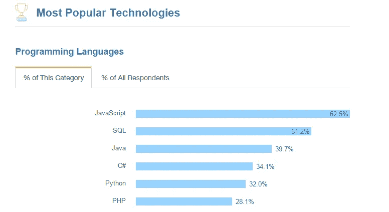
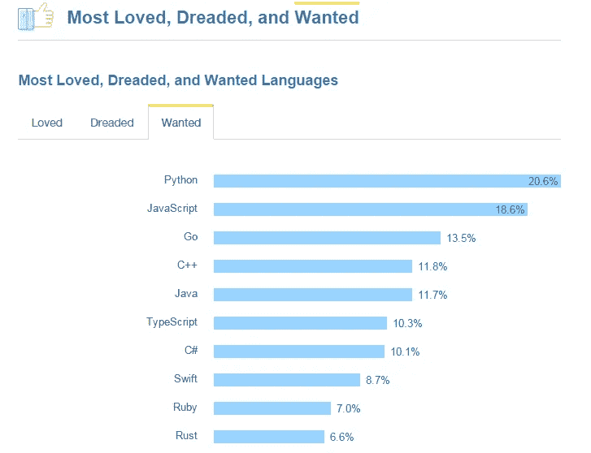
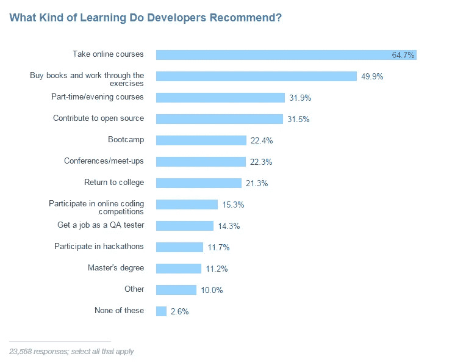
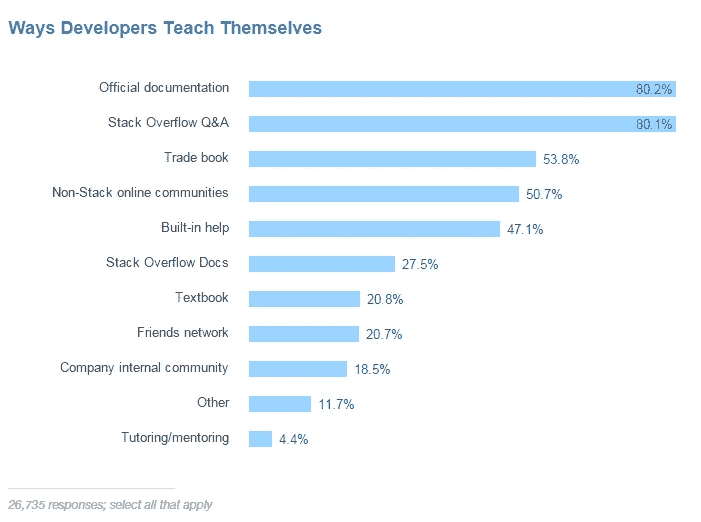
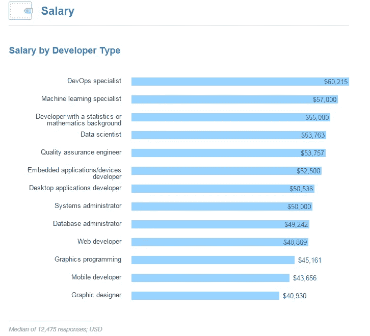
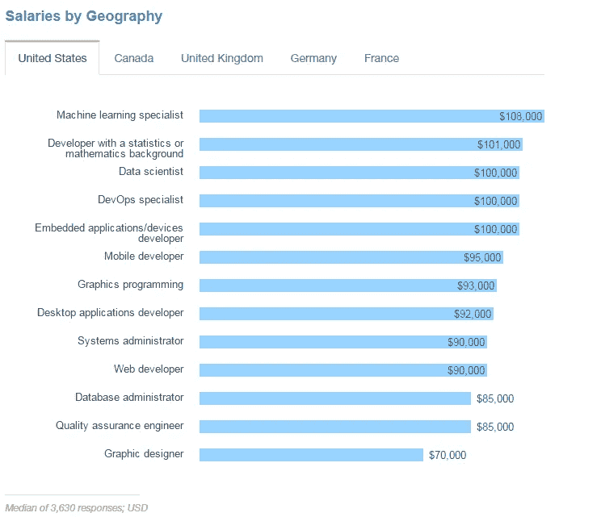

# 2017 年堆栈溢出调查的 4 个关键要点

> 原文：<https://medium.com/hackernoon/4-key-takeaways-from-stack-overflow-survey-2017-37f301f58f93>

Banner Courtesy: [http://stackoverflow.com/insights/survey/2017/](http://stackoverflow.com/insights/survey/2017/)

上周，Stack Overflow 发布了其 [2017 年开发者调查结果](http://stackoverflow.com/insights/survey/2017/)，许多结果与去年的结果产生了共鸣，但我想强调几件事作为关键要点。

**1。我 _am_most_wanted_language.py**

**Python** 已经超越 PHP 成为 SO 社区中继 JS、SQL、Java、C#之后第五大最受欢迎的编程语言。

这并不是说 Python 在流行编程语言列表中排名上升，Python 也成为了开发人员最想使用的语言。

**2。我是初学者，给我推荐一个学习<这门语言>的方法**

在任何社区中最常被问到的问题之一是“一个完全的初学者如何学习社区已经熟悉的东西——比如一门编程语言？”因此，Dev community 给出的最佳答案是:**参加在线课程**，其次是最传统的方法——**买书和做练习。**

**3。我已经是一个开发者了(至少我这么称呼自己)，那么如何提升我的技能呢？**

因此，在回答提升技能的最佳方式时，Community 几乎引起了全球开发人员社区的共鸣(那些已经进入开发阶段的人):**阅读官方文档**。

这对于新手来说可能听起来很琐碎，但这是建立技术专业知识的最有效的方法之一，事实上，一个新手如果在学习一门新语言时养成了浏览官方文档的习惯，就可以利用这个习惯成为这门语言的主题专家。

Image Courtesy: [https://priceonomics.com/stack-overflow-and-the-zeitgeist-of-computer/](https://priceonomics.com/stack-overflow-and-the-zeitgeist-of-computer/)

当然，在这个星球上(只有在这个星球上)任何开发人员——我指的是真正的开发人员——的最佳伴侣是**堆栈溢出 Q & As** ，通过它，是积累专业知识的实用方法之一。首先，挑选一个 SO [标签](https://stackoverflow.com/tags)——如 [js](https://stackoverflow.com/questions/tagged/javascript) 或 [py](https://stackoverflow.com/questions/tagged/python) ，浏览常见问题和特色问题，了解在 SO 上提问和回答的最佳实践，并加入社区。

**4。开发者+数据科学/机器学习= = $ $ $ $**

数据是新的石油，行业渴望从数据块中提取有价值的信息，这使得拥有数据科学的**开发人员或拥有机器学习技能的****在需求和薪资方面都处于独角兽俱乐部。**

********

> **[**点击此处查看完整的调查结果！**](http://stackoverflow.com/insights/survey/2017/)**

************

> **[黑客中午](http://bit.ly/Hackernoon)是黑客如何开始他们的下午。我们是阿妹家庭的一员。我们现在[接受投稿](http://bit.ly/hackernoonsubmission)并乐意[讨论广告&赞助](mailto:partners@amipublications.com)机会。**
> 
> **如果你喜欢这个故事，我们推荐你阅读我们的[最新科技故事](http://bit.ly/hackernoonlatestt)和[趋势科技故事](https://hackernoon.com/trending)。直到下一次，不要把世界的现实想当然！**

****