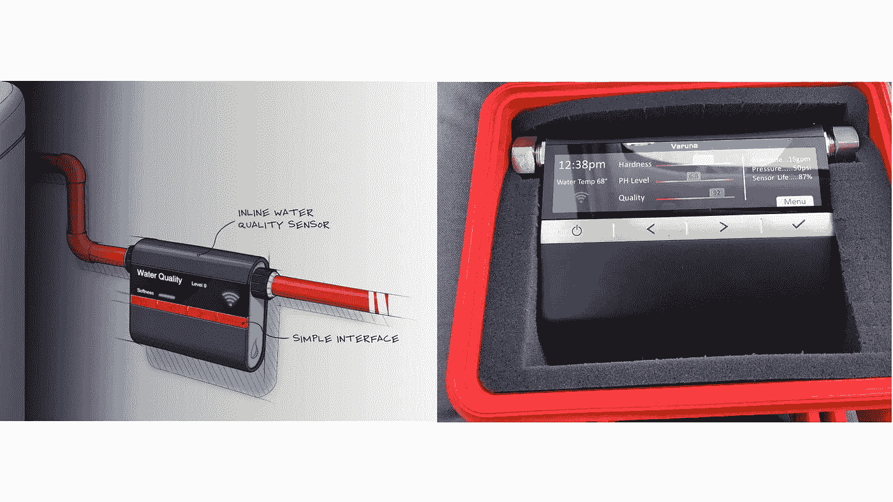
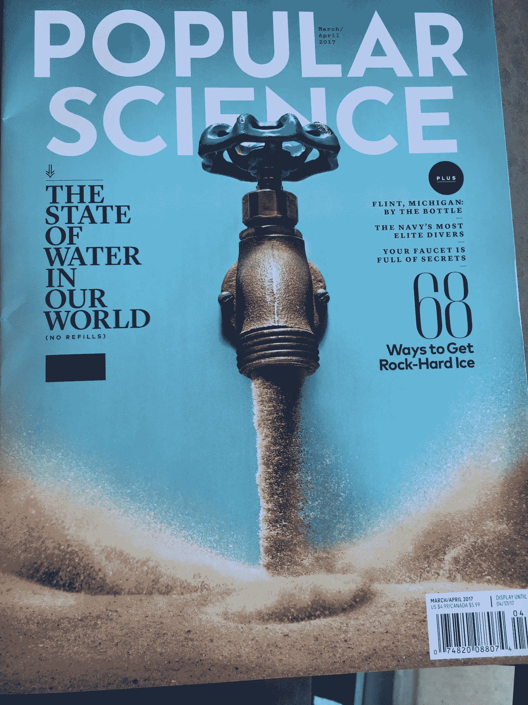
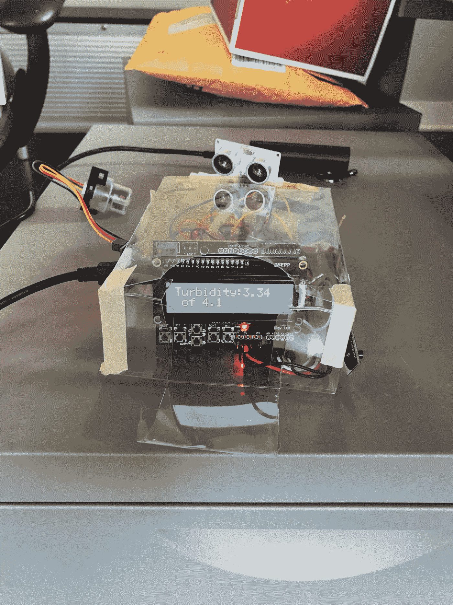
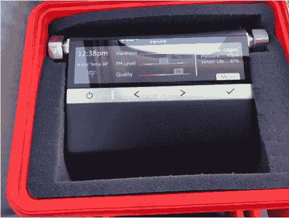

# 在 4 个月内构建物联网设备的 4 个教训。

> 原文：<https://medium.com/hackernoon/4-lessons-from-building-an-iot-device-in-4-months-53f718f887ed>

Varuna: the image and the current looks like of the product

几个月前，我分享说[我将致力于早期预警水质物联网设备(上图)](https://hackernoon.com/doing-work-that-matters-why-6345ddd3a90b)。这是启发性的几个月，我想我会分享一些关于这个项目的学习和更新。我为自己记录了这个过程，也分享了我的错误，作为成千上万从事硬件产品工作的人的教训。

四课的总结

1.  数据支持你构建产品的直觉吗？
2.  …知道过程很乱。
3.  先搞清楚函数再做表格和
4.  ...在信息不完整的情况下做决定时要从容。

这是一种令人谦卑的体验，Q [uoting Austin Kleon 在*展示你的作品*](http://amzn.to/2oQtbcM)*‘在所有的作品中，画家的过程和过程的产物之间是有区别的’。下面是这个过程中的一些教训。*

## 1.数据支持你的直觉吗？

我们决定参与这个项目，是因为一篇关于移情物联网产品的文章反响热烈。但我们最终决定继续调查的依据是 2015 年 5 月北卡罗来纳州 T2、2015 年科罗拉多州 T4 西尔弗顿、2014 年西弗吉尼亚州 T7、芝加哥、因艾琳布朗科维奇而出名的辛克莱和其他 4 个州仍然令人担忧。我们甚至还没有讨论过弗林特。有问题要解决是一个严重的动机，数据证明这是一个严重的问题。但要确保你不只是用数据来证明你已经做出的构建产品的决定的合理性。

> [“为了找到新的解决方案，你必须了解不同的人、不同的人、不同的场景、不同的地方。”Emi Kolawole，斯坦福大学 d.school 主编](http://www.designkit.org/resources/1)

The cover of March/April edition of Popular Science

## 2.…这个硬件开发过程非常混乱。

尽管这是一个集成游戏——我们正在使用现成的传感器构建水质物联网设备——但我们发现这里可能需要一些发明。铅传感器很难找到。我们已经从亚马逊订购了从未发货的产品[。我们在阿里巴巴上搜索过产品，(我不骗你)我相信，就像《T2》中的实时需求驱动商业模式一样，阿里巴巴上的机器人会根据不存在的产品搜索词生成产品页面。](http://amzn.to/2nXA3G0)

拿出一个丑陋但功能强大的 MVP，得到了朋友和家人的捐赠，与水和物联网领域的专家以及非营利组织的负责人进行了交谈。不管你的 MVP 看起来有多丑，它能让人们打消你的*想法。*因为它不再只是一个想法。**MVP*让你的对话变得真实，因为你给出了*表单*和*产品*。*

> *[“我们希望允许自己探索各种不同的可能性，这样才能找到正确的答案”Patrice Martin，IDEO.org 的联席主管兼创意总监](http://www.designkit.org/resources/1)*

## *3.首先关注功能而非形式…*

*..但是要考虑形式。我们已经构建并重新构建了多次最小可行产品/MVP(见下文),尝试不同的传感器并进行校准/重新校准，以确保产品能够检测和通信。尽管有失误和进步，但我们从未忽视这样一个事实，即我们的最终产品必须利用我们现有的技术来简化数据收集和早期检测水质问题的 4 大原因。不管 MVP 看起来有多丑，它必须服务于核心需求；比传统的水质检测方法更早、更快地检测到水质问题。*

*Testing for some use cases we had not initial planned to.*

## *4.在数据不完整的情况下轻松做出决策*

*一旦我们有了功能，排除我们还没有找到或开发的铅质量措施，我们必须开始考虑的形式。我们不能继续摆弄传感器，即使该设备没有测量我们最初列出的质量指标(浊度、铅、总溶解含量/TDC、温度)。黑匣子是丑陋但令人敬畏的 MVP 的部分功能原型。我们已经将 MVP 压缩到一个容器中，以便进行测试。包装虽然是黑色的，但也开始转移人们对产品本身质量的质疑。具有讽刺意味的是，一个质量测量设备应该看起来像一个质量设备。对于任何创业产品来说，决策速度是你实际控制的少数事情之一，不要浪费这个优势。*

> *[“乐观是推动你前进的动力”John Bielenberg，Future Partners 创始人](http://www.designkit.org/resources/1)*

*那么我们在哪里？与[瓦兹](https://www.linkedin.com/in/waziri-garuba/)(他是这个项目的沃兹尼亚克)和[丹](https://www.linkedin.com/in/daniel-phipps-664549b/)(拥有并运营 [Axis Design](http://axisdesign.com) 和 [Forge Proto](http://axisdesign.com) )合作非常愉快。我们对自己和这个过程了解了很多。这磨练了我的物联网产品管理能力和水务领域的知识。我们都有保持正常运转的工作(我有两个客户是 Asha Labs 的[和三个客户是 Harper Jacobs 的](http://asha-labs.com)和[我们已经到了一个决策点，你可以提供一些意见；我们是应该尝试一次众筹活动，还是从一位朋友那里拿钱，这位朋友愿意像传统风投那样投资以获得回报？或者我们应该把这个项目交给别人？我们希望这个产品存在！不到一个月前，我读了这篇文章，说在加利福尼亚弗雷斯诺的一个特定的邮政编码区，大约 13%的孩子体内铅含量是弗林特的 3 倍！这个问题不会有任何进展，必须有人来解决它…](http://harperjacobs.com)*

*而这一切都来自于写一篇关于移情物联网的博文。不可思议的是，这些天每当我给我儿子读《苏斯博士》[哦，你要去的地方](http://amzn.to/2oo98ik)时，它对我来说就有了一定的分量..*

*你的想法？*

**

***如果你喜欢这篇文章，请点赞、发微博、分享并用心阅读。报名参加我的博学月刊** [**这里**](http://www.getrevue.co/profile/seyifabo?utm_campaign=Issue&utm_content=forwarded&utm_medium=email&utm_source=Seyi+Fabode) **，你会喜欢的。此外，请查看**[**Harper Jacobs**](http://HarperJacobs.com)**进行引人注目的内容创作&** [**Asha Labs 进行创新/战略咨询**](http://www.asha-labs.com/bio/) **。***

******

> *[黑客中午](http://bit.ly/Hackernoon)是黑客如何开始他们的下午。我们是这个家庭的一员。我们现在[接受投稿](http://bit.ly/hackernoonsubmission)并乐意[讨论广告&赞助](mailto:partners@amipublications.com)机会。*
> 
> *如果你喜欢这个故事，我们推荐你阅读我们的[最新科技故事](http://bit.ly/hackernoonlatestt)和[趋势科技故事](https://hackernoon.com/trending)。直到下一次，不要把世界的现实想当然！*

**