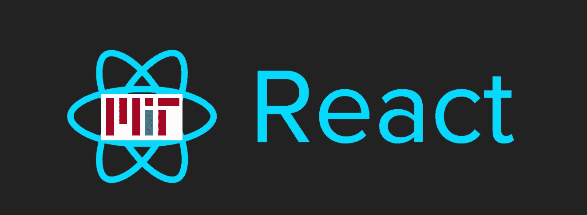

# 4“React 专利许可”争议的教训

> 原文：<https://medium.com/hackernoon/4-lessons-from-the-react-patent-license-controversy-3da3c4baf3a4>

# 从混乱中理出头绪…

在经历了几周的不确定性和来自开发者和主要开源玩家(包括 T2、阿帕奇和 T4、WordPress 和 T5)的批评后，脸书(FB)、T6 宣布他们将会在麻省理工学院开源许可下重新许可他们的 JavaScript 库和其他项目。

许多开发商都松了一口气。然而，围绕脸书的[**“BSD+专利”许可**](https://blog.cloudboost.io/3-points-to-consider-before-migrating-away-from-react-because-of-facebooks-bsd-patent-license-b4a32562d268) **的**讨论揭示了开发人员社区中关于开源许可和专利的几个常见误解**。**

虽然关于“BSD+ Patents”许可的争论现在可能是学术性的，但是**这里有几条开发人员应该记住的要点**(无论是使用 [React](https://hackernoon.com/tagged/react) 还是任何开源项目):

***免责声明*** :我是一名专利律师，我不代表脸书，这只是供参考(不是法律建议)(我忘了什么吗？).

# 1.版权和专利的区别

软件可以与两种主要的知识产权联系在一起:**版权**和**专利**。

如果我写了一些新代码，我就拥有了**版权**。这意味着我(合法地)控制谁能/不能使用我的**代码**。通过开源许可发布它，我给了其他人重用我的代码的权利。在法律术语中，我授予他人‘版权许可’(承诺当你使用我的**代码**侵犯了我的**版权**时不起诉)。

与版权不同，**专利**保护新的特性/功能。如果我开发了一个新的“非显而易见”的功能并获得了专利，我可以在专利的“有效期”(20 年)内阻止其他人制造、使用或销售具有相同**功能**的产品。

考虑一个场景，您从头开始编写一个现有的函数。既然你没有使用过任何人的**代码**，你就不会侵犯任何人的**版权**。但是，如果我在那个功能上有一个**专利**，你仍然可以侵犯我的专利，因为你的产品结合了我的专利**功能** ( *即使你的代码是 100%原创的，没有侵犯任何版权*)。

OSS 许可证附加在源代码上，在解决版权问题上非常有效。然而，**由于*专利权*可以延伸到发布的实际代码之外，OSS 许可证对专利权的处理更加复杂**。

一些开放源码软件许可证，如[阿帕奇 2.0](http://www.apache.org/licenses/LICENSE-2.0) 和 [GPLv3](http://www.gnu.org/licenses/gpl.html) 有具体条款来处理专利权并提供明确的专利许可证。其他 OSS 许可——包括[MIT](https://spdx.org/licenses/MIT)——根本没有提到专利或专利许可。

# 2.麻省理工学院的许可证没有提到专利

麻省理工学院许可证的简短文本在任何地方都没有提到专利。然而，许可证确实说明代码作者授予您:

> “……允许……不受限制地经营软件……”

许多人将此解读为*含蓄地*授予专利许可。毕竟，代码的作者允许你“无限制地”使用代码在这种情况下，**有理由假设作者不会利用他/她的专利来阻止你使用代码**。

不过，归根结底，这只是猜测。据我所知，这一问题从未被提起诉讼，因此没有法院*最终*认定此类默示许可。

# 3.麻省理工学院的“暗示专利许可”可能是有限的

让我们假设麻省理工学院的许可证确实包括一个“隐含专利许可证”。**牌照还有多远？在 React 的案例中，这种暗示许可是否适用于 FB 的所有专利？还是只有其中一部分？**

由于麻省理工学院的许可证是附加在“软件”上的(这里是 React)，我还希望任何“暗示专利许可证”都仅限于“软件”上的专利。所以:

*   涵盖 React 库本身提供的**功能的专利**很可能被隐含专利许可所涵盖。
*   非 React 自身提供的功能**专利**将**非**可能被默示许可所涵盖。

**为了说明**，我们假设:

(a)您使用 React(在麻省理工学院许可下)开发新的虚拟现实社交网络应用程序，以及

(b) FB 拥有(1) React 功能和(2)社交网络、虚拟现实等方面的专利。

在这种情况下，您使用 React，因此“隐含许可”将合理地保护您免受 FB 关于 **React 功能**的专利的影响。但是，FB 在**非反应功能**(社交网络、VR 等)上的专利。)会不会**不会**可能包含在这样的许可证中。

这并不一定意味着 FB *会*试图对你实施这些(非反应)专利。但这确实意味着他们可以。

# 4.理解“防御性”专利

许多公司(无论大小)出于“防御”目的维护专利组合。虽然专利所有者*可以*起诉任何侵权人，但专利诉讼费用昂贵。对于许多公司来说，积极监管专利的成本可能会超过收益(将侵权者从市场中清除出去)。

然而，**如果像 FB 这样的专利所有者被指控侵犯了另一方的专利，FB 可以“挖掘”自己的(大量)专利组合，以确定原告可能侵犯的专利**。这些专利可以成为“反诉”的基础。虽然“两个错误不等于一个正确”，但这种“防御性”反应可以用来解决最初的诉讼或(理想情况下)阻止诉讼开始。换句话说，**许多公司持有专利不是为了起诉你，而是为了阻止*你*起诉*他们*** 。

各种规模的公司都应该仔细考虑这种动态。不管你对软件专利有什么想法，**处于弱势地位(专利方面)会让你容易受到拥有更大投资组合的竞争对手的攻击**。此外，在考虑是否以及如何提起专利侵权诉讼时，在采取行动之前，要仔细评估对手的专利组合。

如果你喜欢这篇文章，请在 Medium 上推荐它(为它鼓掌！)，并分享到 Twitter、LinkedIn 等。

**在** [**Twitter**](https://twitter.com/ArielR_IP) **上随时关注我，并在**[**LinkedIn**](https://www.linkedin.com/in/ariel-reinitz-9149b53)**上与我联系。**