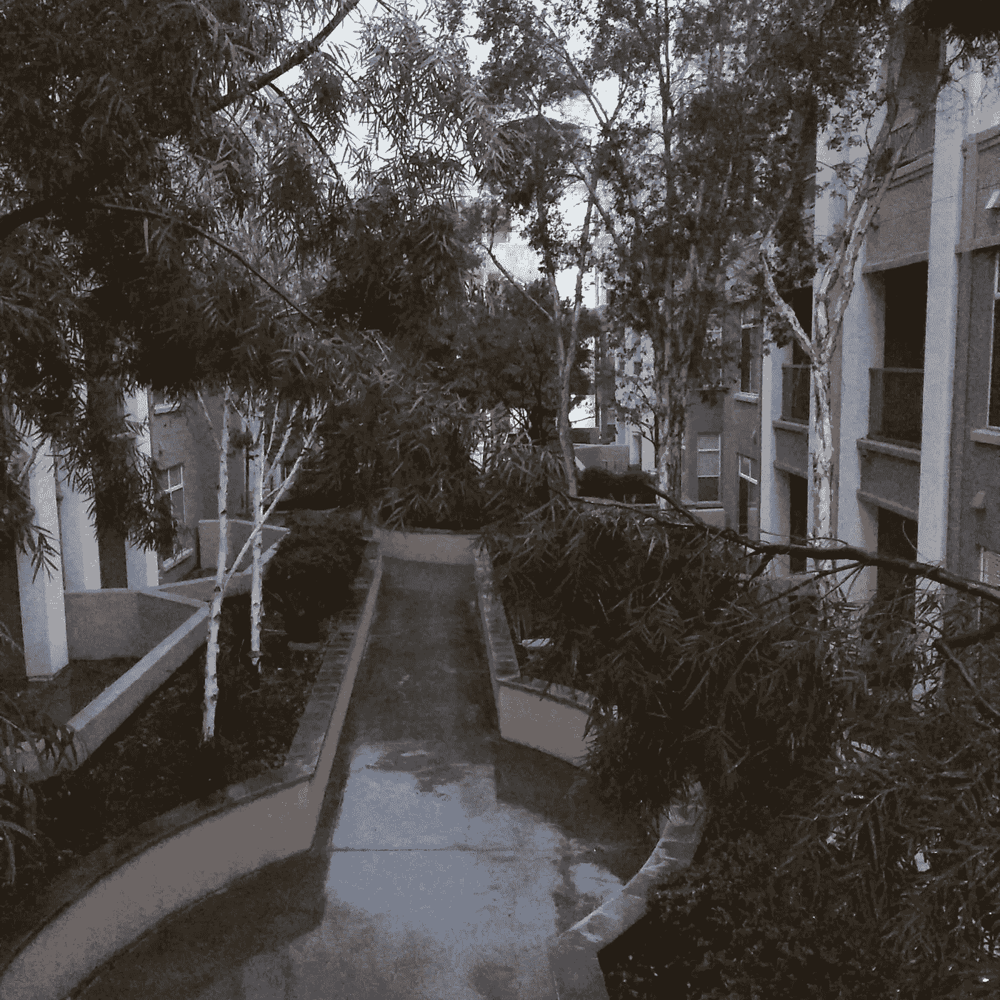

# 4 个月了

> 原文：<https://medium.com/hackernoon/4-months-in-dc045759e163>

三个月过去了，写下在湾区的生活似乎成了一种仪式。每个人都有自己的观点，让我印象深刻的是，每个人都在解决同样的痛点，但几乎没有做什么。我对当地的政治和旧金山的历史了解不多。再说一次，我来自芝加哥，它被夷为平地，并以合理、合理的方式重建，所以我的观点是不正确的。

那我们就开始吧。

# 天气

毫无疑问，这是湾区和芝加哥最明显的区别，尤其是在每年的这个时候。我的公寓还没有开暖气，经常开着窗户和吊扇睡觉。我进出公寓几次后才意识到我是在外面，直到我进入公寓。

早上开始可能是阴天，但当我从航天飞机上下来步行回家时，已经是晴空万里了。从帕洛阿尔托站走到斯坦福，我甚至可以眼冒金星！猎户座腰带最为突出。我不知道怎么会有人在这里学习，我只能猜测教授们觉得他们必须与天气竞争，所以他们的课必须引人入胜，非常有趣。

每天气温在 40 或 50 度。即使是雨也是温暖的。我不知道怎么会有人在这里学习，我只能猜测教授们觉得他们必须和天气竞争，所以他们的课必须引人入胜，非常有趣

在天气方面，我没有什么可抱怨的。

# (因高价引起的)标价冲击

芝加哥和湾区的另一个明显区别。当然，我做了调查，并为成本的巨大差异做好了准备。尽管如此，还是让人大开眼界。

大多数人指向[住房](https://hackernoon.com/tagged/housing)，这肯定是可以理解的。我在温哥华生活和工作了两年，租金也没那么离谱。不管是哪个城市，我都不喜欢住在市区，这很有用。我没有住在温哥华市中心，我没有住在环路或芝加哥市中心，我也没有住在[旧金山](https://goo.gl/5VCLwi)市区。这在温哥华和芝加哥省了一大笔钱，在湾区省了一大笔时间。

# 说到时间…

旧金山的陌生人和无家可归的人告诉我，对于西海岸来说，我走得太快了，带着太多的目的。我需要“冷静下来”。当你到达那里的时候，你会到达那里的。”

时间的概念在这里是矛盾的。[科技](https://hackernoon.com/tagged/tech)行业占据主导地位，所以在产品或市场上击败你之前，需要速度和效率。然而，游览海湾地区需要花费大量的时间。交通非常糟糕，虽然我很高兴我没有车，但交通并不一定能让我更方便。无论哪种方式，都不能操之过急。你真的会说，“到了那里就到了那里，伙计。”

这对我来说是一个困难的方面。我是一个早到的人，绝对讨厌迟到。我会提前两个小时到达机场，在候机楼里漫游，直到登机时间。所以这种“人到桥头自然直”的心态是一个挑战。

# 被 CTA 破坏

人们可以对芝加哥运输管理局提出许多抱怨或批评，但不是它的影响力，也不是它的可靠性，即使是在恶劣的天气里。事实上，令人惊讶的是 CTA 可以在暴风雪中运行。

在我搬出这里之前，我并不完全欣赏 CTA。海湾地区的交通无法与之竞争，也无法与之相比。

我完全被 CTA 宠坏了，我知道我的“正常”期望是不可能的。海湾地区没有一个交通系统能“超额交付”，所以我只能接受它的平庸，用它来到达一个中枢，然后步行去我的目的地。

由此我了解到，为了一个小时的游戏时间(在这种情况下是篮球)往返 4 个小时是不值得的。吸取的教训。

# 最后的想法

海湾地区有许多值得喜爱和享受的地方，也有许多不喜欢、令人讨厌或因沮丧或厌恶而把手举起来的地方。话说回来，每个城市都是这样。温哥华对我来说太小了，芝加哥有它的政治，荒谬的税收结构(云税有人吗？)和怪异的天气。

不过，温哥华有山，冬天也很暖和。天气寒冷，人们并不匆忙，而且是一个非常活跃的城市(二月份在雨中玩极限飞盘是一种体验)。它也是一个友好的城市。在我的公寓里，我是楼层上唯一一个锁门的人。

芝加哥是家，有很棒的博物馆，娱乐场所，去很多地方很容易，还有一条美妙的河边散步和湖滨带，带着奇妙的天际线。也很友好，尽管如果你只看新闻标题，你会很容易看到它。娱乐运动组织有序，交通便利。

海湾地区，嗯，也有好东西。虽然令人惊讶的是娱乐性运动没有更有组织性，但还是有选择和小游戏的。天气太棒了。人们也很友好，他们中的许多人自己进行移植，并回忆起他们最初几个月的生活。

还没准备好注销。事情就这样发生了，所以我很想知道这一年是如何展开的。

> [黑客中午](http://bit.ly/Hackernoon)是黑客如何开始他们的下午。我们是 [@AMI](http://bit.ly/atAMIatAMI) 家庭的一员。我们现在[接受投稿](http://bit.ly/hackernoonsubmission)，并乐意[讨论广告&赞助](mailto:partners@amipublications.com)机会。
> 
> 如果你喜欢这个故事，我们推荐你阅读我们的[最新科技故事](http://bit.ly/hackernoonlatestt)和[趋势科技故事](https://hackernoon.com/trending)。直到下一次，不要把世界的现实想当然！

