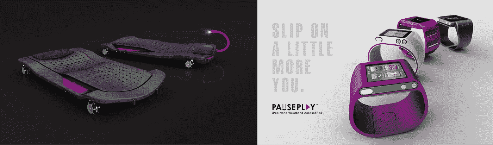
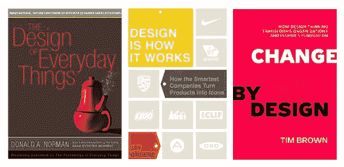
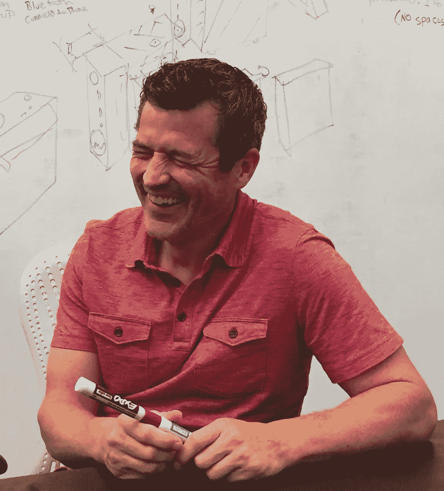
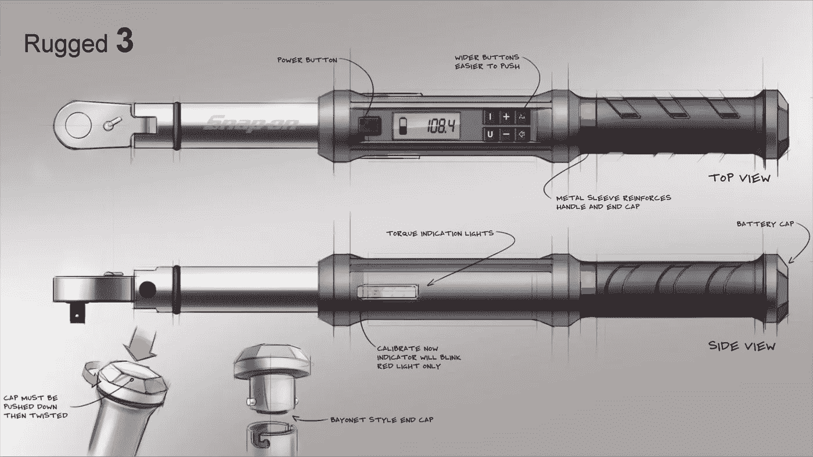
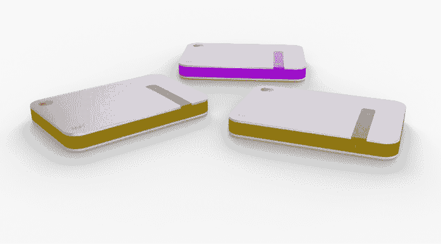
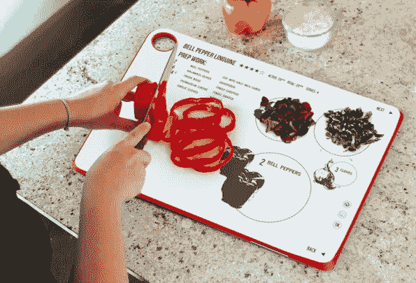
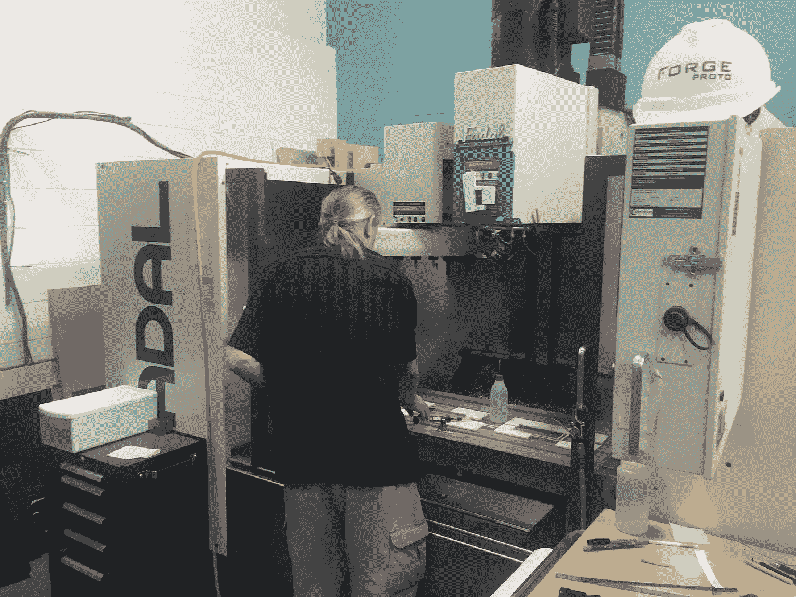

# 来自微软、戴尔、柯达和 Yeti 的工业设计师的 4 个非显而易见的教训。

> 原文：<https://medium.com/hackernoon/4-non-obvious-lessons-from-an-industrial-designer-for-bose-dell-kodak-and-yeti-881177c38a08>

Past work by Axis Design

## 你也是设计师吗？

几年前，像所有非设计师技术人员一样，我陷入了设计/设计思维的误区。我变成了那个讨厌的非设计师，读了唐·诺曼的《日常事物的设计》(T0)(T1)、杰伊·格林的《设计就是这样》(T2)(T3)和蒂姆·布朗的《通过设计改变 T4》(T5)，但我没有称自己为设计师。吸引我们注意力和金钱的产品突然间变成了以设计为中心的产品。现在依然如此。

直到最近我才意识到这对那些受过教育并有多年设计经验的人来说有多讨厌。对于那些人，包括我大学时代的工业设计师朋友，我道歉。

## 变化来了…只有学习者会茁壮成长。

随着建筑环境、技术、能源生产/管理之间的融合步伐加快，我逐渐意识到，所有这些行业的专家都必须在比以前更深的层次上参与进来，而以前我们的行业是孤立的。出于这个原因，我开始花更多的时间与这些行业的专家(建筑师、工业设计师和天生的修补匠)在一起，作为公用事业行业的技术战略专家，这些专家与我越来越相关。几周前，我和三位世界著名的建筑师共进了一顿美妙的午餐，我的所有问题他们都礼貌地回答了，这一定让他们很恼火。对话的中心是*能源世界的大规模经济系统和物理基础设施，以及更有形的使用和体验规模*。我很高兴能继续讨论设计如何成为这些尺度之间的接触点。

很自然地，我的下一次谈话是和一位工业设计师。这是丹·菲普斯最近在他位于德克萨斯州圆石城的[安讯士设计和原型工作室](http://axisdesign.com)的一次聊天。像一个新手，我第一次见到丹的时候，我提出了很多想法，我应该闭上我的嘴只是听。第二次聊天我决定闭上我的嘴，学习设计师如何通过他们的工作将我上面提到的两种尺度结合在一起。

## 不明显的商业教训

丹·菲普斯非常低调。知道我会分享这篇博文让他很不舒服。对于一个为柯达、Crockpot、戴尔、惠普、Bose、宝丽来、SnapOn、Yeti 等标志性硬件产品和品牌工作过的人来说，丹太低调了。处于他的位置，我会制作印有所有这些标志的 t 恤，并贴上“我为他们设计的”字样。一直都是。

除了对设计的思考，丹还分享了一些不太明显的经验，我忍不住与新旧设计师分享。这些经验也适用于我们这些已经工作的人，并且随着所有这些行业的融合，我们将会和设计师一起做更多的工作。

1.  **像了解客户一样多的了解行业环境:**丹分享了一个客户的故事，与他共事很愉快，他有一些很酷的项目。在公司内部，Dan 的客户拥有优秀的产品，这些产品是公司唯一的增长和利润来源。几个月过去了，该组织申请破产，而丹从未拿到工资。更糟糕的是，当丹决定在他的设计工作室里增加一个模特工作室时，他已经向供应商支付了他现在没有得到的报酬。这是从整体上理解行业和市场状况的一课，而不是仅仅关注你为组织内的团队所做的工作。这个故事让我想起了蒂姆·布朗(Tim Brown)在《设计改变》(Change by Design)中分享的一个类似的故事，他谈到了他在 Wadkin Bursgreen company 的出色工作，这家公司现在已经不存在了，设计圆锯和主轴成型机。蒂姆·布朗分享说****作为一名设计师，我不认为木工行业的未来有问题，而不是机器的设计。****’**
2.  ***当客户告诉你他们是谁时，听着:** Dan 发现，他的公司和客户之间的沟通水平是项目进展情况的一个重要指标。它决定了人们对工作的兴奋程度，有助于或阻碍思想的流动。他曾经有一个不善于沟通的客户，尽管如此，他还是希望丹的团队带给他的想法能与他的想法相匹配。这种非交流型风格并不是在项目中途开始的。甚至在签合同的时候，这就是时尚。听信号。讨论的开始是这种接触将如何发展的一个好迹象。*
3.  ***关于无形资产:**用丹自己的话来说，*一个好的客户可以向你传达他们想要的东西。*不可解，异。这不是关于客户告诉设计师做什么，而是客户分享足够多的信息，让设计师知道工作的方向。像“*这样的陈述，我们希望你设计这个新的标记，我们真的需要风格化的帽子*或“*我们对标记的愿景是什么是标记*？是客户方面视野清晰的良好指标。从你的客户身上寻找并培养这种能力。*
4.  ***警惕企业抗体**:携手#2 和#3 是客户组织内部沟通的方式。员工如何在企业内部进行决策？即使客户已经确定了愿景，你也在与客户合作以增强和实现愿景，而且进展顺利，但当他们遇到将变革和新思维视为一种需要被消灭的疾病的企业抗体时，你的接触进展如何？他们存在于所有大大小小的组织中，对项目的成功与否起着重要的作用。*旁注:这和我所在的行业公用事业行业的关系:行业正在发生变化，但行业内外的抗体会抵制和阻止这种变化带来的增长。**

**

*这些经验适用于每个行业，在某个时候，你/我/我们要么是客户，要么是设计师。理解这些事情来管理合约与我们认为客户有多创新没有任何关系。这真的是关于我们沟通的好坏。仔细想想，这四课可以归结为一课；听着。这意味着没有自我，学习的心态和开放的耳朵。这关系到我们是客户还是设计师，我们倾听的程度如何，尤其是在传统上根本不听客户意见的行业。在我们周围快速变化的世界中，这种方式已不再适用…*

**

*The other Daniel on the team at the CNC machine*

*丹·P 给所有年轻设计师的最后一条建议(他已经在这个行业工作了 20 年左右)；努力工作，磨练自己的手艺。“这是关于养成努力工作的习惯，这样当你找到你热爱的事情——一个项目、一个客户、一笔生意——这种习惯就会转化，它会让你在竞争中脱颖而出。”我们不都想在竞争中脱颖而出吗…*

*我会在这里为丹做一个广告(他不会自己做)，如果你正在寻找一个伟大团队的伟大产品设计工作，请查看 axisdesign.com 或发电子邮件给我。*

*请分享、喜欢和做你对 Medium 上的文章所做的一切。在[*【Asha Labs】*](http://www.asha-labs.com)*阅读对最重要行业(公用事业)更关键但相关的分析，或在*[*Harper Jacobs*](http://www.HarperJacobs.com)*寻求代笔(这并不糟糕)。塞伊·法博德是*[*vested world*](http://vestedworld.com)*的运营合伙人。**

******

> *黑客中午是黑客如何开始他们的下午。我们是这个家庭的一员。我们现在[接受投稿](http://bit.ly/hackernoonsubmission)并乐意[讨论广告&赞助](mailto:partners@amipublications.com)机会。*
> 
> *如果你喜欢这个故事，我们推荐你阅读我们的[最新科技故事](http://bit.ly/hackernoonlatestt)和[趋势科技故事](https://hackernoon.com/trending)。直到下一次，不要把世界的现实想当然！*

**