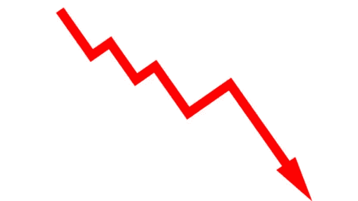

# 当前 ICO 现实的 4 个原因

> 原文：<https://medium.com/hackernoon/4-reasons-icos-will-lose-value-2aac8627d927>

过去的情况是，在 ICO 之后，当代币在交易所变得可用时，价值会上升或保持稳定。

那些日子已经一去不复返了。

在大多数情况下，当代币在交易所变得可用时，代币的价值已经显著下降。

*这一现实将持续下去，原因如下:*

**ICOs 前的营销创造了对代币的兴趣和需求。**一旦 ICO 结束，营销就停止了，兴趣减少了，需求也减少了。

**ICO 的代币价格由卖家设定。**

开发是艰难的，而且几乎肯定会比预期花费更长的时间。随着承诺的兑现，对项目的价值和信心逐渐减少。

采纳总是被高估或忽视。为了存在真正的价值，需要采纳。人们忽略了采纳的需要，或者基于某些信号高估了采纳的速度。

*当发生以下情况时，该趋势将反转:*

**ico 变得价格合理。**

**在这些项目中建立适当有效的治理/问责制。**