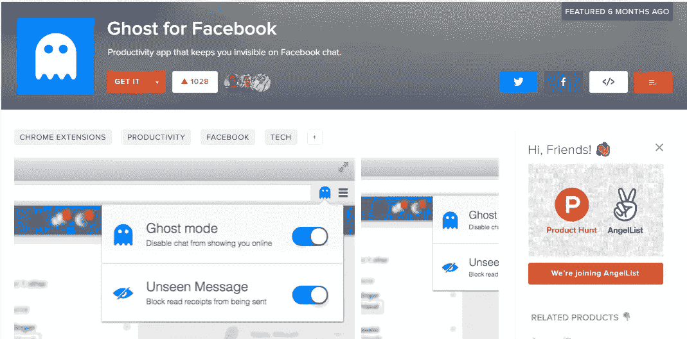

# 帮助我推出两款产品的 4 条规则

> 原文：<https://medium.com/hackernoon/4-rules-that-helped-my-launch-2-products-d554574c414a>

在产品搜索上发布产品？我可能有一个或四个见解给你…

在我的一个产品通过了 1000 次投票，并因此获得了[金猫提名](https://www.producthunt.com/posts/ghost-for-facebook-3)，并在发布日[凭借第二个](https://www.producthunt.com/posts/email-list-verify)产品赢得了技术第一名之后，我认为我可以分享我的战略了，这很简单，而且对我很有效。

1.  在社交媒体和论坛上发出前所未有的声音。提前加入团体，在那里互动，与人交谈，交朋友，不要害怕尽可能努力，如果你值得，他们会投票。
2.  牵着你认识的每个人的鼻子走，带领他们为你投票和评论，没错，你的人脉是基础，他们提供下一步需要的社交证明。
3.  在启动之前拥有一个社区，即用户或与管理社区的人联系，并从他们那里获得帮助(当然只是为了换取以前提供的价值，这可能也需要一些时间来建立)。
4.  列一份相关记者的名单，给他们发一封关于发布的邮件，最好是前一天。这样他们会跟踪发射。不要期待任何东西，他们可能在同一天或几天后发表，或者根本不发表，这取决于他们。即使他们没有回复，他们也是圈内人，当你把事情做大的时候，他们会收到你的邮件。

这些行动可能会帮助你进入 1000 俱乐部，并从那里获得足够的关注，从而被提名金猫奖。

我很想知道你的发布策略…如果这篇文章对你有所帮助，我真的很感谢你投票支持我获得 2016 年金猫奖提名，[这是我的应用](https://www.producthunt.com/posts/ghost-for-facebook-3)。

更新:[我们获得了 2016 年最佳 Chrome 扩展的亚军](/@producthunt/the-best-technology-products-of-2016-cea5f922e014#.1w3nz5vbs)！谢谢大家的支持！:)

> [黑客中午](http://bit.ly/Hackernoon)是黑客如何开始他们的下午。我们是 [@AMI](http://bit.ly/atAMIatAMI) 家庭的一员。我们现在[接受投稿](http://bit.ly/hackernoonsubmission)，并乐意[讨论广告&赞助](mailto:partners@amipublications.com)机会。
> 
> 如果你喜欢这个故事，我们推荐你阅读我们的[最新科技故事](http://bit.ly/hackernoonlatestt)和[趋势科技故事](https://hackernoon.com/trending)。直到下一次，不要把世界的现实想当然！

