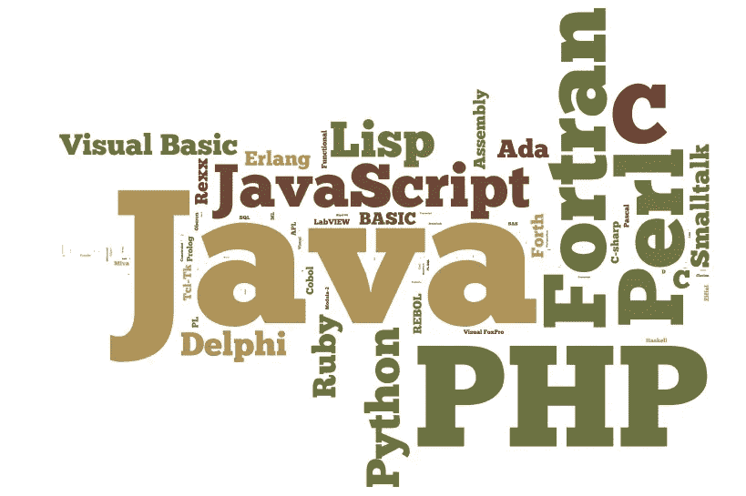

# 学习如何编码的 4 个启动平台

> 原文：<https://medium.com/hackernoon/4-startup-platforms-for-learning-how-to-code-8b8a29db183b>

开始很难。直到现在，我仍然试图寻找其他资源来自学编程语言。我用一对夫妇，并发现一对夫妇，将足智多谋，为你们所用。

## 1.乌达城

*   在这个网站上，你可以了解每一种语言，而不仅仅是语言。如果你像我一样在努力理解如何在 [Udacity](https://hackernoon.com/tagged/udacity) 编写计算机语言，他们会给你最简单的课程。这是我的头号[资源](https://hackernoon.com/tagged/resources)。我每天都用它！！

## 2.乌德米

*   我个人没有用过这个，因为我没有兴趣付费，但它值得付费(我只是想节省其他资源。)在 Udemy，他们教你如何编写这种语言，以及如何将它投放市场。也很推荐。

## 3.代码集

*   在我看来，这个网站适合我。这并不是一开始，但一旦你完成了 Udemy 或 Udacity 的课程，它就会变得非常有用。

## 4.开源代码库

*   你不仅可以从其他开发人员那里学习代码，还可以为自己和其他开发人员编写代码。这只是另一种亲身体验。

我希望我给了你们一个平台，让你们在编码方面有一个良好的开端。如果您有任何问题，请在下面评论！