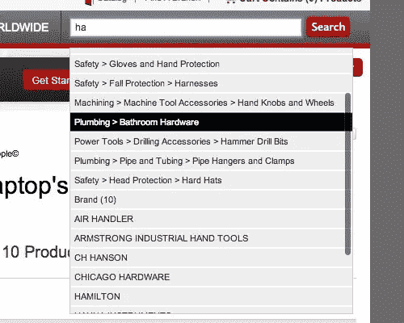
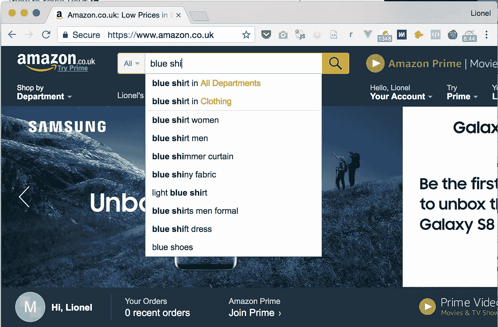
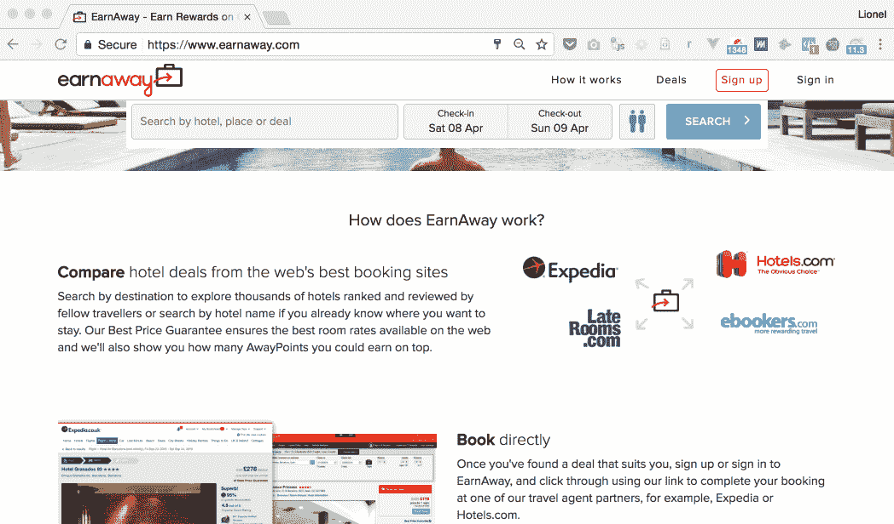
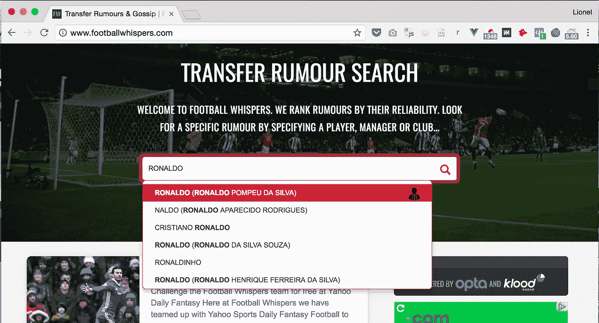
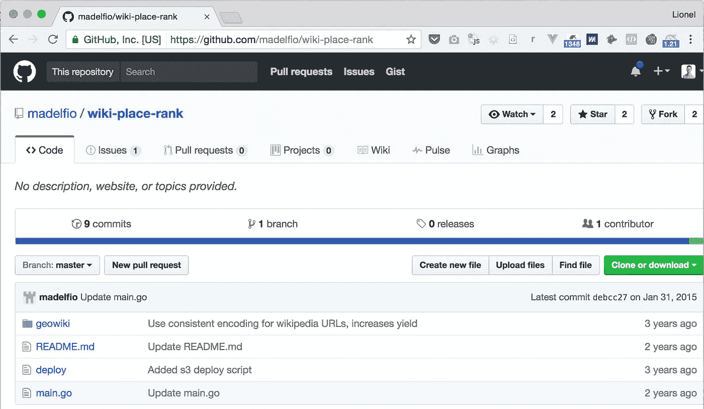
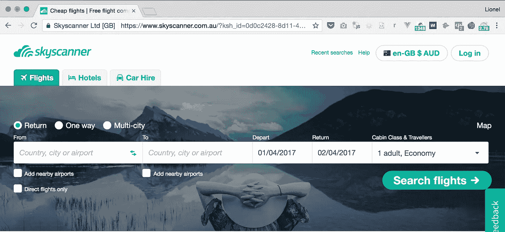
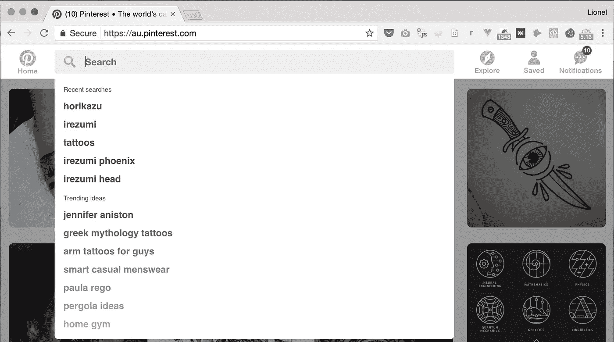
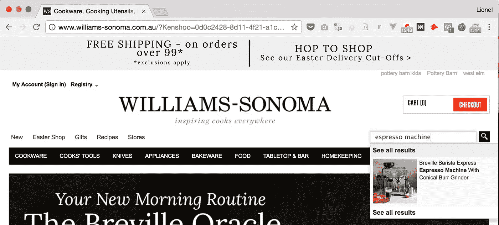

# 设计用户会回来的搜索体验:网络平台所有者指南

> 原文：<https://medium.com/hackernoon/4-steps-to-designing-a-delightful-search-experience-for-your-web-platform-3f05d78a8ebc>

在我开发的市场中，[搜索](https://hackernoon.com/tagged/search)是唯一最有影响力的功能，也是最难以实现的功能。

在这篇操作指南中，我分享了你可以为你的网络[平台](https://hackernoon.com/tagged/platform)考虑的不同搜索体验，解释了哪些设计和实现相当简单，哪些对你的业务更有意义。我从我开发的平台以及其他流行的网络平台的搜索功能中吸取了一些例子。

# **使用适当类型的建议**

首先，对你来说，知道你想给你的用户提供什么类型的搜索栏(和下拉列表)是至关重要的。在很高的层次上，有两个选项:

**随键入搜索:**这是搜索栏的行为，它会在你键入时给出实际的结果。如果你的网络应用是围绕一个可能结果的固定数据集来组织的，例如，如果你的用户正在寻找另一个用户名、汽车型号、餐馆名称等，这种方法会非常有效。
在这种情况下，您的用户可能会搜索他们心目中的商品，而不是浏览列表。

**基于关键词的建议:**如果你的 web 应用是一个市场，其中的列表是用户生成的内容，那么你就没有固定的结果集。通常，您的用户会搜索一个术语并浏览选项列表(产品、供应商、报价等)
一个例子是分类广告平台:
-您的用户会希望浏览特定类别中某一种类的许多不同产品的列表
-您的用户通常会键入关键字、品牌、通用产品名称或产品型号。

对于关键字建议，方法是完全不同的，因为它不能基于您的平台数据:
-从文本数据中提取有意义的关键字是极其困难的
-即使您可以，通过在您的建议中显示用户生成的内容，您可能会有不那么有趣的结果，可能会对您的用户体验产生负面影响。

Too complicated!

所以，第一步是定义你的用户希望看到这两个常见搜索中的哪一个。

**自动或手动搜索范围:** 如果你的用户有机会从一开始就确定搜索范围，你的应用搜索结果将会更加相关。范围可以是要搜索的类别，也可以是品牌、城市等。它可以帮助你的用户在最少的尝试和点击中找到他想要的搜索结果。
在搜索时，您可以提供手动范围(通常是搜索栏附近的下拉菜单)，也可以在建议中提供自动范围。

Amazon offers a category scope both in a dropdown (left-hand side) and in-results.

最后，如果你有少于 5 个主要类别，你应该考虑在一个名为多重搜索的表单中对建议进行分组，这让我想到…

# 把它和多重搜索混合起来

多重搜索包括按预定义的类别对结果进行分组。它更适用于提供有限的可能结果列表的网络平台，比如下面的 EarnAway.com。你能选择的地方和酒店就这么多。你可能会搜索城市、邻居、机场或酒店的确切名称。对于 EarnAway，我们建议同时选择地点和酒店。当结果不如其他类别相关时，类别可能会在您键入时消失。

Ultra-fast multi-search on EarnAway.com

**模糊搜索，符号，缩写..** 当你在那里的时候，你会想要支持少量的偏差，比如错别字、符号和缩写(稍后会有更多的介绍)。

# **建立建议数据库**

现在您已经知道哪种建议最适合您的平台，您将需要生成适当的数据集。对于随键入搜索的建议，您需要将您的产品数据库编入搜索引擎，并对其执行全文搜索。基于关键字的建议更具挑战性，因为关键字很难生成。您可以通过抓取来生成它们，但是最好的办法是购买现成的数据库。

## 用地理数据自动完成

大多数人认为谷歌地图自动完成在这一点上，但有几个捕捉。Google Places 搜索小工具无法控制用户体验。你必须使用他们的下拉菜单，你必须显示“由谷歌提供动力”的标志，你只能显示地点的结果，例如，你不能像上面的多重搜索例子一样，把它和你自己的平台产品混合在一起。

如果您需要的只是一个位置查找栏，它将使用纬度/经度查询您平台的数据库，您就可以了。其他任何东西，你很快就会被使用条款所限制。

> 您不得使用 Google 的内容或服务来创建或扩充您自己的(或第三方的)地图相关数据集，包括地图或导航数据集、企业名录数据库、邮件列表或电话销售列表

严禁将来自此小部件的数据保存到您的数据库中，或用它来增强您的数据。如果您通过这个小部件获取了用户的邮政地址，您就违反了使用条款。

那么有什么选择呢？

像开放街道地图这样的开源替代品会带来非常不一致的数据，尽管你可能会幸运地使用 Geonames.org OSM 的子集。另一个不错的选择是[Geopostcodes.com](http://geopostcodes.com)(纬度/经度精确到街道级别，世界上任何地方)。

An Amazon-like prototype to estimate shipping cost, on a French auction platform

两者都是你需要下载的数据库，在你的数据库中播种，这只是工作开始的地方。搜索结果需要根据你的需求进行筛选，更重要的是，要进行排名。

**排名建议** 搜索最难的是相关性。您希望首先显示最有可能的选项。什么可能性更大？
-您的用户正在搜索英国伦敦，而不是安大略省伦敦
-您的用户正在寻找罗纳尔多，而不是不太知名的罗纳尔多

Not quite right yet — Cristiano Ronaldo should come first

对于上面的足球悄悄话，一个解决方案是用球员受欢迎程度的排名来增加我们的球员数据库。这不是你能从当地的乐购买到的那种数据集，所以这就是你需要创新的地方。

在这种情况下，由于我们有了他们的 Twitter 账号，我们一直在下载他们的关注者数量作为流行度指标，并排序显示最受欢迎的建议。

对于您的 web 平台，度量标准可能会有所不同。对于 EarnAway，我们一直在关注人口指标，但也根据每个地点附近的酒店数量计算“旅游”得分。一个强大的 AWS 服务器花了 8 天 8 夜来处理这个分数，但它仍然感觉不对劲。旅游景点的地标本身并不一定受欢迎。

所以，我们决定从维基百科中提取流行度。通过对维基百科的数据拷贝(40GB 未压缩！)，我们已经能够得到地标的受欢迎指数。然后花了几天时间进行处理，但是建议的质量立即提高了。

The GoLang script we used to PageRank Wikipedia

最后，你也可以根据你当前的用户(他的位置，配置文件设置或搜索历史)对搜索结果进行排名。这被称为*偏向搜索*，可以在 Google Places 自动完成中配置，以便返回给定坐标集周围的结果。

# **清晰格式化搜索结果**

在对你的建议数据库进行整理、组织成多重搜索、对你的数据进行排序等所有这些工作之后，如果不把它做得好看一点，那就太可惜了，不是吗？

这些是你在设计搜索栏时应该考虑的因素:

1.  **Placeholder** :抓住机会，通过显示支持的搜索查询来帮助你的用户。一个通用的“在此搜索”占位符不会给出任何线索。

“Country, city or airport”

**2。突出显示用户搜索词**:参见上面的亚马逊截图。

**3。在建议中包含搜索历史**:为什么不在用户点击搜索输入之前显示一些有用的内容:

Pinterest showing grouped suggestions before I start typing

**4。没有结果时的后备计划**:如果你的搜索没有找到相关的建议，你有什么计划？

**5。避免滚动条**并保持建议数量可控，最多 15 条

**6。支持键盘导航**(上、下、回车)

7.**在适当的时候使用图像**

Williams-Sonoma showing product images in suggestions

那么建议之后是什么呢？在下一篇文章中，我们将讨论展示你的平台产品列表的最佳方式，以确保你的用户享受搜索体验，并找到他想要的东西。

# **技术实现**

我将在另一篇文章中详细讨论这个话题。我们将看看如何使用 ElasticSearch 和 PostgreSQL 全文搜索特性实现高性能的建议和搜索。

告诉我，就搜索体验而言，你最喜欢哪个网站？本文中描述的哪些功能可以立即改善您自己的网站？

*莱昂内尔是总部位于伦敦的初创公司 Wi5 的首席技术官。你可以在*[*https://getlionel.com*](https://getlionel.com)上联系他