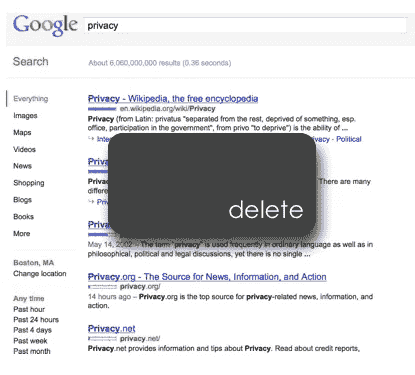
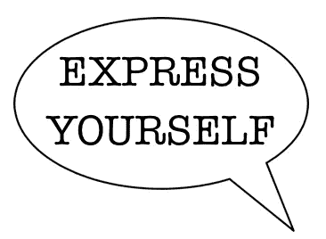
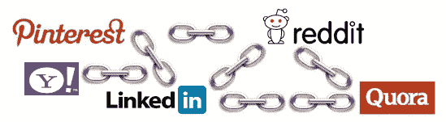

# 降低负面搜索结果的 4 个步骤

> 原文：<https://medium.com/hackernoon/4-steps-to-lower-your-negative-search-results-4ca2591e3daa>

威尔·西蒙兹

> 披露:[在线隐私公司 Abine](https://goo.gl/3iEZxb) 曾赞助过黑客 Noon。 [**他们招牌产品七五折，模糊&删除我**。](https://goo.gl/Uk2QUH)

在一个完美的世界里，我们能够删除所有关于我们自己的不公平、过时和负面的搜索结果。事实上，除非在特殊情况下，大多数内容都会存在。删除你能删除的，但是创建你自己的正面内容来抑制负面内容是控制你的形象和改善你的搜索结果的一个很好的方法。那么，如何把负面搜索结果往下推呢？

请注意，如果你想从网上消失，这不是你的解决方案。你会创造出更多关于你的内容，但是你会把天平从消极转为积极。

# 步骤 1:为自己创建和管理公共配置文件

某些网站总是出现在搜索结果的前列。只需用你的名字和一些身份信息创建一个个人资料，你就可以抑制负面结果。请确保将您的隐私设置设为公开查看，并且只发布您绝对确定以后不会后悔的内容。以下是可供使用的网站列表:

如果你不能删除不好的东西，那就用好的东西来埋葬它。

*   [推特](http://twitter.com/)
*   [领英](http://www.linkedin.com/)
*   [我的空间](http://www.myspace.com/)
*   [脸书](http://www.facebook.com/)
*   [谷歌+](https://plus.google.com/getstarted)
*   [Formspring.me](http://www.formspring.me/)
*   [正方形](http://foursquare.com/)
*   [关于。我](https://about.me/)
*   [Pinterest](http://pinterest.com/)
*   [博主](http://blogger.com/)
*   [Tumblr](http://tumblr.com/)
*   [摄影桶](http://www.photobucket.com/)
*   [Quora](http://www.quora.com/)
*   [磕磕绊绊](http://www.stumbleupon.com/)
*   [Reddit](http://www.reddit.com/)
*   [Digg](http://www.digg.com/)
*   [Plixi](http://www.plixi.com/)
*   [雅虎脉动](http://pulse.yahoo.com/)
*   [Flickr](http://www.flickr.com/)

# 第二步:在新闻文章、论坛和社交媒体上公开发表评论

麦当娜参考:嘿嘿嘿嘿。

你也可以使用你的真实姓名在新闻网站上注册，并对文章发表评论，尽管这些类型的帖子往往不如上面列出的网站排名高。如果你做好了自我审查的准备，用真名发帖可能是推销自己的明智策略。知道你在网上说的任何事情都可能在有人搜索你的时候出现，利用你的帖子为你服务:发布有智慧的、语法正确的、拼写检查过的、理由充分的内容。在你想立足的领域表现自己。

# 第三步:链接你的各个网站

链接你的网站，使他们都排名更高。

谷歌确定一个网站在搜索结果中排名的方法之一是分析其他网站链接到它的次数。你可以让你的内容上升，通过链接到它本身。例如，创建一个 twitter 帐户，将其连接到您的 formspring 帐户，将这两个帐户连接到您的脸书页面，并在您的 Blogger 页面上链接到所有帐户。当然，你越是使用你的账户并与其他人互动，他们就越有可能链接到你的内容，从而推动你的结果更高。

# 第四步:收回负面关键词

如果对你的名字的搜索通常是正面的，但是包括一个特定的关键词会带来负面的或者不想要的结果，试着重新使用那个词。假设对“John Doe”的搜索是肯定的，但是“John Doe”+“State College”带来了否定的结果。John Doe 应该开始在他的正面内容创作中包括短语“州立大学”,以便将其与他的良好声誉相关联。

网上有没有让你或你认识的人念念不忘的东西？你如何看待搜索引擎和互联网阻止我们把过去的事情一笔勾销？在下面评论，让我们知道你的想法。