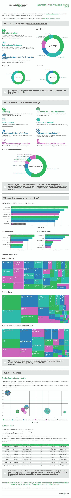

# 我们从 15，945 条澳大利亚 ISP 评论中学到的 4 件事

> 原文：<https://medium.com/hackernoon/4-things-we-learned-from-15-945-reviews-of-australian-isps-40a4ca867a96>

对于消费者来说，他们最重要的关系之一是与互联网服务提供商(ISP)的关系。互联网就像氧气，当我们无法接触到它时，我们会感觉自己快要淹死了。无论是工作、交流还是娱乐，互联网(以及提供互联网服务的互联网服务提供商)都是一个我们觉得不可或缺的连接。

澳大利亚的互联网服务提供商在关于速度、价格、NBN 和客户服务的讨论中充满激情。有了比以往更多的选择， [ProductReview](http://www.productreview.com.au/) 希望深入了解澳大利亚互联网服务提供商的表现。我们分析了收到的 15，945 条评论，以及在过去 12 个月中对我们的 [ISP 类别](http://www.productreview.com.au/c/internet-service-providers.html)进行研究的 542，169 名消费者。

通过查看这些数据，我们发现了四个关键点:

**消费者正在阅读评论内容:**虽然收视率和评论数量是头条新闻，但评论内容才是真实的故事。研究多个 ISP 的消费者会通读评论。这是他们购买旅程的重要组成部分，他们阅读的内容会影响他们的决定。澳大利亚消费者不仅想看评论；他们现在希望阅读评论。

**客户体验很重要:**在过去几年中，客户体验一直是一种增长趋势。在像 ISP 这样竞争激烈的领域，客户体验是赢得、服务和留住客户的关键。随着网速、价格和套餐变得越来越商品化，客户体验通常是发展 ISP 业务的唯一途径。

**中型品牌正在赢得这场战斗:**像 Mint [Telecom](https://hackernoon.com/tagged/telecom) 、Boom Broadband、MATE Communicate、Tangerine Telecom、Australia Online 和 Skymesh 这样的互联网服务提供商正在利用客户体验作为吸引消费者的关键优势。这些互联网服务提供商一直拥有良好的客户反馈，他们正在利用这一点来赢得业务。

**较大的品牌正在输掉这场战争:**较大的互联网服务提供商，如 TPG、begin、iiNet、Dodo、Optus 和 Telstra Broadband 的得分都低于类别平均水平。消费者花在研究这些品牌上的时间通常是最多的，这意味着对现有购买途径的潜在破坏。消费者阅读差评的时间可能是阅读好评的五倍。

为了提供更多的信息，我们制作了一个信息图，提供了我们收到的评论、消费者研究以及哪些 ISP 评分最高、评论最多和最受欢迎的数据。您可以查看下面的信息图或单击链接在线查看互动版本。你也可能对早先的一篇文章感兴趣，[“为什么澳大利亚的互联网服务提供商正在流失客户(他们可能还不知道)”](http://www.linkedin.com/pulse/how-australian-isps-losing-customers-probably-dont-know-chris-perrine)。

# [互联网服务商:2017 年 3 月互动信息图](http://infogr.am/productreview_internet_service_providers)

> [黑客中午](http://bit.ly/Hackernoon)是黑客如何开始他们的下午。我们是 [@AMI](http://bit.ly/atAMIatAMI) 家庭的一员。我们现在[接受投稿](http://bit.ly/hackernoonsubmission)并乐意[讨论广告&赞助](mailto:partners@amipublications.com)机会。
> 
> 如果你喜欢这个故事，我们推荐你阅读我们的[最新科技故事](http://bit.ly/hackernoonlatestt)和[趋势科技故事](https://hackernoon.com/trending)。直到下一次，不要把世界的现实想当然！

