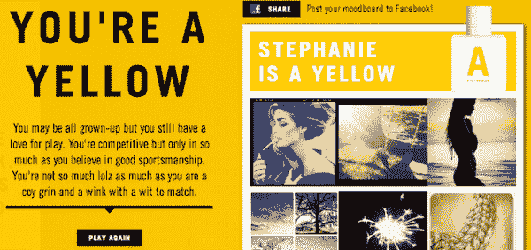
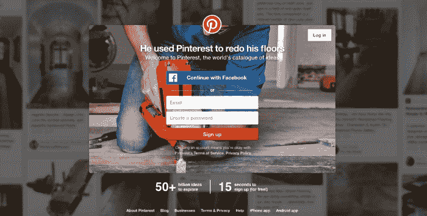
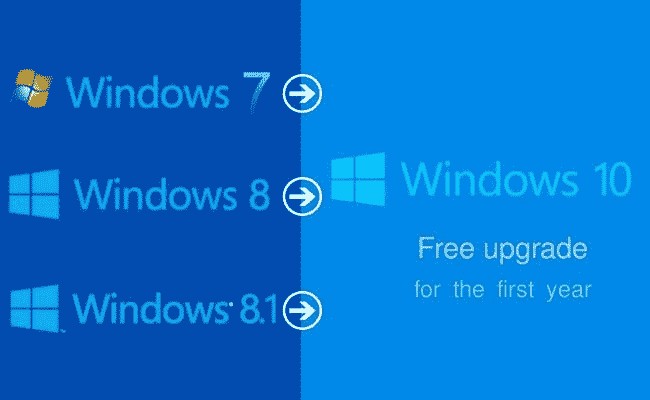
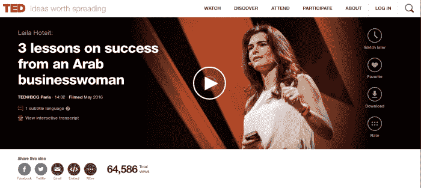

# 4 个网站设计技巧

> 原文：<https://medium.com/hackernoon/4-tips-to-create-an-extremely-addictive-website-7328eced4c68>

## 奥尔多是如何通过其 Instagram 活动抓住它的

在你漫长的一天中，你可能已经**花了**几个**小时** **在线**寻找下一个分散注意力的事情。据统计，员工在工作时间访问较多的网站有[脸书](https://medium.com/u/25aae929dbb1?source=post_page-----7328eced4c68--------------------------------)、 [BuzzFeed](https://medium.com/u/ef7ccf89e7dc?source=post_page-----7328eced4c68--------------------------------) 和 **YouTube** 。

毫无疑问，这些给了我们一个立即逃离不断困扰我们的政权的机会。

现在，为了营销人员的利益，设计师和所有关心他们的网站和业务的人需要清楚地**了解**是什么刺激了对这些网站的**上瘾**。

也许，了解让我们不断回头的原因可以提供有价值的见解，帮助我们在建立自己的网站时模仿精英中的精英。

## **用户是玩家—** [**游戏化**](https://www.google.co.in/url?sa=t&rct=j&q=&esrc=s&source=web&cd=1&cad=rja&uact=8&ved=0ahUKEwiK_5Sh2afXAhWMQ48KHamlCp4QFggnMAA&url=https%3A%2F%2Fen.wikipedia.org%2Fwiki%2FGamification&usg=AOvVaw3lxc0znc5qpjAT0B5QpiHc)

你和孩子们一样欣赏好游戏吗？近年来，最热门的趋势冲击互联网空间的商业手段，越来越多的公司意识到一个令人上瘾的网站的重要性。这种方式(有吸引力的设计)可以增加网站上的客户参与度。

除了生意之外，顾客们还因为把他们生活中艰难的部分变得无趣而得到了娱乐。**通过游戏化**，可以驱动、衡量、奖励客户的行为。通过为你的客户和潜在客户创造一个**惊人的体验**，你可以达到你设定的转化目标。

> **战术 1:** 别忘了打赏
> 
> 策略二:避免过多的游戏
> 
> **例如**:就像**奥尔多**所做的那样，将产品的颜色与顾客的个性联系起来。脸书上的一款游戏，用户登录后会被带到“情绪板”,在这里他们可以从 Instagram 上挑选图片，并将其链接起来，显示他们的个性。

## **奥尔多 INSTAGRAM MOODBOARD**

## [**奥尔多举例**](https://www.google.co.in/url?sa=t&rct=j&q=&esrc=s&source=web&cd=1&cad=rja&uact=8&ved=0ahUKEwjtrqeq2afXAhUBo48KHVcNAZIQFgg0MAA&url=https%3A%2F%2Fwww.aldoshoes.com%2Fus%2Fen_US&usg=AOvVaw3UUXcRgRVsJ2FmS6NkQ935)

## **观众的选择很重要**

首先，关注你的目标受众。安全地假设谁可能是你的网站访问者，这样你**就能为他们创造有吸引力的**和**高质量的图片**。网站应该组织得很好，帮助用户不用离开你的网站就可以很容易地浏览他们喜欢的东西或在特定的类别中搜索。

对于任何网上商店来说，让顾客只需点击一下鼠标就能买到商品，这一点太重要了。一般来说，**通过了解你的目标受众**，你可以交付一个 [**无缝的用户体验**](https://www.google.co.in/url?sa=t&rct=j&q=&esrc=s&source=web&cd=2&cad=rja&uact=8&ved=0ahUKEwiwz-m22afXAhXKLY8KHU0dDLkQFggsMAE&url=https%3A%2F%2Fen.wikipedia.org%2Fwiki%2FUser_experience&usg=AOvVaw2P_bmmozsS9HyTZydHt90V) 。如果你正准备创建一个网站，考虑先画出流程图。明确你想在你的网站上包含什么，以及它与你的访问者有多匹配。

这样，确保你网站上的所有文字不仅写得好，而且足够清晰。没有什么比访问一个色调不相关的网站更烦人的了。

这同样适用于书写标题、菜单和其他内容。作为一个有凝聚力的品牌，一个网站必须完全有意义。**问问自己**你的网站与你所推广的品牌之间的联系。答案应该永远是令人共鸣的“是”。

> **战术 1:** 停止困住访客【例如:“注册”弹出窗口必须有“稍后展示”或“返回主页”按钮】
> 
> **战术 2:** 让它移动友好
> 
> Pinterest 非常了解它的访问者，70%的用户是女性。

我是个女人，我知道这有多让人上瘾！

## 提出一个他们无法拒绝的报价

这次有什么特别的？微软新版 Windows 10 的下载量达到了 7000 万次。通过免费提供新版本，微软能够通过引发开发者的早期兴趣来利用数百万用户。

相比之下，通过向用户提供免费服务，公司可以很容易地建立用户群，也可以迅速增加客户获取的数量。我们知道有几个因素会阻止访问者购买我们的产品， [**价格起主要作用。**](https://www.google.co.in/url?sa=t&rct=j&q=&esrc=s&source=web&cd=1&cad=rja&uact=8&ved=0ahUKEwiyqKjO2afXAhWMpY8KHTR4CeEQFggnMAA&url=https%3A%2F%2Fwww.nickkolenda.com%2Fpsychological-pricing-strategies%2F&usg=AOvVaw22YFWeEr7PhF-9JUM1CZue)

你通过免费销售你的产品占据了上风，完全消除了用户在购买产品时通常会问的问题，**“我需要为此付费吗？”**。免费提供你的产品的一部分是提高客户诚信度的一个很好的方法，他们也可以了解你的业务，而不需要考虑钱的问题。

没有必要有一个 [**免费增值商业模式**](https://www.google.co.in/url?sa=t&rct=j&q=&esrc=s&source=web&cd=3&cad=rja&uact=8&ved=0ahUKEwjS3ITY2afXAhWEtI8KHQXtDAgQFggvMAI&url=https%3A%2F%2Fen.wikipedia.org%2Fwiki%2FFreemium&usg=AOvVaw0IYHJ8T2p5wYRaZXr3mkgE) ，相反，你可以利用免费的小服务或免费咨询。

> **个人建议:**提供免费试用或样品，对你的潜在客户大有帮助。

## [**微软的 WINDOWS 10**](https://www.google.co.in/url?sa=t&rct=j&q=&esrc=s&source=web&cd=1&cad=rja&uact=8&ved=0ahUKEwjJ29Hf2afXAhUlSY8KHXApCMoQFggnMAA&url=https%3A%2F%2Fwww.microsoft.com%2Fen-in%2Fwindows%2F&usg=AOvVaw0AwELCXM9i-injr3PnYcAS)

## [**视频是必不可少的一部分**](https://www.google.co.in/url?sa=t&rct=j&q=&esrc=s&source=web&cd=1&cad=rja&uact=8&ved=0ahUKEwjpzpHq2afXAhWJv48KHSI-BhMQFggnMAA&url=https%3A%2F%2Fdigitalmarketinginstitute.com%2Fblog%2F5-secrets-super-successful-video-marketing&usg=AOvVaw2xM3tHDafM-Jp1cpBhJVVX)

说到创建一个有吸引力的网站，视频的作用是巨大的。

如今，每家公司都比以往任何时候都更加明白，视频在创建一个成功网站的过程中扮演着关键角色。虽然**吸引了顾客的注意力**，但它以简单而有意义的方式传递了广泛的品牌信息。

进一步看，数据证明，平均观看视频的网民数量已经跨过 **1 亿**。它在购买决策中也起着重要的作用。不管视频有多长，你只有 10 秒钟的时间来抓住观众的注意力。

更深入地说，大约在 **20%的访问者**在 **10 秒**内离开网站，这显然使得 **60%的访问者**在 **2 分钟**内离开网站。为了打造一个真正有效的网站，关注[**视频分析**太重要了。](https://www.google.co.in/url?sa=t&rct=j&q=&esrc=s&source=web&cd=1&cad=rja&uact=8&ved=0ahUKEwj9mr2C2qfXAhWKrY8KHUxPAUEQFggnMAA&url=http%3A%2F%2Favigilon.com%2Fproducts%2Fvideo-analytics%2Fvideo-analytics%2F&usg=AOvVaw2MRMdvjT7InXIJqxk23m4-)

## [**TED 演讲**](https://www.google.co.in/url?sa=t&rct=j&q=&esrc=s&source=web&cd=1&cad=rja&uact=8&ved=0ahUKEwiLsMiI2qfXAhWDuI8KHVynCREQFggnMAA&url=https%3A%2F%2Fwww.ted.com%2F&usg=AOvVaw38w6rMJjoK8HD-A9uA6afX)

我们通常所说的最好的设计是与主题相关的。研究表明，人们总是更喜欢好看的，更可能是值得信赖的网站。

但是，创建一个美观的网站不可能永远成功。为了一致的立场，努力创建一个整体用户体验更好的网站是很重要的。

有了 [**市场上的网络分析软件**](https://www.google.co.in/url?sa=t&rct=j&q=&esrc=s&source=web&cd=1&cad=rja&uact=8&ved=0ahUKEwivq6SR2qfXAhWEuI8KHd0IBqsQFggnMAA&url=https%3A%2F%2Fen.wikipedia.org%2Fwiki%2FWeb_analytics&usg=AOvVaw3NsNmqceXCOjlgjQfuVnPA) 可以给你所有需要的信息，这反过来又会让你的网站有更高的对话率。