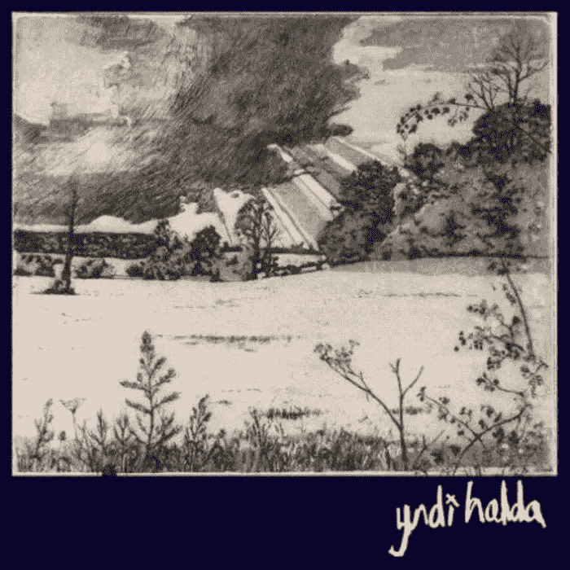
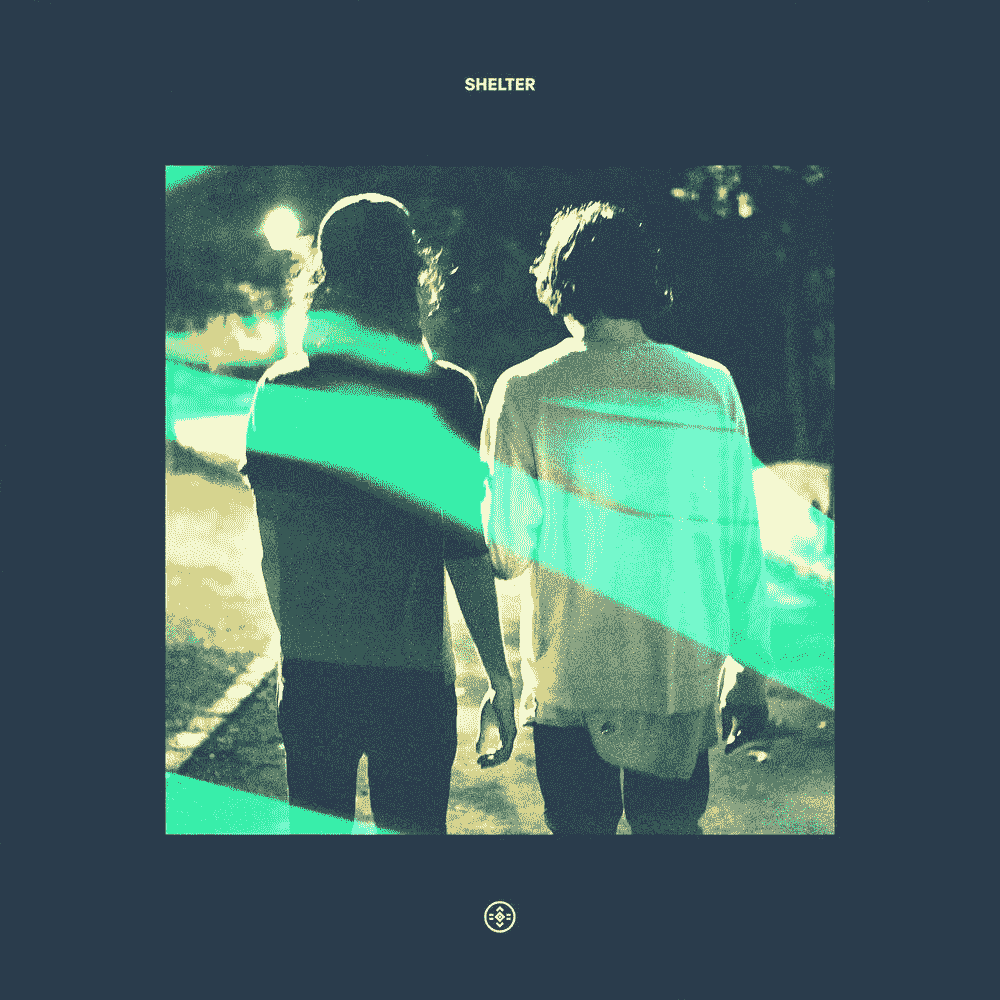
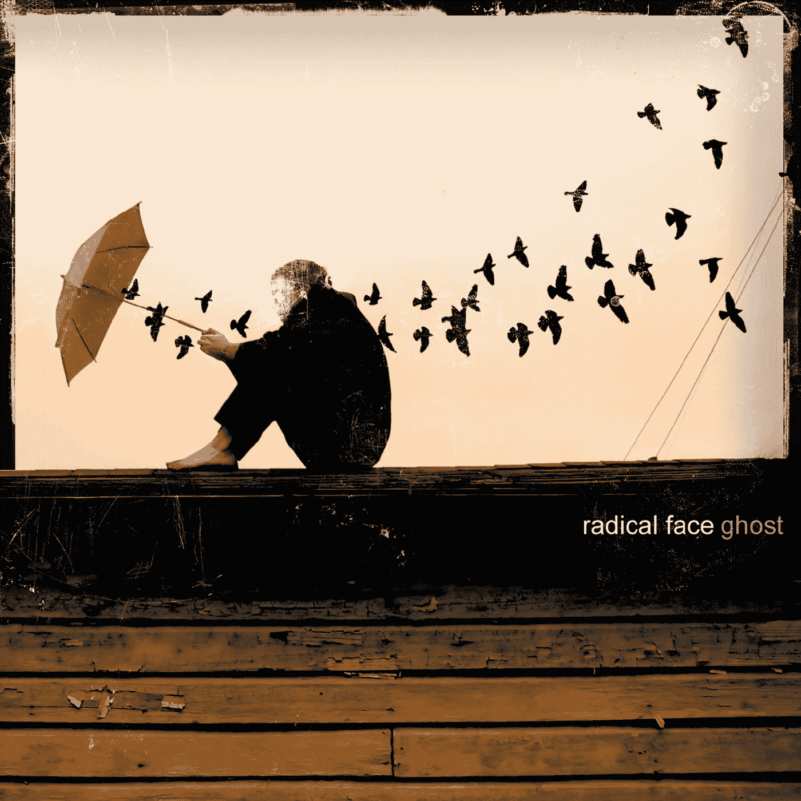
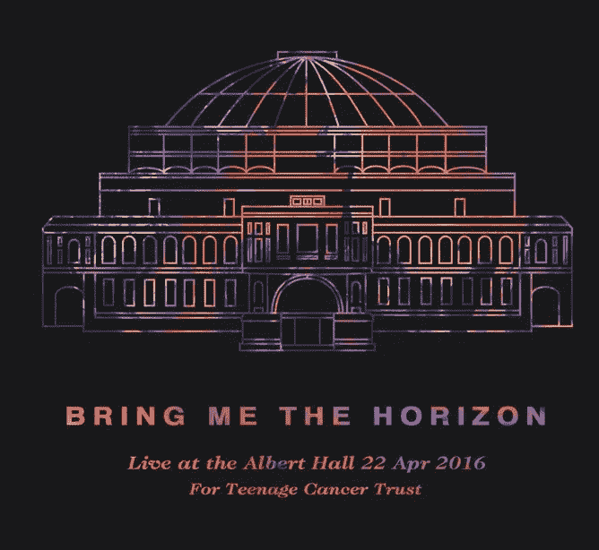

# 4 首完全不同但非常美妙的歌曲。

> 原文：<https://medium.com/hackernoon/4-vastly-different-but-seriously-beautiful-songs-i-work-to-51de44546ad8>

## 简短版:

音乐是很好的东西。如今，大多数人都是边听音乐边工作(大声喊着耳机技术和流媒体)，这四首歌/专辑是我 90%的工作时间都在听的:
**1)** 。[我们淹没空湖](https://www.youtube.com/watch?v=0K_MJdkKFS8)——[隐帝豪达](http://www.yndihalda.com/)
2)。[避难所](https://www.youtube.com/watch?v=HQnC1UHBvWA)——[波特·罗宾逊](http://porterrobinson.com/)&[made on](http://www.madeon.fr/)
**3)**。[欢迎回家](https://www.youtube.com/watch?v=pqi4whXaHx8)——[字根脸](http://www.radicalface.com/)
**4)** 。哦，不(来自皇家阿尔伯特·海尔的现场直播)——[带给我地平线](http://www.bmthofficial.com/)

## 长版本:

当 Apple Music 和 Spotify 等流媒体服务首次出现时，它改变了我与音乐的关系。我一直是(现在仍然是)一个专辑迷，我喜欢买一张专辑，反复听一个月以上，然后再看一张新专辑或者再看一张旧专辑。这是一种非常有趣的聆听和欣赏音乐的方式，尤其是因为我会买这张专辑…是的，我知道，我是那些真正为音乐付费的人之一——很少；).

但有了流媒体服务，一切几乎都在那里，价格/支付障碍被消除了。所以在糖果店的孩子，我下载了更多我听不完的音乐，不再翻阅专辑，不再体验歌曲的故事/旅程。

讨厌流媒体服务推送的预先制作的播放列表废话，在我最初的挥霍之后，我回到了我的专辑收听方式，这是四首歌曲(和专辑，这些只是对我来说这些专辑的精选，是的，我确实意识到其中一首歌曲来自单曲)，它们经受了我的收听时间的考验，并不断修改，特别是在工作时。

我不得不估计，我所做的所有电子邮件、宣传材料、广告材料、计划、战略文件和一般琐事中，有 90%是受他们的影响而完成的。非常感谢隐帝·霍尔达、波特和马迪恩，激进的面孔&让我成为你美丽贡献的地平线。下面是关于这首歌的简介和荣誉提名名单！

Enjoy Enteral Bliss Album Cover

**1)。** [阿拉洪空湖](https://www.youtube.com/watch?v=0K_MJdkKFS8)——[隐帝豪达](http://www.yndihalda.com/)。《我们淹没空湖》是一个融合了摇滚和民谣的乐队演奏的器乐。它几乎用相似的建筑和桥梁玩了自己两次。这让我想起了很多电影，伟大的开始，伟大的中间场景，相似的结尾，但是却有一个伟大的结尾。

我第一次听到这首歌是在 2009 年的一个 fuelTV 广告上，从那以后我们就成了朋友。

Shelter Album Cover

**2)** 。[庇护所](https://www.youtube.com/watch?v=HQnC1UHBvWA)——[波特·罗宾逊](http://porterrobinson.com/) & [制造的](http://www.madeon.fr/)。《庇护所》是《老友记》波特·罗宾逊和麦迪昂的第一张专辑。波特和 Madeon 似乎都在执行一项任务，将 EDM 带到新的高度，最著名的波特在今年早些时候删除了一些他早期发布的音乐，因为他发布了这些音乐而不高兴。《庇护所》大受欢迎，随后伴随着一部令人惊叹的动画短片。它永远不会让我处于一种良好的状态，或者帮助我继续做我正在做的事情。

Radical Face Album Cover

**3)** 。[欢迎回家](https://www.youtube.com/watch?v=pqi4whXaHx8)——[激进脸](http://www.radicalface.com/)。是的，完全是尼康相机广告里的那首歌！我是在看专辑封面的时候听到这首歌的，铃声和风的声音伴随着吉他的即兴重复，让你感觉自己就像一只正在飞翔的小鸟。本(激进脸背后的家伙)在这首歌中捕捉到了一种声音，我认为我永远不会厌倦，这是他周围的声音，哇，太完美了。

Bring Me The Horizon Live at the Albert Hall Album Cover

**4)** 。[哦，不](https://www.youtube.com/watch?v=mrD-XCXa__c)(来自皇家阿尔伯特·海尔的现场直播)——[给我带来地平线](http://www.bmthofficial.com/)
你再给我找一个能和 47 人的交响乐团和 14 人的合唱团一起演奏的金属乐队，声音那么好，我会给你一美元(说真的！).哦，不，是现场专辑的最后一首歌。这首歌是对上瘾和康复的深刻审视。“不要称之为派对，因为它永远不会停止”这句歌词直截了当地谈到了上瘾的滑坡，这是一个与主唱奥利(现在干净了)非常相关的主题。这些家伙与视差乐团和指挥西蒙·多布森一起进行的表演将金属和现场音乐带到了一个新的高度。当歌曲结束时，听到人群合唱“OoooOhhhhh Noooooo ”,这是我听到的最强大的鸡皮疙瘩产生的声音之一，在这 9 分钟里，我真的处于一种前所未有的心流状态。

## 荣誉提名(专辑和歌曲):

**1)。**波特·罗宾逊—世锦赛专辑&语言单曲
**2)。**狼—磷光，宋
**3)。**灰色章—活结，相册
**4)。**当你想通了，说是(声学)——黄牌
**5)。**梅隆·柯利和无限悲伤——专辑