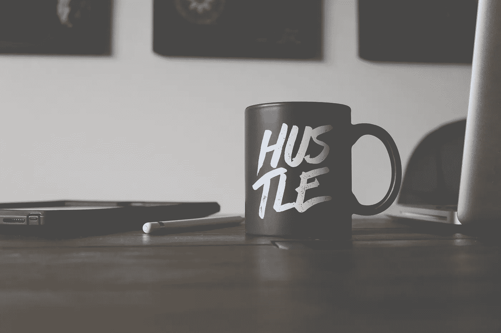
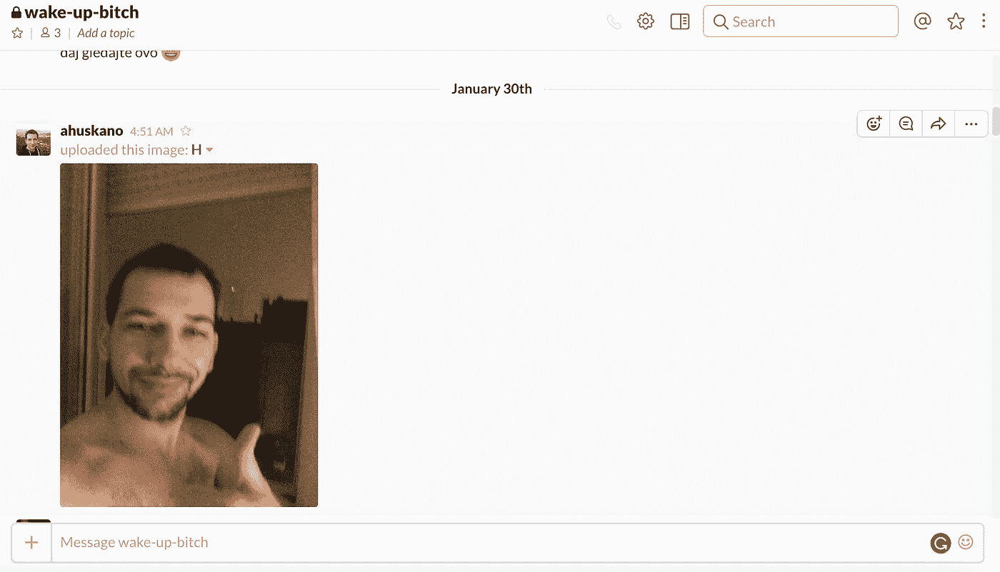
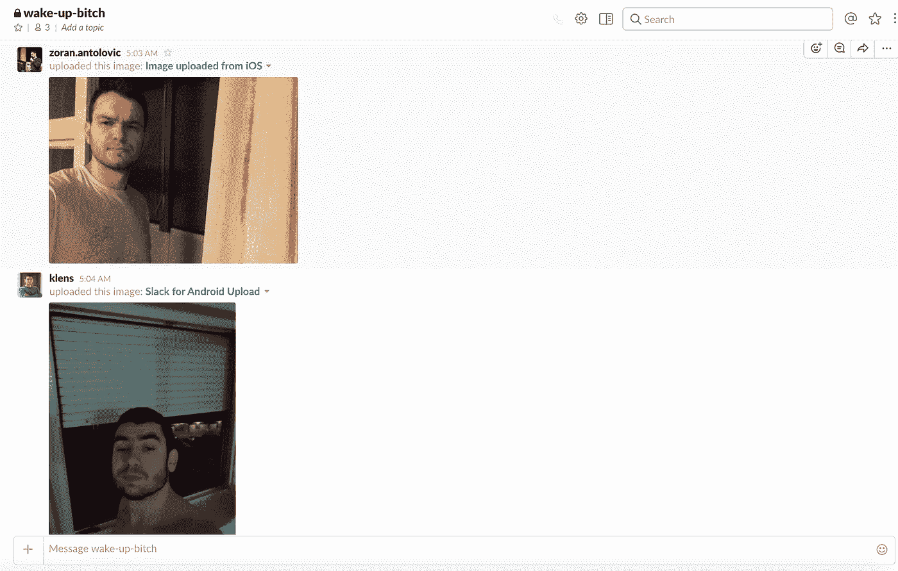
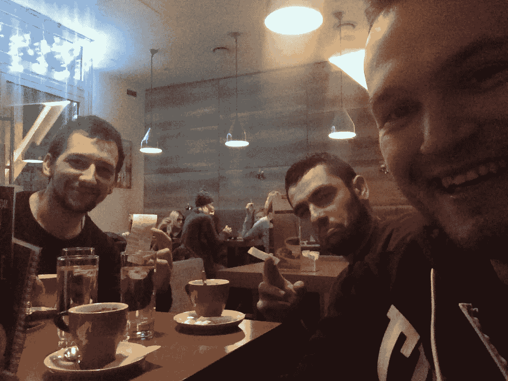
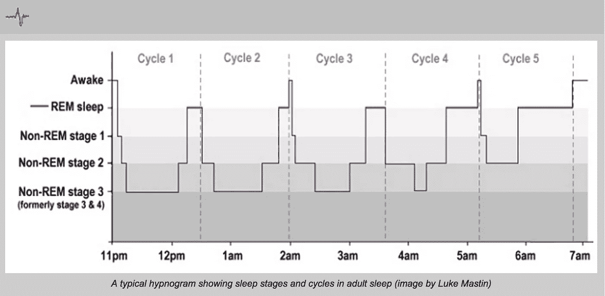

# 4 周到凌晨 5 点——成功的晨间例行公事

> 原文：<https://medium.com/hackernoon/4-weeks-to-5-am-dd04eea7e459>

Source: [Unsplash](https://unsplash.com/search/hustle?photo=CmF_5GYc6c0)

> 从床上起来。除非你想变得又胖又穷又老。

如果你是一个早起的人，并且这是你的生活方式，那太棒了。如果你不是，那么用 10 个瞌睡和一盆咖啡面植物开始你的一天是很好的。或者也许不是？

# 几小时前

现在是凌晨 4 点 50 分，我的手机闹铃响了，把我吵醒了，我关掉手机，从床上爬起来。我打开窗户，深吸一口气，感受着外面的冷空气，现在还是晚上。我在拿我的 iPhone，自拍。把自拍上传到 Slack 频道“叫醒-婊子”。

我要去洗手间，去刷牙。我喝了一杯水，开始准备咖啡。几分钟后又来了两张自拍。

什么，那是谁？这是[佐兰](https://medium.com/u/6e522f3f681b?source=post_page-----dd04eea7e459--------------------------------)和[卢卡](https://medium.com/u/f2c0f396592d?source=post_page-----dd04eea7e459--------------------------------)，和我一起运行[异步实验室](http://www.asynclabs.co/)的家伙。

## 你需要灵感

我是一名企业家、作家、软件开发人员……所有这些工作都严重依赖于我的生产力。如果我觉得做这件事很糟糕，或者我精神焕发、注意力集中，这是不一样的。一直忙不是目标，目标是在合理的时间内把屎做完。如果我没有效率，如果我不能专注于工作，我就会拖延结果。然后，对于同样的工作，我至少要多花 50%的时间，但是，如果我工作效率很高的话，同样的工作需要花 10 个小时，我不到 5 个小时就能完成。

如果我没有过有成效的一天，在结束的时候，我会感觉很糟糕。我是个失败者，我做不到，我什么都不是…

不要浪费你的时间，时间是有限的，在采取任何可能夺走你时间的行动之前，请三思，这值得吗？

# 两年的挣扎

过去两年，我一直在努力成为一个早起的人，一直在奋斗。每次失败的时候我都感觉很糟糕。我失败了很多次，每次都失败了。我试过了我在网上找到的所有该死的技术和建议。去你的早上路线，去你的晚上常规，去你的建议。我制定了自己的套路，也许，但只是也许，这次我会成功。

## 我决定学习

我太想要它了，如果埃隆·马斯克能做到，我也能做到。我会学习，我会找出可行的办法，然后开始做。无论我要付出什么代价。我想要，我就去做，没有别的选择。我愿意付出代价。

我读了几百篇关于生产力、注意力、日常事务、习惯的文章……我也花了一些时间读了一些相同主题的书。

> 你必须*真的*想要它。因为一旦你做了，没有什么能阻止你拥有它。

# 为什么是早上 5 点？

> 如果你想在早上 5 点之前做一些特别的工作。

但是为什么是早上 5 点？很简单，你刚睡醒，心情还不错。在那段时间里不会发生什么坏事。还有，没有分心的事，没有人在脸书，没有人会打电话给你。你有相当多的时间专注于某件事，并把事情做完。

你可以在晚上做，但是我发现在那个时候很难有纪律。早上没人想出去闲逛或出去喝酒，最重要的是你头脑清晰，精神饱满。记住，清晰的头脑是你最有力的工具。

经过多年的失败，我与[佐兰](/@zoranantolovi)和[卢卡](/@lklancir)达成了协议。2017 年 1 月 3 日起，我们将醒来工作。我们有四周时间养成早上 5 点起床的习惯。只有四周，不会更多。第五周应该正好是凌晨 5 点。

# 我们做了笔交易，我们全押了

将闹钟设置在早上 6 点，你有 5 分钟的时间打开窗户，自拍并放在一个松弛的频道上。这证明你确实做了这件事。你不想成为一个失败者？不是吗？

如果你在闹钟响后的 10 到 15 分钟内自拍，你就有一次罢工。当你三振出局时，你必须为另外两个人买一杯咖啡。如果你想睡得更久，这是你必须付出的代价。需要注意的是，你需要连续醒来五次才能消除一次打击。是的，你睡了，现在付钱吧。他妈的失败。

如果你在早上 6:15 之后发自拍，你会立刻被三振出局，这是个他妈的骗局。给我们买杯咖啡。

我失败了，我是个失败者，失败了第四天…证明如下。

First caffe

## 我们将一小步一小步地去做

每周我们减少 15 分钟的时间。

*第一周:早上 6 点*

*第二周:上午 5:45*

*第三周:早上 5:30*

*第四周:上午 5:15*

*第五周:早上 5 点*

*第六周:凌晨 4:45*

在写这篇文章的时候，我们正处于第六周，早上 5 点之前。我们准备好了，我们势不可挡。

# 只有三件事很重要

我们从中学到了什么？如果你想控制你的时间，如果你想富有成效，如果你不想感觉像狗屎。你只需要对三件事有所约束。其他都不重要，只要遵循这些基本规则:

**规则 1:健康饮食**

**规则二:健康生活**

**规则三:早点睡觉**

很简单，这是做对的最简单的方法。早起不是重点，重点是早起，不要一整天都觉得自己像屎一样。只有积极的态度和正确的生活方式，你才不会放弃。

没有任何物质可以帮助你，最重要的是不要感觉像狗屎。只有在自然的情况下才有可能。你需要睡眠，你需要有一个健康的身体，就是这样。我们是感性的生物，如果我们不喜欢，我们就不会去做。你必须在改变习惯的同时感觉良好。情绪和态度至关重要。

> 也许，只是也许它能解决…但是我很确定，如果我不试一试的话，肯定会一事无成！

## 你必须保持一致性

日子就是日子，工作日和周末没有区别，一天就是一天，它属于你，不属于别人。如果你在周末一直睡到中午，就很难养成这个习惯。你一定要始终如一！你不需要在周末早上 5 点醒来，但是不要睡到中午。最好的方法是早上 8 点左右起床。

周末我们被允许睡到早上 8 点(自拍时间是之后的 5 分钟)，但几乎每次我们不睡到 8 点，我们以前醒来过，因为现在我们习惯了。

## 酒精是不允许的

如果我们认为第二条规则是健康生活，那么酒精健康吗？不，相信我，我测试过了。如果你前一天喝酒(尤其是在晚上)，你会很挣扎。第二天早上你会他妈的挣扎。不要去做，如果你早上起来，你会感觉像狗屎->你的生产力会受到影响。但是如果你前一天喝了酒，要像个男人一样为咖啡买单。总比整天感觉自己像坨屎好。

## 定期基础锻炼

我们中的两个人([佐兰](/@zoranantolovi)和[卢卡](/@lklancir))每周去健身房六次。对我来说，这不是健身房，我参加舞蹈班。但是，这里的重点是，做一些体育活动，你必须做一些有助于你保持状态的事情。你的身体应该是健康的，你必须做些什么。

不需要去健身房，不需要去上舞蹈课。找到自己的方式，但是做点什么，可以是在家锻炼。没人在乎，重点在这里，这是你的选择。

## **睡眠周期**

信不信由你，睡眠时间是分阶段的。我试过了，我可以肯定地告诉你，要叫醒处于第三阶段睡眠(T1)的人是相当困难的，但是在第一阶段睡眠(T3)或快速眼动睡眠(T4)的人相对容易。每个阶段大约 90 分钟。你知道当你醒来感觉火车撞到你的那一刻吗？当你感觉糟糕的时候？可能你从第二阶段或第三阶段醒来。

闹钟是残酷的，它们在睡眠周期的错误部分叫醒我们。如果你想在早上 5 点醒来，你必须在以下时间入睡:

*   凌晨三点半
*   凌晨 2 点
*   凌晨 00:30
*   晚上 11 点
*   晚上 9:30

我试过了。如果你想有 6 小时的睡眠时间，晚上 10:45 左右睡觉。你将有 15 分钟的时间入睡，醒来后会精神焕发。如果你错过了那个时间，请不要在早上 00:15 之前睡觉。这 4 小时 30 分钟比 5 小时会让你早上感觉更好。不要错过你醒来精神焕发的阶段和机会。

开始时，你很难找到理想的时间，但是经过几天的测试，你会找到的。对我来说，是 6 个小时。

Source: [How sleep works](http://www.howsleepworks.com/images/hypnogram.jpg)

## 早上开始晚上之前

如果你的作息时间每天都有很大变化，那就很难养成晨练的习惯。但是需要的只是一点点动力和决心。我们试图每天晚上 10 点至 11 点睡觉，但每天都很难负担得起。

尝试在睡觉前至少一个小时关闭所有的技术。看看书，写点东西，散散步。做你想做的事，但不要看屏幕。那意味着；没有手机，没有笔记本电脑，没有电影…我测试过，真的很有帮助，如果你能负担得起就关掉吧。

一周中有几天晚上我有一些义务，我在晚上 11 点左右回家。我至少要花半个小时来布置好一切，然后上床睡觉。我挣扎，第二天早上我挣扎。早上起来真他妈的难。但我不想成为一个失败者，我正在付出代价，我醒了。

## 冷水澡会有帮助

我喜欢它，我用它快一年了。如果你洗冷水澡，对健康有很多好处，你的血液会更好地在体内流动。冷水的冲击会让你重新振作，帮助你更好地开始新的一天。洗完冷水澡后，我感觉精力充沛了 100%,我的头脑也准备好专注于某件事了。

事实是真的很难做到。坚持下去真的很难，尤其是在最初几周。我将对你说实话。你会纠结，开始做几个月后，你会一直纠结。你永远不会习惯的。相信我，我还在挣扎。

洗完冷水澡后，你会感觉更好，你会觉得一整天都没有什么可以阻止你。你觉得已经准备好充分把握这一天了。

# 你必须感觉良好

也许这些建议不适合你，但对我很有效。重要的是找到一个很适合自己的作息规律。做这件事你必须感觉良好，**如果你不喜欢，你就会放弃**。你会像大多数人一样退出。

**阅读建议，过滤它们，尝试它们，找到适合你的，并坚持下去。你需要找到一个你能坚持的常规。**

> 如果你愿意付出代价，一切皆有可能

## 最后一件事…

*如果你喜欢这篇文章，点击💚所以其他人会在这里看到它。*

> [黑客中午](http://bit.ly/Hackernoon)是黑客如何开始他们的下午。我们是 [@AMI](http://bit.ly/atAMIatAMI) 家庭的一员。我们现在[接受投稿](http://bit.ly/hackernoonsubmission)并乐意[讨论广告&赞助](mailto:partners@amipublications.com)机会。
> 
> 如果你喜欢这个故事，我们推荐你阅读我们的[最新科技故事](http://bit.ly/hackernoonlatestt)和[趋势科技故事](https://hackernoon.com/trending)。直到下一次，不要把世界的现实想当然！

