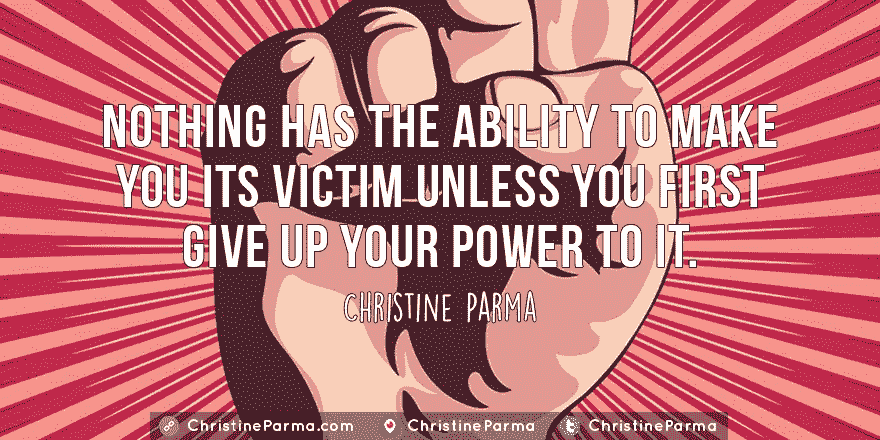
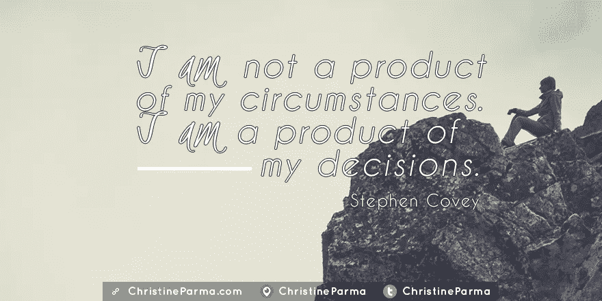

# 艰难时期激励你的 40 句励志名言

> 原文：<https://medium.com/hackernoon/40-inspirational-quotes-to-motivate-you-when-times-are-tough-5194703d09ac>

有时候，我们很容易觉得我们的世界面临的挑战是不可克服的……暴力、不公正、贫困、疾病和世界上大部分地区的日常斗争永远不会被克服。

即使你有幸生活在西方世界，在那里我们享受了许多生活的舒适(大体上)，可以肯定地说，我们每个人都会在一生中的某个时候经历艰难的时刻、悲剧和“灵魂的黑暗之夜”。一次个人挫折或悲剧，即使没有全球恐怖主义的规模，也可能会让你觉得生活发生了更大的改变，并演变成负面思维的黑洞，迅速吞噬你的动力、能量和成为你想成为的人的能力。

因为生活可以如此残酷，随机残酷，所以这是如此难以置信的重要，世界上以心为中心，充满爱心的人利用每一个机会照亮他们的光明，驱散黑暗。我们每个人都有力量成为希望和善良的灯塔，这样其他人就可以因为我们在这个世界上的存在、话语和工作而受到鼓舞。你的所作所为和你的生活方式不仅在个人层面，而且在全球层面都有影响。

所以，当你发现自己被击倒，对自己和生活的信心受到打击时，你如何重新站起来，再次前进？

你只是选择这么做。你有意识地决定*做出反应*而不是*做出反应*并且不放弃你对周围环境的权力。

你可以成为动乱中的*，而不会成为*失去* *的它*。*

话虽如此，我的生活并没有免于损失和苦难，我欣赏悲剧在试图摧毁一个人的意志和生活时可以发挥的毁灭性力量。我同情那些受到最近暴力事件影响的个人和家庭，以及那些每天都在挣扎的人们。

我收集了一些我最喜欢的名言，这些名言在艰难的时候给了我鼓舞和力量，另外我还添加了一些我自己的话语。我希望你能从中得到灵感，也希望它们能像表达我的心声一样表达你的心声。

一如既往，我希望收到你的来信。

你最喜欢的名言是什么？

当日子变得艰难时，你从哪里找到灵感？

面对悲剧和苦难，你从哪里汲取力量？

# 艰难时期激励你的 40 句名言

> 尽可能友善。总是有可能的。—达赖喇嘛

> 真正伟大的标志不是没有困难，而是能够从挫折中恢复过来。—吉姆·科林斯

> 我一个人不能改变世界，但是我可以扔一块石头在水面上激起许多涟漪。——特蕾莎修女

## [请在[http://www.ChristineParma.com/blog/40-quotes-to-motivate](http://www.ChristineParma.com/blog/40-quotes-to-motivate)的我的博客上查看带引用图片的完整文章]

# 嗨，我是克莉丝汀·帕尔玛。

我帮助那些雄心勃勃、以服务为基础的企业家，他们为自己的收入付出了太多的努力。我一步一步地指导他们如何创建自己的[不可抗拒的优惠](http://www.christineparma.com/raiseyourfees)和[高收费的销售项目](http://www.christineparma.com/premiumprograms)。因为他们从每个客户身上赚了更多的钱，他们可以停止财务上的挣扎，减少工作时间，最终过上他们想要的生活。

我相信金钱和意义并不排斥。做你喜欢做的事情，你会有很大的影响和收入——并且没有压力和压力。

[订阅我的时事通讯](https://christineparma.leadpages.co/leadbox/14532cb73f72a2%3A165bd1e58346dc/5769928858664960/)了解如何通过您自己的签名计划、活动和务虚会扩大您的影响，吸引您的狂热粉丝，并发展您喜爱的有利可图的业务。

在 Twitter[@ Christine parma](http://www.twitter.com/ChristineParma)和脸书 [ChristineParmaEmpower](http://www.facebook.com/ChristineParmaEmpower) 上找到我。

# 诚实而轻松地提高你的费用

快速在你的日程表上填满忠诚的、收费更高的客户！我们将一起为您创造强大的、不可抗拒的优惠，您可以与潜在客户和现有客户分享，支持您收取并获得更高的费用*今天* …并最终获得您应得的报酬！[点击此处了解更多信息。](http://www.christineparma.com/raiseyourfees)

> [黑客中午](http://bit.ly/Hackernoon)是黑客如何开始他们的下午。我们是 T21 家庭的一员。我们现在[接受投稿](http://bit.ly/hackernoonsubmission)并乐意[讨论广告&赞助](mailto:partners@amipublications.com)机会。
> 
> 如果你喜欢这个故事，我们推荐你阅读我们的[最新科技故事](http://bit.ly/hackernoonlatestt)和[趋势科技故事](https://hackernoon.com/trending)。直到下一次，不要把世界的现实想当然！

