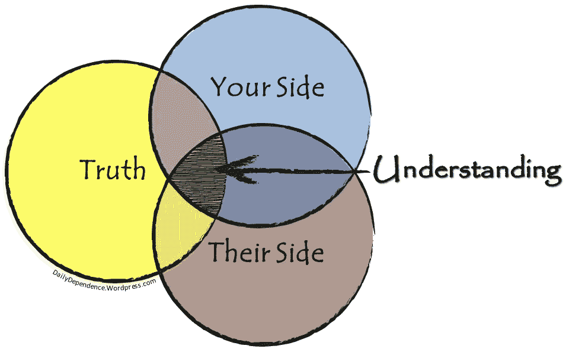

# 非前线人员误解的 42 件事

> 原文：<https://medium.com/hackernoon/40-things-non-front-liners-misunderstand-fcb2f55088f9>

期望没有在软件开发第一线工作过的人*得到它*是不公平的。正如我猜测的那样，开发人员和 UXers 很难获得销售和营销，成为首席执行官，并在人力资源部门工作。假设恶意是一个大错误。我们都希望各自的业务取得好成绩，但却很难弥合分歧。

根据我与开发人员、设计师、UXers、数据科学家、客户支持和产品经理的交谈，我提供了大约 40 个。当然…“视情况而定”，这些都不是到处都适用的。

## **请加更！**

# **非前线人员通常……**

1.  低估多任务处理和上下文切换的成本
2.  **低估**增加复杂性(增加用例、功能等)的成本。)
3.  **低估**定期重构的好处，投资工具，为非结构化的研究/实验分配时间
4.  **低估**建立(并保持)有意义的共同理解所需的投资
5.  **低估**根据实际客户使用和反馈立即(而不是几个月后)迭代的价值
6.  **高估了**分而治之模式的价值，在这种模式下，单个团队与参与同一计划的其他团队联系有限
7.  **高估**让经理/代理在团队之间交流的价值(与让团队直接交流相比)
8.  **高估**集中/分享某些职能(如 QA、DevOps、UX)的价值
9.  **低估**稍后投入工作的价值(例如，根据新信息采取行动，而不是预先投入资源)
10.  **低估**更多非结构化黑客攻击/扣球的价值，以充分把握新挑战的重要性
11.  **低估**将单个团队成员隔离在不同的“项目”中以提高利用率的成本(相对于拥有更多空闲时间，并专注于更少的计划)
12.  低估了让单个架构师孤立地“决定一切”的成本，从而消除了决策过程中的一线人员
13.  **高估**分离前端和后端开发人员的价值
14.  高估使用人为截止日期来激励员工的价值
15.  **低估**在产品中留下已知的错误/缺陷的成本
16.  **过高估计没有个人贡献者(将完成工作的人)在场的广泛预先计划的价值**
17.  **低估**花时间“远离键盘”(例如拜访客户、团队白板等)的价值。)
18.  **低估了**阻止开发者使用他们选择的工具的成本。另一方面，可能高估了工具选择中一致性的价值。
19.  **高估了**客户描述他们需要什么以及他们可能会发现什么有价值的能力
20.  **低估**将新开发人员与更广泛的业务背景联系起来的价值(例如，邀请他们参加销售电话会议、客户支持队列等)。)
21.  低估对高保真模型产生情感依赖的成本
22.  **低估**公正指导和引导的价值
23.  **低估了协同定位的价值，低估了混合定位的成本(让一些人协同定位，但其他人远离)**
24.  **过高估计**在低信任/低安全环境中添加流程的价值
25.  **高估拥有特定语言/领域经验的价值(当然，有时这是非常有效的)**
26.  **低估**横向解决问题的价值(相对于一个组件一个组件地深入)
27.  低估了实时模式库的价值
28.  低估了庆祝银子弹的成本，因为这项工作需要偷工减料，而且显然是“作秀”。高估成功剧场的价值
29.  低估了让团队自主管理工作环境并提供专用空间开会/工作的价值
30.  低估拥有一个对任何人来说都难以理解/解释的复杂系统的成本
31.  **高估**仅仅基于故事点速度来衡量团队的价值
32.  **低估**开发人员对理解业务/客户问题(以及可能给公司带来的价值)的兴趣
33.  **高估**通过一对一解决团队冲突的价值(相对于指导团队公开解决问题)
34.  高估单个产品经理正确预测未来的能力
35.  **低估**将工作与高级业务成果联系起来的价值
36.  **低估**QA、试运行等环境不一致的成本。
37.  **低估**表现出有害行为的“杰出”高管所造成的累积阻力。低估将该行为与组织的其他部分隔离开来所需的成本(以及这些努力的效率)
38.  **低估了**某些激励结构会在团队成员之间造成冲突的程度
39.  **低估**一致性问题的成本(例如，违背既定公司文化或目标的行为)
40.  在计划的早期低估分歧的价值。我们的倾向是过早地收敛和“移动”
41.  **低估**围绕合规性和安全性(相对于全球政策)向客户做出个别承诺的成本
42.  **过高估计**开发人员“接触时间”影响计划总交付时间的程度(40%的值是好的，典型的是 10-15%)

如果我们能够一起收集一份“非一线人员在考虑软件产品开发时经常低估和高估的事情**的概要”，那将会是非常棒的事情。我认为这种形式是可行的，有助于我们保持一致:**

*   低估了 _ _ _ _ _ _ _ _ _ _ _ _ _ _ _ _ _ _ _ _ _ _ _ 的成本
*   高估了 _________________ 的价值

我在这里的目标不是咆哮，而是建立桥梁和共同理解。让我们保持评论简洁明了，重点关注对业务的好处。