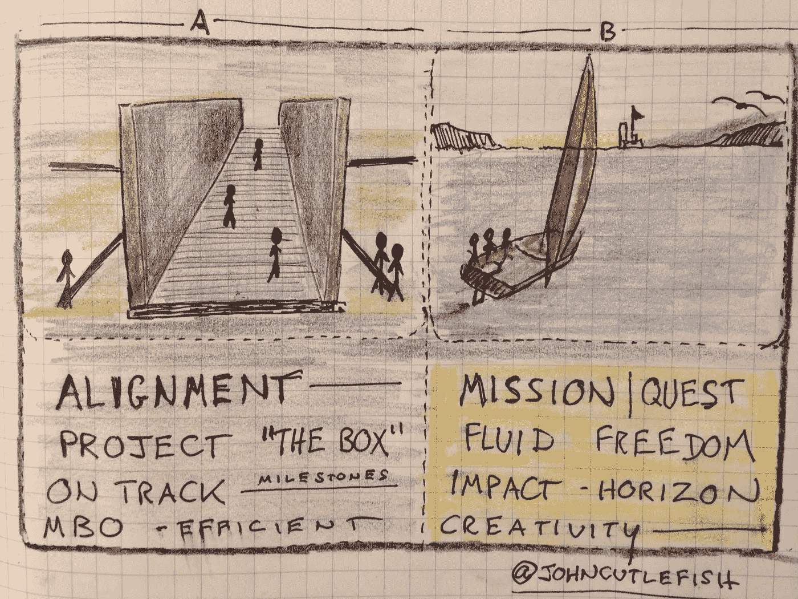
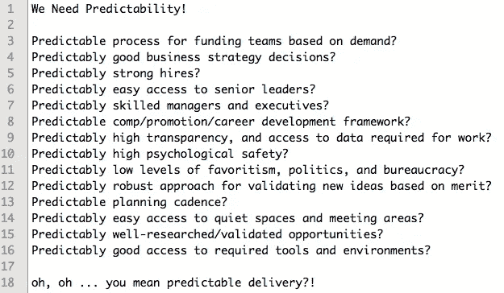

# 40 个 Twitter 涂鸦、列表和图表

> 原文：<https://medium.com/hackernoon/40-twitter-doodles-lists-and-diagrams-4a0b1cc51c08>

在为未来的 [Medium](https://medium.com/u/504c7870fdb6?source=post_page-----4a0b1cc51c08--------------------------------) 帖子做准备时，我发现自己在旧推文中挑选。我喜欢涂鸦、绘画和图表。我喜欢推特。

偶尔这些图画和列表会以[中型](https://medium.com/u/504c7870fdb6?source=post_page-----4a0b1cc51c08--------------------------------)帖子的形式结束，但大多数情况下它们会留在推特上。我在下面分享了几个引起软件产品爱好者注意的例子。

我认为 Twitter 是一个很好的约束。一条微博，一张图片。这意味着很多事情没有说出来，误解是很常见的。所以不要全信。

