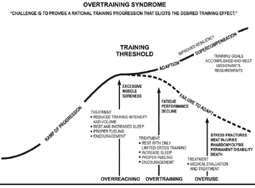

# 投资更有弹性团队的 40 种方法

> 原文：<https://medium.com/hackernoon/40-ways-to-invest-in-more-resilient-teams-c2ac7d008591>

不分解肌肉，不恢复，就不可能练出肌肉。没有一些不适和修复，你就无法建立韧性和力量。如果你总是专注于效率(如果你不愿意有时感觉有点笨)，你就学不会。如果你在直升机管理和流程中扼杀团队，你就不能指望他们表现出“主动性和自主性”。

没有灵丹妙药。当人们喋喋不休地谈论“10 倍团队”时，他们很少考虑创造这种环境和培养冒险所需的心理安全(T2)的成本(T3)。这是一种**投资和承诺**，不是你可以简单安装的东西(不管顾问会卖给你什么)。

短期增长总是更有吸引力。但是，一个健全的经济框架将永远尊重/理解这种增长的成本。再说一遍，这是一项投资。增长对系统压力太大(相对于投资“积极的”压力源以建立弹性)，系统就会崩溃。

1.  轮换谁“跑”起来
2.  探索新的回顾形式
3.  延长新员工入职时间。所有新员工都在支持队列中工作，与销售人员坐在一起，倾听客户的成功电话
4.  与其他团队开展开发者交流项目
5.  监控来自支持/反馈渠道的实时客户反馈
6.  任何涉及团队离开正常环境的事情(活动、旅行、锻炼等。)
7.  自愿调解和解决冲突培训。[非暴力沟通](https://www.cnvc.org/)
8.  实施“生产中零已知缺陷”政策。如果生产中有一个 bug，所有团队的所有工作都会停止
9.  扼杀特写的日子
10.  在存在跨团队依赖的情况下，限制正在进行的工作。不要“绕开”其他团队。蜂拥而至。限制总体工作进度
11.  远离数字化工作工具。当你想出更好的工作方式时，用一面墙、卡片和胶带
12.  想办法让所有团队成员使用该产品来做实际工作！或者至少在客户现场观察他们几个小时*自然工作*
13.  缩短迭代长度。实施持续集成和持续部署
14.  功能切换以测试新客户的功能
15.  克服瓶颈，而不是绕开它们。即使这意味着在短期内放缓
16.  产品开发团队的长期“奖金”。例如，任何团队，在任何时候，都可以自由地交付移动度量 X 而不移动度量 Y 的东西
17.  大规模的“绘制债务地图”活动。可视化当前的能力差距
18.  行为[预死亡](https://hbr.org/2007/09/performing-a-project-premortem)
19.  跨团队协作时，让所有团队成员都在场(而不仅仅是团队经理或项目经理…参见[非项目文化](https://www.google.com/url?sa=t&rct=j&q=&esrc=s&source=web&cd=1&ved=0ahUKEwiv06rYp__TAhVJwWMKHVKzBuEQFggnMAA&url=http%3A%2F%2Fblog.crisp.se%2Fwp-content%2Fuploads%2F2014%2F03%2Funproject.pdf&usg=AFQjCNE5gsI2maM8S9gEWaiPRUcDEXmapw&sig2=eiC_Fo3UN5Ww4ndRwHMCEQ)
20.  同伴指导计划
21.  要求团队写出[他们自己的健康检查框架](https://hackernoon.com/product-development-team-self-assessment-c3707f065069)
22.  整个公司的办公桌交换日
23.  让多个团队尝试并行解决方案。根据交付给客户的实际结果进行一次烘焙
24.  创建一个内部播客，将来自整个组织的客人带进来
25.  配对和 [mob 编程](https://en.wikipedia.org/wiki/Mob_programming)
26.  可选会议。如果你不能增加价值，就离开
27.  涉及整个团队的客户拜访。上一辆货车
28.  避免大量的预先规划和设计。接受一些混乱，因为团队正在思考这个问题。考虑一个多日合作设计类型的活动
29.  [众包状态更新和团队故事。将它们公之于众，让每个人都可以访问](/@johnpcutler/case-study-from-the-front-lines-43513ccf8fb2)
30.  跨团队手工艺行会(如安全，UX 模式等。)
31.  [露天场所](https://en.wikipedia.org/wiki/Open_Space_Technology)改善活动
32.  公开拜访时间表，因此任何开发人员/UX 都可以随时接听客户电话(销售、支持或其他)
33.  研讨会日。预订所有会议室，并与志愿者教师/辅导员一起开展研讨会
34.  跨团队的价值流和能力映射*以探索潜在的重叠和机会*
35.  *[设计冲刺](http://www.thesprintbook.com/)远离键盘*
36.  *不同功能区的午餐轮盘赌*
37.  *多学科小组的视觉练习。在公司的所有部门中，awesome 会是什么样子？*
38.  *CEO/C 级的开放办公时间。或者更好的是，首席执行官访问他们环境中的团队*
39.  *关于公司如何`*actually makes money*`的研讨会。向每个人解释基本的经济学原理*
40.  *你明白了…在安全的环境中学习，挑战极限，关注长期增长而不是短期效率，并建立弹性*

******

> *[黑客中午](http://bit.ly/Hackernoon)是黑客如何开始他们的下午。我们是 [@AMI](http://bit.ly/atAMIatAMI) 家庭的一员。我们现在[接受投稿](http://bit.ly/hackernoonsubmission)，并乐意[讨论广告&赞助](mailto:partners@amipublications.com)机会。*
> 
> *如果你喜欢这个故事，我们推荐你阅读我们的[最新科技故事](http://bit.ly/hackernoonlatestt)和[趋势科技故事](https://hackernoon.com/trending)。直到下一次，不要把世界的现实想当然！*

**