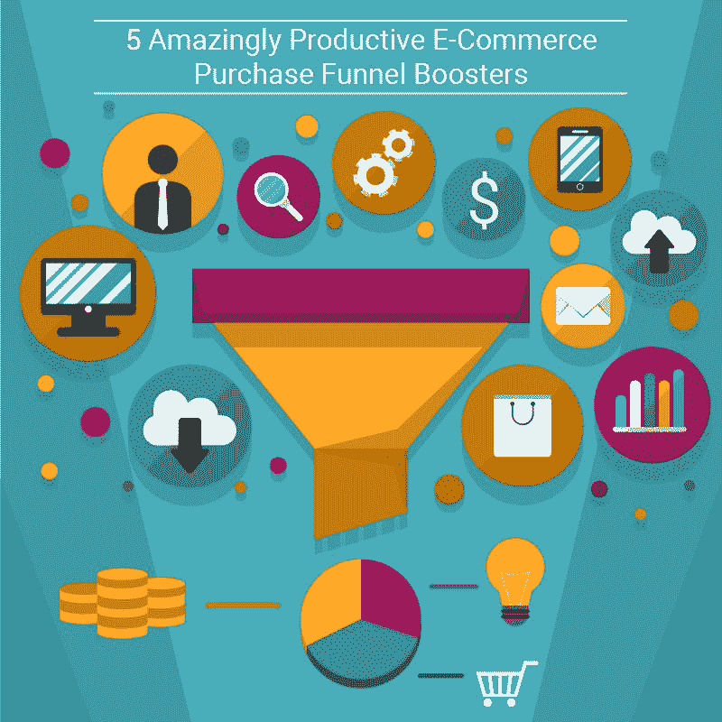
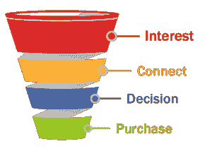

# 5 个惊人的高效电子商务购买漏斗助推器

> 原文：<https://medium.com/hackernoon/5-amazingly-productive-e-commerce-purchase-funnel-boosters-a74ef90e49cc>

全球电子商务行业正处于一个竞争日益激烈的空间。该领域的三大巨头(亚马逊、Snapdeal 和 Flipkart)每年都要消耗超过 3000 亿印度卢比(300 亿美元)的现金，仅仅是为了战胜竞争对手，这一事实本身就说明了问题。

如果这是大多数市值公司的苦难，你只能想象它们对年轻玩家的影响。因此，对于年轻玩家来说，优化他们的营销渠道至关重要，以获得更好的客户参与和转化。让我们来看看电子商务领域的一些最佳数字营销实践，它们将帮助你扩大购买渠道。

[Image Source](https://www.agilecrm.com/blog/wp-content/uploads/2016/07/sales-funnel-leads.png)

1)将结账页面与网站
同步为了更好地理解这一点，让我们设想一个场景。

想象一下，你在一家知名品牌的商店里。你随便进入商店，浏览橱窗。20 多分钟后，你正在检查价值你一个月工资四分之一的东西。

是什么促使你这样做的？

商店本身的设置——合适的商品陈列在合适的地方，商店员工帮助您获得购物体验，以及库存本身提供的选择范围。

但是在结账的时候，如果你被要求在店外而不是在柜台付钱给一个可疑的人，该怎么办？

你肯定会退出。为什么？因为链条中的最后一环与整体购物体验并不同步。

电子商务也是如此。一个人可以做好每一件事，但如果与网站不同步，最终还是会在结账页面阶段失去买家。

原因很简单。它会影响客户的信任度。

您需要确保结帐页面与您的登录页面具有相同的设计方案，以便客户在购买时感到舒适。

**2)关注顾客在购买漏斗中的位置**
每个数据池中都隐藏着一个故事。如果你没有关注你的购买漏斗产生的统计数据，你就错过了一些很好的优化机会。

让我们来看看这里的漏斗报告示例:

[Image Source](http://www.tatvic.com/blog/wp-content/uploads/2014/07/shopping_behaviour.png)

你注意到报告中强调的问题了吗？

显然，产品登录页面需要进一步优化，以提高产品结账率。

如果你仔细观察，你会发现超过一半的“购物车中的产品”已经被顾客放弃了。这表明需要解决购物车的进一步同步问题。

像使用工具进行详细的漏斗报告和 A/B 测试页面的不同方向这样的步骤在这里会有很长的路要走。

利用顾客的不耐烦换句话说，创造紧迫感。

上周，我选择亚马逊(Amazon)而不是 Flipkart 购买一副窗帘，只是因为前者用一个时钟吸引了我，承诺如果我在一小时内下单，一天内就可以送货。

利用买家的不安全感真的能让你比竞争对手更有优势。

另一个很好的例子是让你的库存实时显示剩余的产品数量。

快速移动的产品会一直让买家保持警觉(就像旅游网站上的火车座位一样)，因此，会极大地增加他们考虑购买决定的时间。

将产品视频与图片一起展示
视频已经成为互联网上最新的营销规范。现在连脸书都允许你上传个人视频了。那么为什么不在电子商务中充分利用它们呢？

以下是一些事实。 [71%的顾客](https://animoto.com/blog/business/small-business-video-infographic/)认为视频能更好地解释产品，与图片相比，视频能提高 73%的转化率。

请考虑以下棒球棒的产品视频:

如果与你的产品登陆页面整合，我敢打赌这将比一些图片卖得更多。原因很简单。视频更吸引人。很容易给产品附上一个故事，帮助顾客更好地与它联系起来。

**5)有针对性的应用推送通知**
如果你还没有为你的在线商店推出应用，你就错过了一大块潜在业务。应用程序通知是从忠诚客户那里获取重复业务线索的金矿。

想象一下，你使用亚马逊应用程序，在购物车中添加产品，只是为了改变主意，稍后退出应用程序。如果你收到一个通知，激励你第二天检查产品，并更新额外的 5%折扣，你不是更有可能继续购买吗？

[Image Source](https://blog.wigzo.com/wp-content/uploads/2016/10/nike-notification.png)

根据贸发会议的估计，电子商务行业多年来经历了巨大的增长，目前市场规模高达 23 万亿美元。

如果企业打好自己的牌，在席卷全国的数字浪潮中有巨大的机会可以利用。优化购买漏斗是朝着这个方向迈出的关键一步。

[*online sales . ai*](https://onlinesales.ai/?utm_source=hackernoon&utm_medium=social&utm_campaign=medium%20post)*为电子商务提供了一个智能的绩效营销平台，并与专业的商业策略师一起专注于推动 RoI、roa 和 CPT 基准。ai* *创新并让零售商追踪他们所花费的每一分钱的利润。* [*您可以在这里观看我们平台的产品讲解视频！*](https://www.youtube.com/watch?v=UCnHSP_JByA)

本文原载于 [OnlineSales.ai](https://onlinesales.ai/blog/5-amazingly-productive-e-commerce-purchase-funnel-boosters/?utm_source=hackernoon&utm_medium=medium%20post)

> [黑客中午](http://bit.ly/Hackernoon)是黑客如何开始他们的下午。我们是 T21 家庭的一员。我们现在[接受投稿](http://bit.ly/hackernoonsubmission)并乐意[讨论广告&赞助](mailto:partners@amipublications.com)机会。
> 
> 如果你喜欢这个故事，我们推荐你阅读我们的[最新科技故事](http://bit.ly/hackernoonlatestt)和[趋势科技故事](https://hackernoon.com/trending)。直到下一次，不要把世界的现实想当然！

