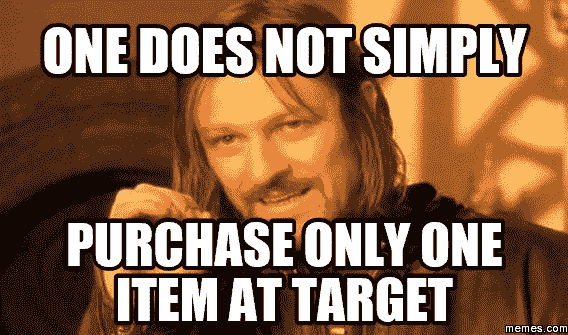
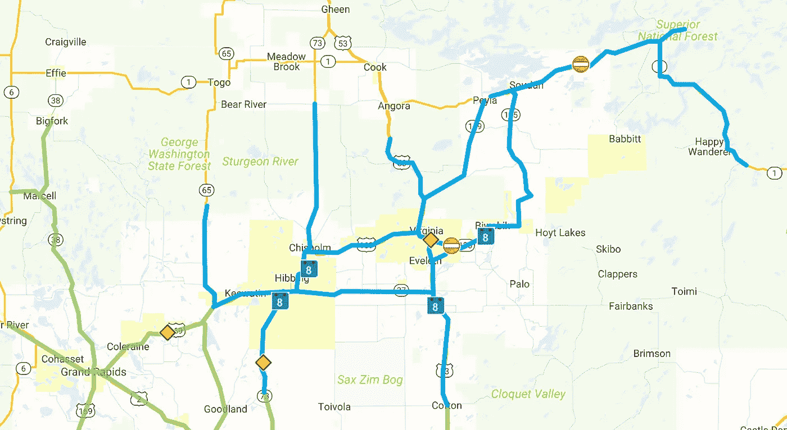
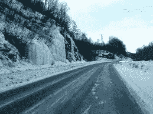
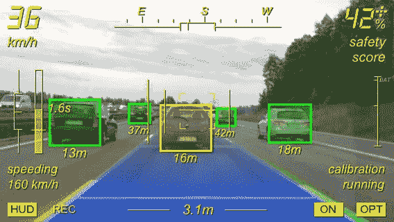
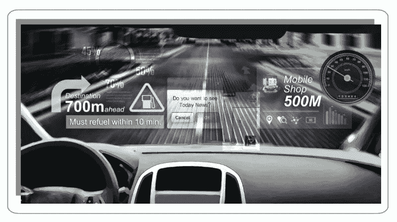
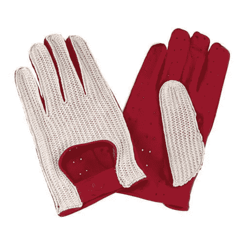
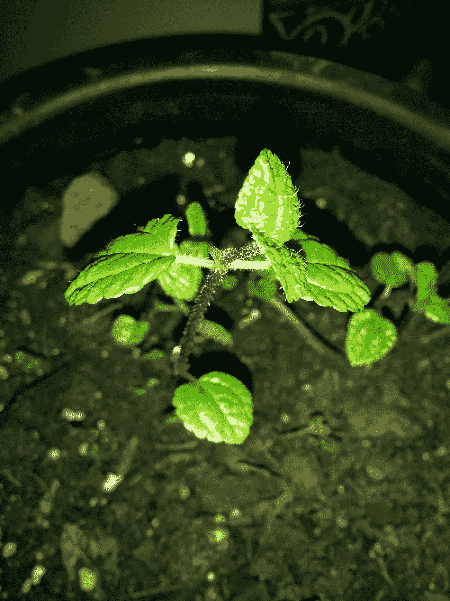

# 今天我会使用 AR/VR 的 5 种(半)方式…

> 原文：<https://medium.com/hackernoon/5-and-a-half-ways-i-would-have-used-ar-vr-today-268cd24be38a>

## …但是不能。

今天早上，我有片刻的渴望。我正在为我的一天做准备，一边照镜子，一边坚持我近乎机器人的早晨惯例，我开始思考在一些先进技术的帮助下，我可以更有效率。正如我所想的那样，我决定在脑海中保留一个运行列表，列出我在日常生活中可能使用 AR 或 VR 的方式，尽管这些方式通常很平凡。开个玩笑，我的生活很棒。)

当阅读下面的列表时，我鼓励你想象增强/虚拟现实初创公司或现有公司如何实现这一点。最终，我希望所有这些功能都变成免提，但是现在，手持设备可能是必要的。

# **1:目标**

好吧，我们都经历过。事实上，我们都经历过足够多的事情，以至于这成了针对[目标](http://www.target.com/)的一个笑话，但让我们回顾一下这个场景:

你最近为公司本周的第四次聚餐用盒子制作了著名的贝蒂·克罗克糖饼干。但是，就在你准备把大小不一的面团放到烤盘上的时候(你甚至记得预热烤箱！)，你意识到你没有羊皮纸了。

向目标前进。

当你从车里走到商店门口时，你反复对自己说:“我需要羊皮纸。我需要羊皮纸。**我需要羊皮纸 。我需要…哦…那是什么？那是马里奥吗？我进来的时候马里奥是不是跟我说话了？为什么？哦，看哪！马里奥展示！哦，对了，新的[任天堂 Switch](http://www.nintendo.com/switch/) 有新的马里奥游戏。我最好去看看。”**

九十五分钟和…

*   六卷打折的圣帕特里克节包装纸，
*   五双可爱的婴儿短靴，你可能需要在即将到来的不存在的怀孕朋友的送礼会上穿，
*   四袋你“小时候爱吃的”糖果
*   三张有趣的圣诞卡会让你在第二年的 1 月 13 日之前彻底忘记自己的存在，
*   两个咖啡机作为备用，以防万一，
*   还有，一部你刚刚*有*看过的电影的 DVD(但直到此刻才忘记它的存在)，

…稍后，您结账并回到您的车上。直到你回到你的住处，你的大脑才重复说，“我需要…羊皮纸。”

是的，我们都去过那里。而且，如果这么多的文字还不足以让你疲惫和恼怒，记得上次你 ***实际上*** 就是这么做的！

相反，让我们回到(希望)不久的将来的一个神奇时刻。在这一刻，我们已经表明我们想要羊皮纸，我们还带着我们的便携 AR 设备。当我们在组成每家目标商店的光荣的善的迷宫中迂回前进时，就在我们经过存放羊皮纸的过道时，嗡嗡声、乒乒乓乓的声音引起了我们的注意。

虽然增强现实不太可能阻止我们向大箱子神提供我们的曾曾侄子的遗产，但它至少可以确保我们记住我们打算购买的*一样东西。*

# *2:驾驶*

*在北方，我们醒来时发现 5 月 1 日下了一场并不罕见的雪/雨/雨夹雪。在一年中的这个时候，有些日子的最高温度达到 70 多度，其他日子的最高温度达到几乎冻结的温度，这是最令人困惑的——特别是当这种差异可能在一夜之间出现的时候。我听过最好的描述是，“天气喝醉了。”*

*所以，当我冲出浴室去听客厅电视上的天气预报时，我发现我错过了我需要的部分:路况。如果你曾经在寒冷的气候下生活过一个冬天，你就会知道这些有多重要:否则你怎么知道要为你的通勤计划多长时间。冰雪覆盖？增加三十分钟。白雪覆盖？如果你走紧急雪道的话，可能要加 10 分钟。刚刚下雨，太好了:再来一杯咖啡。*

*今天早上我能做的最好的事情就是把自己从日常工作中解脱出来，在网上查找当地的路况。不过，这些都是泛泛的概括。一个 60 英里的路段可能被标记为“一般”，而与之相连的路段被标记为“良好”那是什么意思？那个十字路口正是道路改变状况的时刻？*

**

*This… is not helpful.*

*什么会更好？互动性。也许我戴着 ar 耳机，也许我的汽车启用了 AR。我表示我关注今天的路况，它会在我旅行时为我定制报告。也许当我开始左转时(让我们面对现实吧，谷歌已经知道我的工作方式，所以我的 AR 将*肯定*知道我的预期转弯)，一些声音或警报会告诉我某个路段在 30 分钟内发生了两起事故。或者，也许它会根据一段时间内类似情况下的事故历史，为我预先计划好最佳路线。无论哪种方式，它都比我现在做的更有效率，而且对路上的每个人都可能更安全。*

**

*This…*

**

*Plus this… would be helpful.*

# *2.5:驾驶(再次)*

*今天开车的时候，我还飞过了正常的午餐点。随着一首新的最受欢迎的歌曲吹着口哨，我在车里摇晃着，让旁观者感到有趣(或恐怖)。我不会假装如果有一个小小的提醒就好了。*

**

*Image credit goes to [Moulay Elmenouar](https://www.linkedin.com/pulse/2020-5g-virtual-reality-vr-augmented-ar-moulay-elmenouar).*

*是的，通过地图应用和全球定位系统，我们可以在未知的地区编程，以轻松找到地方，但谁会为他们经常出没的地方这样做呢？我不希望每天都有一个详细的导航，但有时它会很好。*

*在惩罚到来之前(是的，我们都应该在开车时更加注意)，这里的谁不能说他们记得曾经想，“我知道那里有一个停止标志。我停下来了吗？我不记得了。我一定有。”*

*有时，我们太习惯于我们正在走的路——那些我们经常使用的路，汽车实际上知道路——以至于我们只是有点儿开小差。或者，也许，有什么东西转移了我们的注意力。也许是一个司机危险地试图挤到你前面。也许这是你梦想中的车，有着你梦想的颜色，向你驶来，你会情不自禁地沉浸在幻想中。或者，也许是一只松鼠打扮成哑剧演员在表演走钢丝，同时杂耍蓝莓松饼，沙鼠驱动的迷你 UFO 在背景下跳精心设计的空中舞蹈。*

*谁知道是什么让我们如此分心，以至于错过了正常情况下本能的转弯/停车。我想说的是，一个小小的提醒时不时会派上用场。*

# *3:重新装修*

*也许是春天的天气……不，不对。*

*也许是因为一点也不像春天的天气，到处都是春天般的，让我觉得是夏天的广告，但我已经有几个星期对重新装修有意见了。*

*我是一个拥抱和热爱变化的人，我的公寓看到了我需求的冲击。家人和朋友开玩笑说，我的厨房墙壁可能被我在上面涂了仅九年多的七层油漆支撑着。尽管如此，我还是得做。待价而沽，厨房已进入最后阶段:卧室和客厅。*

*当我梦见颜色变化和一些重新排列时，我想在实现之前测试一下我的一些想法。时间和金钱总是一个因素，所以任何允许更精简的过程都是受欢迎的！*

*想象一下，你可以站在你房子的某个地方。你可以四处看看，然后给特定的区域分配颜色。那边的墙:白色。沙发后面那个？让我们把它变成灰色。那个书架怎么样？把它换成一种更浅的木质颜色，这样就可以知道一个新的固定装置会对房间的配色方案产生什么样的影响。*

*谢天谢地，[家得宝](https://corporate.homedepot.com/newsroom/project-color-app-paint)推出了一款允许这些事情发生的应用。拍一张房间的照片，并改变颜色。听起来很棒，对吧？事实证明，目前这只是理论上的。*

**

*首先，这个应用程序运行得不是很好。也许我这次期望太高了。作为一名平面设计师，我已经习惯了给我的空间拍照，并在 Photoshop 中用数字方式改变颜色。我不想那么做(挺费时间的)，不用 Photoshop 的人*也不能*那么做。因此，家得宝应用程序听起来像黄金。虽然它目前只能做到技术允许的程度，但它无法提供无缝的颜色变化。另外，它一次只能改变一种颜色。如果改变墙面颜色，就得想象不同颜色的书柜。如果你改变了书柜的颜色，那么你必须想象墙壁的颜色。你的大脑必须把这两个图像放在一起，这允许很高程度的误差。*

*其次，它只能让你通过手机看到图像。同样，你需要展现一些想象力。你的眼睛可以透过手机看到真实的房间，所以这并不像人们希望的那样是一种变革性的体验。*

***相反，想象一下，当你在空间里走动时，一个耳机可以让你实时看到颜色的变化。**不是从一个手持物体的远处，在那里你可以看到过去的真实色彩——就好像你在一个空间里，如果你已经花时间画画，它看起来会是什么样子。对于这一个，我想象一个虚拟现实应用程序会工作得最好。*

# *4:待办事项列表*

*好吧，我们都有。如果你和我一样，也许你有两个书面的——一个工作用的，一个家庭用的——还有 12 个电子的，还有一周中每一天专用的。(不，真的，我有那么多。而且…他们让我快乐。)*

*然而，我不喜欢给它们添加东西。为什么？因为，我必须停下我正在做的任何事情来定位列表，或者输入或者写一些额外的东西。虽然这个动作只花了几分之一的时间，但它仍然是手头任务的暂停，这会让事情慢下来。*

*取而代之的是，想象你可以说或者看一些东西，然后把它们添加到合适的列表中。*

*当然，[亚马逊的 Echo](https://www.amazon.com/gp/product/B00X4WHP5E?tag=googhydr-20&hvadid=88444290302&hvpos=1t1&hvexid=&hvnetw=g&hvrand=217874854150438970&hvpone=&hvptwo=&hvqmt=e&hvdev=c&ref=pd_sl_5bkerg09re_e_yac_yfmrw4) 有一个允许这种情况发生的功能，但它并不像我希望的那样高效，也不会按照我想要的方式组织任务。对 Alexa 说，“Alexa，把法拉利红细条纹冬季手套加到我的清单上，”她就会照做。但是，她能区分我必须在一天结束前完成的职责和我有一个月时间去做的职责吗？不太好。*

**

*(This is the closest I could find to Ferrari-red, pinstripe winter gloves on Google images.)*

*我想要智能的东西，如果我看着一个葡萄柚说“添加”，它已经知道这个项目是食物，必须放在购物清单上。*

# *5:植物护理*

*不要在这种天气或任何事情上喋喋不休，但六个月的雪和雨夹雪后的厄运和黑暗让我想看到一些绿色。当然，孙先生可能很快就会回来，每三天就有超过 20 分钟的时间，但我的耐心正在消失。*

*同时，这几个月对我的室内植物来说很残酷。有些是礼物，但大多数作为传家宝留在了我的绿拇指祖母那里。她做什么似乎无关紧要——她看了两遍的每一株植物都长得无与伦比。*

*我吗？她的常春藤每年都挣扎着长出两片叶子。我最近有四个，但是一场偶然的多云天气很好地杀死了其中的两个。*

*我有点迷恋我家里的植物。大多数人每天都被感动和交谈(我没有疯——我正在尝试做二氧化碳交易)。就我所知，他们按照专家建议的时间表浇水，并考虑到环境例外。*

**

*Seriously, does anyone know what this is?*

****不过，我其实不知道他们都是什么*** 。那些人可能会遭受最大的痛苦。*

*我问过一些人，做过反向谷歌图片搜索，但有些仍然是个谜。一种特殊的植物茂盛生长了四年。两个月前，它经历了一次转折，突然它只剩下了生命。不知道它是什么，很难知道适当的浇水量，阳光的类型和数量，可能的疾病，等等。*

***我最近在奥斯汀 SXSW 的冒险经历让我对植物护理领域的 AR 产生了短暂的兴奋。在商展上有一个摊位推销玛丽。最初，我认为这是一种识别植物、找出单个植物需求以及发现可能的健康原因/解决方案的方法。在第二天回去(第一天他们非常忙)为我工作的首席园丁学习更多知识后，我很难过地听到它只对大麻有效。***

*不过，我明白了。由于大麻是一个富裕的行业(特别是在它合法的地方)，他们有资本比许多其他行业更早地推出这项技术。*

*在短时间内，我可以想象能够查看我的植物，并通过一瞥，获得以下信息:*

*   *浇水建议*
*   *疾病/害虫警报*
*   *日晒需求*
*   *温度需求*
*   *关于土壤的建议(植被、酸度等)。)*

*所有这些都是有用的，节省时间，让植物更快乐。当然，如果 AR/VR 技术太遥远，也许我们可以看看轮回科技。我知道我奶奶会在眨眼之间把这些植物都重新安置好。*

# *那么，你会如何使用 AR 或 VR 让你的生活变得更简单、更精简呢？*

*值得注意的是，我可能不是第一个想象这些 AR/VR 场景的人。许多远见者对这些技术在我们的未来将如何工作有着宏伟的想法。但是，如果人们已经梦想过这样的日子，为什么我们不能更进一步呢？就像几乎每个领域的技术一样，基础设施是阻碍发展的部分原因。必须为这些场景中的每一个创建一个庞大的数据库。此外，我们的物理生活必须匹配(即，我在 AR 汽车中看到的道路必须与我正在行驶的道路、犁过的地方等相匹配。).*

**我的理论是，我们最强烈要求的想法，我们作为消费者最感兴趣的想法，将是最先得到的。也许那是错误的，但是我愿意试一试这个理论。**

> *外行人的技术:新设备、产品和乐趣的指南——给那些没有计算机科学学位的人。*

******

> *[黑客中午](http://bit.ly/Hackernoon)是黑客如何开始他们的下午。我们是 [@AMI](http://bit.ly/atAMIatAMI) 家庭的一员。我们现在[接受投稿](http://bit.ly/hackernoonsubmission)并乐意[讨论广告&赞助](mailto:partners@amipublications.com)机会。*
> 
> *如果你喜欢这个故事，我们推荐你阅读我们的[最新科技故事](http://bit.ly/hackernoonlatestt)和[趋势科技故事](https://hackernoon.com/trending)。直到下一次，不要把世界的现实想当然！*

**