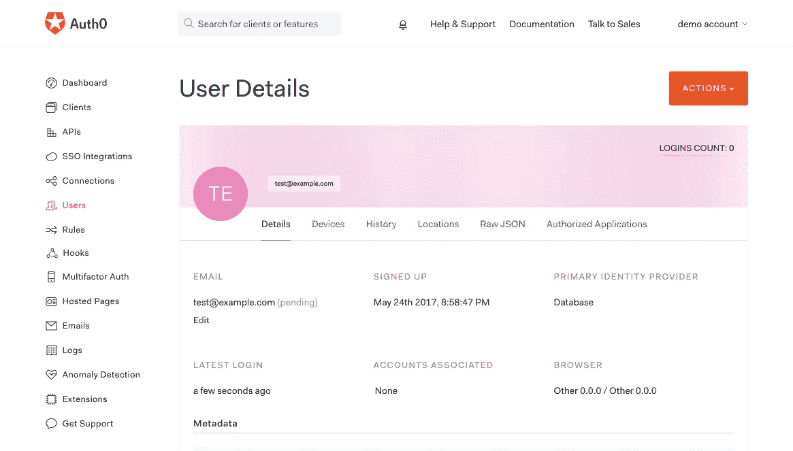
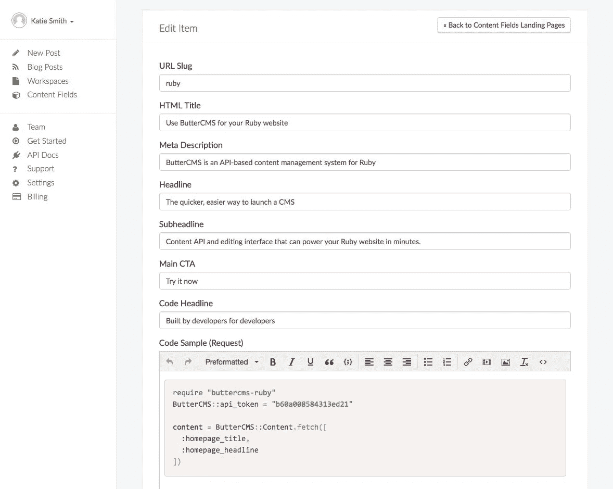
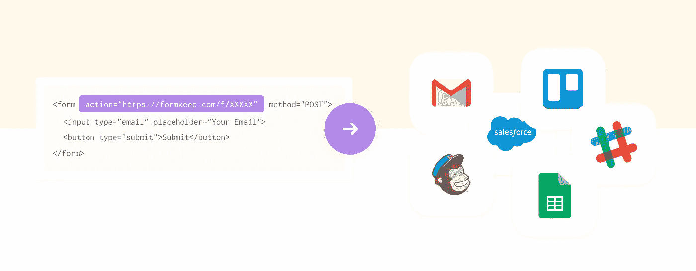

# 5 BaaS 工具可以将开发时间减半

> 原文：<https://medium.com/hackernoon/5-baas-tools-that-can-halve-development-time-d292e8f287da>

为什么要花时间去建造那些你可以买或租的东西呢？

如果您以前从未听说过术语“ [BaaS](https://hackernoon.com/tagged/baas) ”，它代表“[后端](https://hackernoon.com/tagged/backend)即服务”，指的是可以集成到您的应用程序中以快速构建特定功能的第三方服务。

例如，想象一下您的团队为您的产品构建一个单点登录服务以及一个用于提供和管理用户权限的管理界面需要做多少工作。听起来很痛苦吗？好消息是，有大量的服务可以让你不用写一行服务器代码就能实现。

事实上，如今有许多成功的公司能够几乎不用任何自己的服务器端代码就能生产出引人注目的产品。

在本文中，我们介绍了五个 BaaS 提供者，它们解决了一些常见的特性，并研究了它们是如何工作的。

# 1) [Auth0](https://auth0.com/) 进行认证

想象一下，拥有几个服务器提供的 web 应用程序、单页面应用程序、API 和移动应用程序，都需要对一组共享用户进行身份验证和授权？

Auth0 通过其认证平台使这变得更容易。Auth0 可以以多种方式集成，包括[托管登录页面](https://manage.auth0.com/login)和使用 SDK 构建的完全集成的表单。

例如，他们的托管登录页面可以用少量的 JavaScript 代码启动:

```
window.addEventListener('load', function() {

 var webAuth = new auth0.WebAuth({
   domain: 'YOUR_AUTH0_DOMAIN',
   clientID: 'YOUR_CLIENT_ID',
   redirectUri: window.location.href,
   audience: 'https://YOUR_AUTH0_DOMAIN/userinfo',
   responseType: 'token id_token',
   scope: 'openid'
 });

 var loginBtn = document.getElementById('btn-login');

 loginBtn.addEventListener('click', function(e) {
   e.preventDefault();
   webAuth.authorize();
 });
});
```

Auth0 还提供了管理用户、权限甚至模拟的管理界面。



Auth0 甚至提供了不错的额外功能，如多因素身份验证和密码泄露检测。

# 2) [用于博客和内容管理的 ButterCMS](https://buttercms.com/)

假设你已经用你最喜欢的技术栈(比如 Node.js，Rails，React)建立了一个网站。现在假设你需要在你的应用程序中添加一个客户端友好的博客和内容管理系统——就像 WordPress 一样简单易用。

建立博客和 CMS 后台可能是你最不想做的事情。幸运的是， [ButterCMS](https://buttercms.com/) 让这变得简单。

ButterCMS 提供了 API 和[SDK](https://buttercms.com/docs/)来将动态内容集成到您的应用程序中，同时还提供了一个客户端友好的管理界面来编辑和发布内容。

例如，用这个简单的代码使用 [ButterCMS JavaScript 客户端](https://buttercms.com/docs/api-client/javascript)就可以将博客文章或页面内容作为 JSON 获取:

```
butter.post.list().then(function(response) {
 console.log(response)
})butter.content.retrieve(["homepage"]).then(function(response) {
 console.log(response)
})
```

ButterCMS 的管理界面简单而直观，所以你不需要担心你的内容编辑打扰你如何做事情。



# 3) [表单保存](https://formkeep.com/)表单

假设你已经建立了一个简单的静态网站。现在，假设您需要添加一个自定义设计的联系人表单，该表单可以与您的 CRM 集成并发送一封自动回复电子邮件。

构建一个定制的服务器应用程序来处理表单的 POST 请求听起来是一件痛苦的事情，对吗？ [FormKeep](https://formkeep.com/) 的存在就是为了把你从那个麻烦中解救出来。

使用 FormKeep 时，只需将表单指向它们的端点:

```
<form action="https://formkeep.com/f/df42a5f6bd1a" method="POST"> 
  <input type="text" name="name">
  <input type="text" name="email">
  <input type="submit" value="Submit">
</form>
```

FormKeep 可以让你设置定制的回复邮件，并与几乎任何 CRM 或使用 Zapier 的后端集成。



# 4) [电子商务的蜕皮](http://moltin.com/)

如果你想建立一个电子商务网站或应用程序，Moltin 提供了一系列广泛的 API，支持从库存、购物车、结账和支付的一切。Moltin 对于提供跨平台购物体验非常有用，或者如果你想使用你喜欢的技术栈来构建独特的网络体验。

Moltin 的 API 非常广泛，但是为了了解它的样子，这里有一个将产品添加到用户购物车的示例请求:

```
curl -X POST https://api.moltin.com/v2/carts/supercart/items \
 -H "Authorization: Bearer XXXX" \
 -H "Content-Type: application/json" \
 -d '{"data":{"type":"cart_item","id":"9bbf14aa-15ae-42f4-8eed-d860a7c8046f","quantity":1}}'
```

# 5) [SendBird](https://sendbird.com/) 用于发送信息和聊天

你有多少次在应用程序中内置消息或聊天功能？如果你的回答不止一次，很有可能你知道下次你会更希望别人来处理这件事。

SendBird 提供了涵盖从前端 UI 到后端 API 的整个包的 SDK，因此您不必担心精心构建聊天界面或将后端扩展到数百万并发用户。

例如，用 JavaScript 发布来自用户的消息就像三行代码一样简单:

```
channel.sendUserMessage(message, data, customType, function(response, error){
   if (error) {
       console.error(error);
   }
});
```

SendBird 支持各种实现，包括一对一消息传递、群聊和开放频道。它们还提供了不错的高级功能，如阅读回执、垃圾邮件泛滥保护和审核工具。

# 包裹

你有没有一个本文中没有提到的你喜欢的新的后端服务提供商？如果是这样，请在下面的评论中告诉我们！

[](http://bit.ly/HackernoonFB)[](https://goo.gl/k7XYbx)[](https://goo.gl/4ofytp)

> [黑客中午](http://bit.ly/Hackernoon)是黑客如何开始他们的下午。我们是 [@AMI](http://bit.ly/atAMIatAMI) 家庭的一员。我们现在[接受投稿](http://bit.ly/hackernoonsubmission)，并乐意[讨论广告&赞助](mailto:partners@amipublications.com)机会。
> 
> 如果你喜欢这个故事，我们推荐你阅读我们的[最新科技故事](http://bit.ly/hackernoonlatestt)和[趋势科技故事](https://hackernoon.com/trending)。直到下一次，不要把世界的现实想当然！

