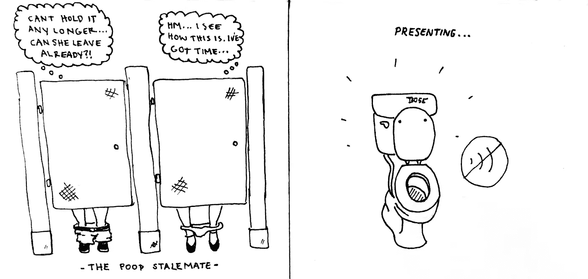
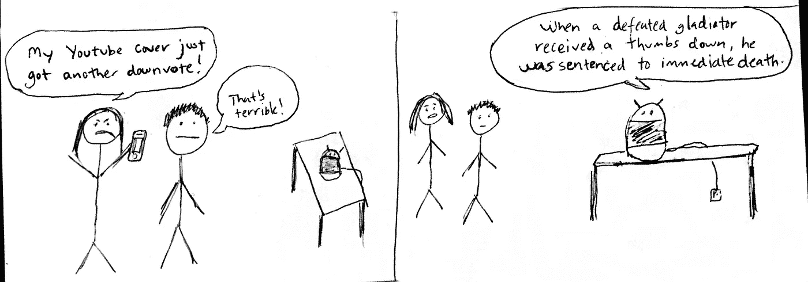
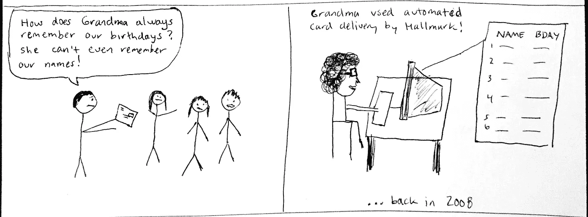
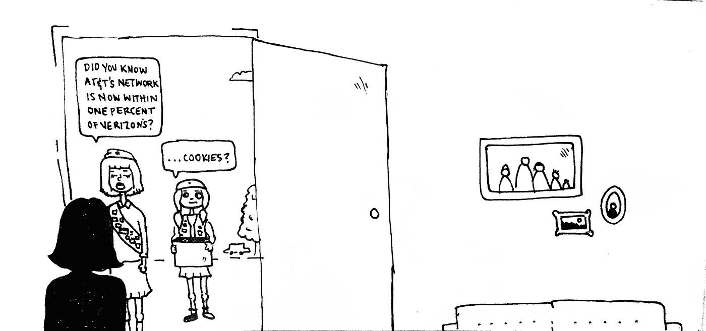
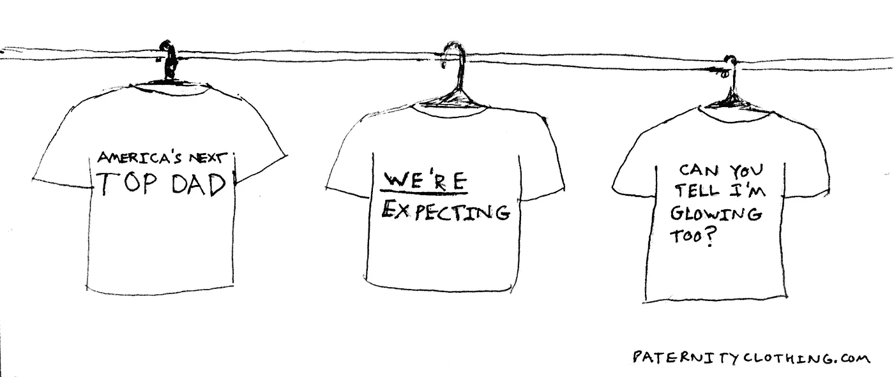

# 5 个糟糕的创业想法(用同样糟糕的图画来解释)

> 原文：<https://medium.com/hackernoon/5-bad-startup-ideas-with-equally-bad-drawings-explaining-them-f2896b2d998e>

投资者请密切关注:如果你正在寻找下一个 [Yo](https://www.justyo.co/) ，下一个[土豆包裹](https://potatoparcel.com/)，下一个优步遇到 SnapChat 的 Slack 的 UI 和 Tinder 的病毒式传播，你来对地方了。

你看，我花了几个月的时间在头脑风暴模式中。好主意已经被投入到一家名为 [Incremental](https://www.angel.co/incremental) 的创业公司中，这家公司是我在二月份帮助创立的。坏主意？他们当然就在这里！

# 坏主意 1:透视机器人

担心注射流感疫苗？为你的科切拉航班延误而难过？因为你的优步游泳池中途又多了一名乘客而生气？？这里有一个解决方案，它将……把事情放在正确的位置。

PerspectiveBot 利用最新的人工智能技术无情地贬低你平凡的第一世界问题。拥有超过 100 万个令人谦卑的事实，PerspectiveBot 可以将最不切实际的人带回冷酷的现实。起价 79.99 美元。

# 坏主意 2:自动送卡服务

让我们面对现实吧。甘甘不像以前那样精明了。随着她第九个孙子的到来，她几乎不可能记住每个人的名字，更不用说他们的生日了。从那时起，你就开始帮助她规划未来——自动化卡片递送服务使未来成为可能。

只需 29.99 美元/年，霍尔马克公司就会在每个孙辈生日时，从 Gam Gam 那里寄出一张贴心的、有年龄限制的贺卡。Hallmark 提供快速、简单的设置—只需告诉我们每个孙子的姓名和生日，我们将确保他们在开始有孙子之前收到卡片。

# 坏主意 3:噪音消除厕所

Image by Jugo de Palabras

多年来，公司休息室一直是一个充满争议的地方。一个典型的放松活动会因为不速之客的到来而迅速演变成令人伤脑筋的僵局的地方。但不会太久哦，疲倦的浴室常客。介绍噪音消除厕所 Bose。

Bose 静音马桶标志着快速扩张的马桶技术市场的一项重大突破，它来自为您带来降噪耳机清脆宁静声音的人们。只需 1499 美元，你就可以让整个办公室浴室终身“隔音”。不再僵持，不再压抑，不再把脚藏在座位上。

*旁注:看来谷歌已经* [*为这个想法*](https://www.google.com/patents/US20060039569) *申请了专利。看来我不是唯一一个在厕所技术上下大赌注的人…*

# 坏主意 4:女童子军广告

Image by Jugo de Palabras

营销人员正面临艰难时期。垃圾邮件过滤器变得越来越智能，广告拦截器变得越来越主流，消费者不再相信“原生”或“内馈”这样的策略。是时候发出警报并派出重磅人物了。

每年售出超过 2 亿盒，女童子军有史以来最高的转化率。现在，他们准备为你销售。从每栋房子 5 美元开始，女童子军将向任何安静的郊区社区广播你的信息(只要他们能顺便卖几盒饼干)。

# 坏主意 5:父亲服装

随着产妇和待产母亲的喧嚣，准爸爸们很容易在混乱中迷失。振作爸爸们——这个服装系列是专为你们设计的！

有 500 多件 t 恤可供选择，paternityclothing.com 是期待爸爸们的一站式商店(是的，我们认为爸爸们也可以期待！).每件衬衫都由 100%棉制成，并附有第三胎保证。父亲 t 恤是送给你生命中期待中的父亲的完美礼物。

# 拿出那些支票簿…

这就是你想要的——5 个低于标准的创业想法，以及一份匆忙写好的电梯间推介。古巴人，打我！

特别感谢美妙的 [Jugo de Palabras](/@yaelcecilia) 在一些想法和绘画上的帮助(提示:她画了一些好的)。直到下一次…

> [黑客中午](http://bit.ly/Hackernoon)是黑客如何开始他们的下午。我们是 [@AMI](http://bit.ly/atAMIatAMI) 家庭的一员。我们现在[接受投稿](http://bit.ly/hackernoonsubmission)并乐意[讨论广告&赞助](mailto:partners@amipublications.com)机会。
> 
> 如果你喜欢这个故事，我们推荐你阅读我们的[最新科技故事](http://bit.ly/hackernoonlatestt)和[趋势科技故事](https://hackernoon.com/trending)。直到下一次，不要把世界的现实想当然！

