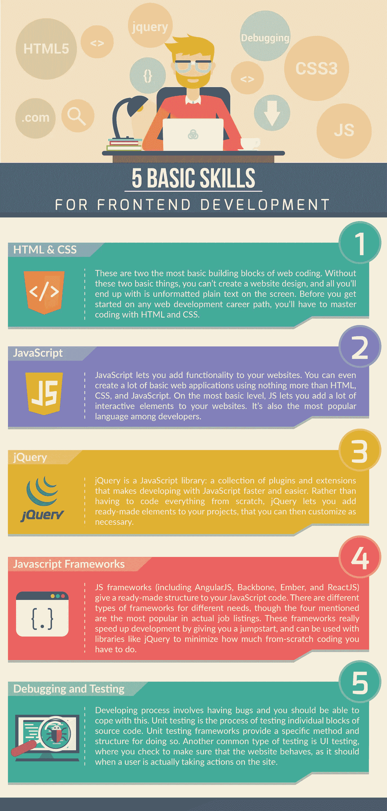

# 前端开发的 5 个基本技能[信息图]

> 原文：<https://medium.com/hackernoon/5-basic-skills-for-frontend-development-infographic-8c9568dab4d2>

我们理解你不想读太多的字。这里有一张很好的信息图，展示了如何成为一名优秀的前端开发人员。检查一下我们挑选出来的一些基本技能的小列表，确保你已经掌握了它们。))

[*德米特里·布科*写的](https://www.linkedin.com/in/dmitrybudko/\)

*想了解更多？* [*点击这里查看*](https://dashbouquet.com/blog)