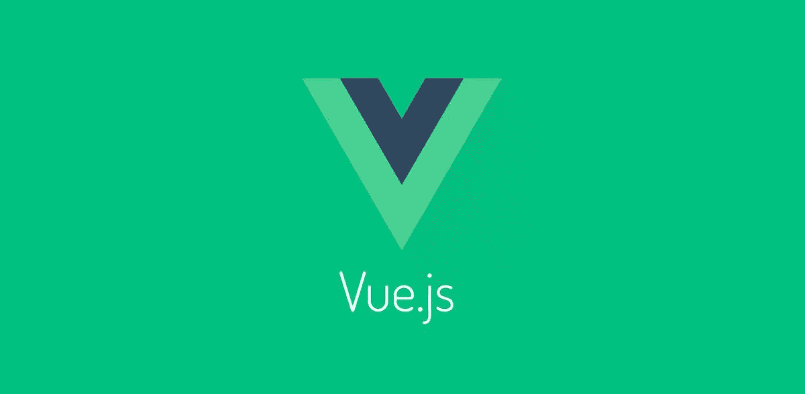
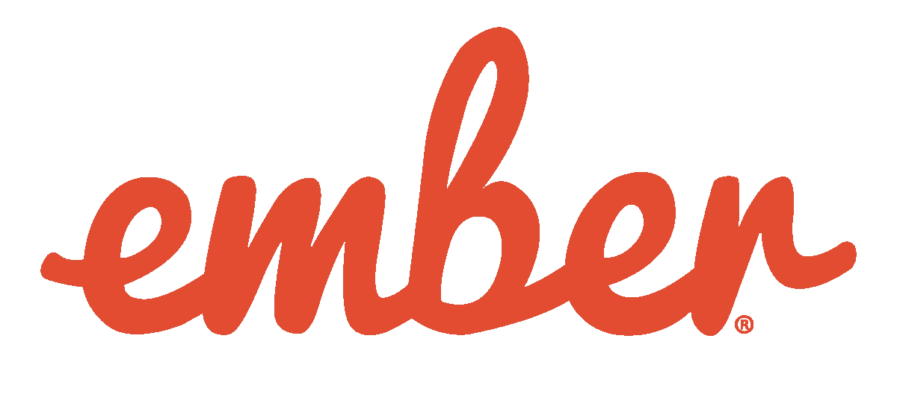
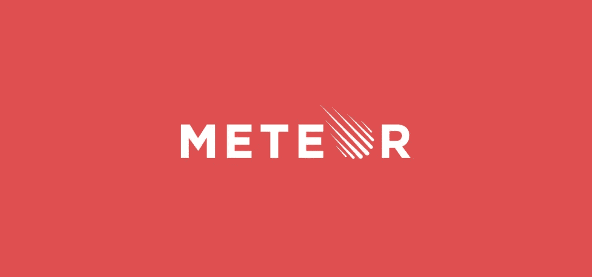
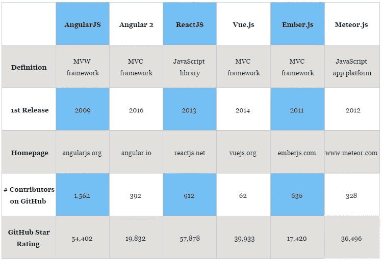
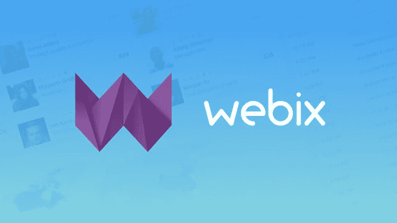

# 2017 年 5 个最佳 JavaScript 框架

> 原文：<https://medium.com/hackernoon/5-best-javascript-frameworks-in-2017-7a63b3870282>

avaScript 的受欢迎程度持续上升。2016 年我们见证了如此巨大的变化，如 AngularJS 的全面升级和 Angular 2 的引入，jQuery 在所有 JS 网站的 [96.5%](https://w3techs.com/technologies/details/js-jquery/all/all) 上的最终统治地位，ECMAScript 的发展，Node.js 在 4 月和 10 月的两次更新，React finest hours，甚至更多。2017 年有什么期待？—这是我们目前所知的: [Angular 4](https://da-14.com/blog/how-will-angular-4-change-app-development) 预计在 2017 年 3 月， [ES2017](https://github.com/tc39/proposals/blob/master/finished-proposals.md) 版计划在 2017 年年中发布，Bootstrap v4 预计也将在今年发布。

最近，JavaScript 被 IBM[评为 2017 年最值得学习的编程语言之一。在这个阶段，它被用于客户端和服务器端，有助于设计有趣的界面，丰富具有众多功能和特性的 web 应用程序，实时修改网页等等。](https://www.ibm.com/developerworks/community/blogs/d13a8e32-0870-49cb-9b0d-ba0e34fa6561/entry/Which_Are_The_Best_Programming_Languages_to_Learn_in_2017?lang=en)

与此同时，JavaScript web 框架可以成为快速 web 应用程序开发的银弹。它们充当了单页应用的框架，允许开发人员在关注复杂界面元素的创建时减少对代码结构或维护的担心，并扩大了 JS 和普通 HTML 的机会。

## 使用 JavaScript 框架的优势:

*   **效率** —过去需要几个月和数百行代码的项目现在可以通过结构良好的预构建模式和功能更快地完成。
*   **安全性** —顶级的 javascript 框架有可靠的安全性安排，并得到大型社区的支持，社区成员和用户也充当测试人员。
*   **成本** —大多数框架都是开源和免费的。因为它们帮助程序员更快地构建定制解决方案，所以 web 应用的最终价格会更低。

## 2017 年最佳 JavaScript 框架:

**角度-s**

在 2016 年期待已久的 Angular back 发布后，它的受欢迎程度达到了新的高度，尽管 AngularJS 将在 2017 年推迟让步。

Angular.js 通常被称为 MVW (Model-View-Whatever)框架，对于初创公司和中型公司来说，它的最大好处是:快速代码生成、轻松测试任何应用程序部分和双向数据绑定(后端的变化会立即反映在 UI 上)。自发布以来，其生态系统已经超出想象。到目前为止，它被合理地称为 SPAs(单页应用程序)开发中使用最多的 JS 框架，并且拥有最大的开发人员社区。

**Angular2** 附带了一长串功能，可以构建从网络到桌面和移动的一切。该框架是用微软的 TypeScript 构建的，目的是让 JavaScript 对大型企业来说更灵活、更有吸引力。ng2 具有基于组件的架构、改进的 DI(依赖注入)、高效的日志服务、组件间通信等等。

对于基于企业的应用程序或对代码可读性有高标准要求的严格编程环境，这两种 Angular-s 都是更好的选择。

**反应堆**

我们已经做了 [React 和角度比较](https://da-14.com/blog/reactjs-vs-angular-comparison-which-better)，尽管事实上它更像是一个库而不是 JS 框架。它位于脸书和 Instagram 的用户界面之后，显示了它在动态高流量应用程序中的效率。

它被认为是发展最快的 JS 框架:截至今天，Github 上大约有 1000 名贡献者。在 MVC(模型-视图-控制器)模式中 **React.js** 充当“V”的角色，可以和任何架构平滑集成。由于虚拟 DOM 的使用，与 Angular 1.x 相比，它提供了很大的性能提升。除此之外，React 组件可以在应用程序之间创建和重用，甚至可以转移供公共使用。

尽管 React 的学习曲线更高，但它使应用程序开发变得简单易懂。此外，它非常适合复杂、高负载和出色的软件解决方案。

**Vue.js**

**Vue 2.0** 也于 2016 年推出，它吸取了 Ember、React 和 Angular 的精华，将所有这些都放入了一个方便的包中。与 React 和 Angular 2.0 相比，它被证明更快、更精简。

更深入地说，Vue.js 提供了双向数据绑定(见于 AngularJS)，服务器端渲染(如 Angular2 和 ReactJS)，Vue-cli(快速入门的脚手架工具)和可选的 JSX 支持。它的创始人说 Vue 2 是最快的框架之一。

Vue.js 是跨平台解决方案快速开发的较好选择。它可以成为高端单页应用程序(SPAs)的坚实基础，并在性能被置于良好的代码组织或应用程序结构之前的情况下成为有益的解决方案。

**Ember.js**

早在 2015 年，Ember 被称为 web 应用程序的最佳 javascript 框架，仅次于 React 和 AngularJS。今天，它拥有一个巨大的在线社区，定期更新和 JavaScript 最佳实践的广泛应用，以保证开箱即用的终极体验。

**Ember** 的特点是双向数据绑定，比如 Angular.js，让视图和模型始终保持同步。应用 Fastboot.js 模块保证了 DOM 在服务器端的快速渲染，提高了复杂用户界面的性能。

Emberjs 通常用于复杂的功能丰富的 web 应用程序和网站。顶级用户包括 Chipotle、Blue 围裙、Nordstrom、Kickstarter、LinkedIn、网飞和许多其他公司。此外，它有一个更容易的学习曲线，网上有大量的教程和指南。

**Meteor.js**

Meteor 是最流行的 JavaScript 框架之一，但是它为后端开发、前端渲染、数据库管理和业务逻辑提供了大量的特性。自 2012 年发布以来，它的生态系统急剧增长，速度很快。

这个全栈平台支持纯 JavaScript 的端到端 web 和移动应用的快速开发。由于模块化的结构，所有的包和库都可以同步使用。就性能而言，数据库中的所有更改都会立即传输到 UI，相反，不会因为不同的语言或服务器响应时间而造成明显的时间损失。

meteorojs 涵盖了软件开发周期的所有阶段，并负责链接、文件连接和其他类似的流程。它目前用于马自达、宜家、霍尼韦尔等商业公司的实时应用程序开发。

## JavaScript 框架比较:

## **值得一提的**

不是每个人都需要像 React 或 Angular 这样的大型市场参与者提供的所有功能。如果一个人正在寻找一个简单的 JavaScript UI 框架来完成不复杂的任务和小项目呢？

在这种情况下，有几种合适的选择。例如， **Webix** 。这是一个 JS UI 库，适合创建各种类型的 web 应用程序，帮助轻松通过概念验证阶段，实现快速的应用程序原型，并处理许多其他任务。这是一个价格合理的轻量级解决方案，当不需要强大框架提供的太多功能时，可以避免支付过多的费用。

Webix 为程序员提供了 100 个可响应的 UI 小部件和 CSS / HTML5 JS 控件，这些控件可以集成到其他 JS 平台中。探索和研究一个新的解决方案并不需要很多时间。即使是初级开发人员或新的团队成员也可以很快搞清楚一切，并立即开始工作。

尝试自定义布局通常会导致错误。因此，解决方案的默认设计应该是高质量的，这样程序员就不必过多地修改它。这个 UI 库有 5 个漂亮的设计皮肤可供选择。

还有 5 个附加的复杂小部件，允许创建丰富的用户界面:看板、Pivot、文件管理器、电子表格和移动调度器。此外，Webix 是跨平台应用程序开发的合适工具。

## 结论

选择正确的 JavaScript 框架并不在于每个框架能提供的特性。它取决于最初的公司目标、项目需求、一般框架功能以及如何在每个特定案例中应用它。

当谈到快速 web 开发或原型开发时，JavaScript 框架是最受欢迎的，2017 年也不会例外。这些框架和库已经改变了 JS 与 HTML 和 CSS 合作在浏览器中编译视图的方式，到目前为止，在本地平台上也是如此。

> [黑客中午](http://bit.ly/Hackernoon)是黑客如何开始他们的下午。我们是 [@AMI](http://bit.ly/atAMIatAMI) 家庭的一员。我们现在[接受投稿](http://bit.ly/hackernoonsubmission)，并乐意[讨论广告&赞助](mailto:partners@amipublications.com)机会。
> 
> 如果你喜欢这个故事，我们推荐你阅读我们的[最新科技故事](http://bit.ly/hackernoonlatestt)和[趋势科技故事](https://hackernoon.com/trending)。直到下一次，不要把世界的现实想当然！

