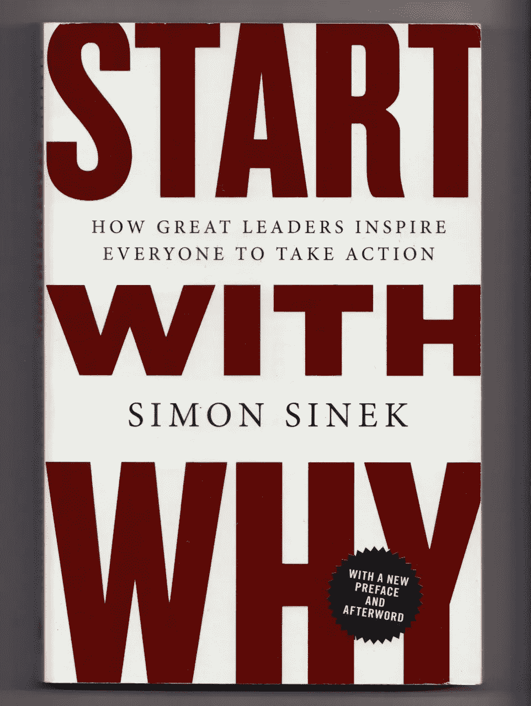
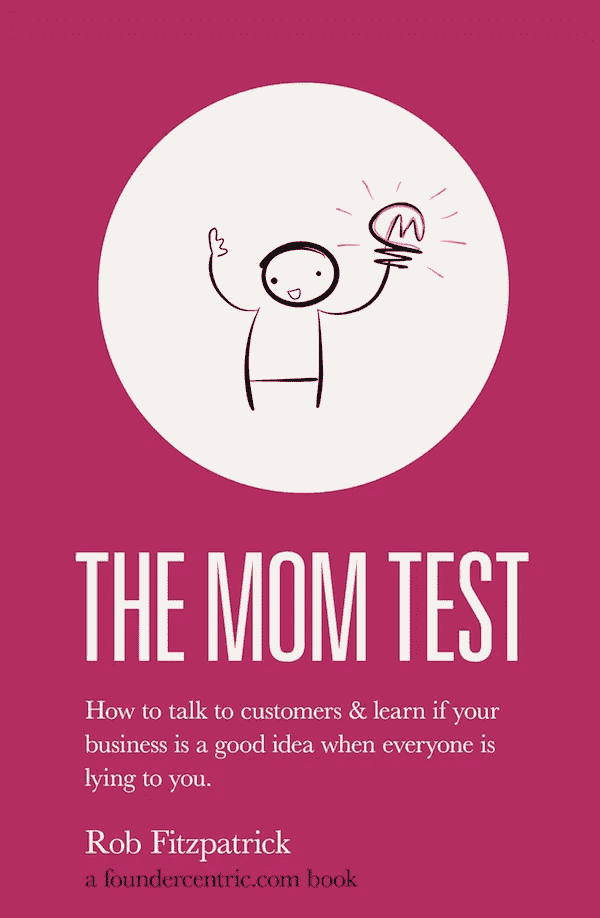
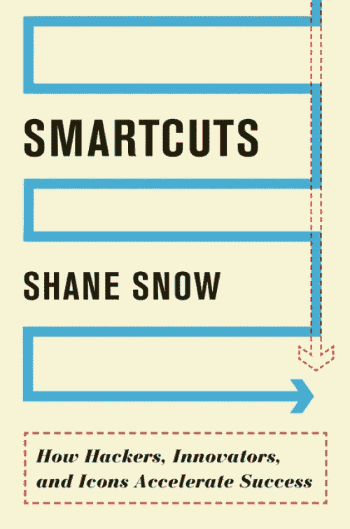
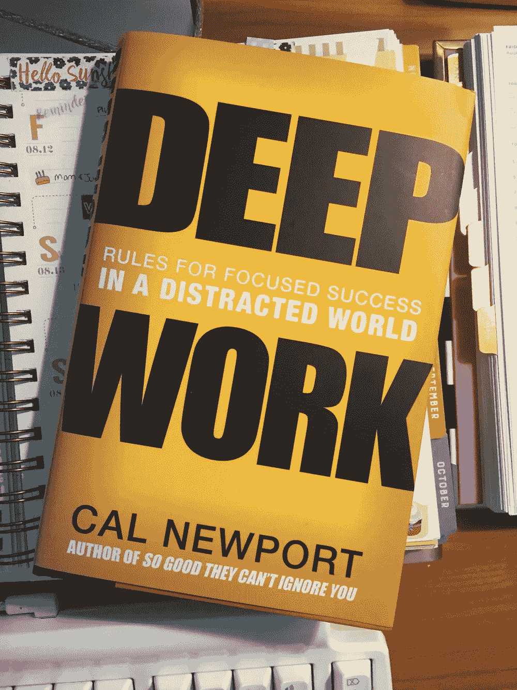

# 每位创始人必读的 5 本书

> 原文：<https://medium.com/hackernoon/5-books-every-founder-must-read-9e7fa03e6b5a>

# [从为什么开始:伟大的领导者如何激励每个人采取行动](http://amzn.to/2pGIQvU)

我创业的头两年很艰难。我们在各种想法之间周旋，经常回到起点，感到困惑，几乎没有结果。我们推出了多种没有吸引力的产品。如果你是这些症状的受害者，这本书会给你指导。

如果你的目标是赚钱，那就是错误的理由。如果有影响的话。目标太抽象了。我们犯了同样的错误。我们的第一个解决方案是为活动组织者，第二个是为板球迷，然后是足球迷，等等。这些几乎没有得到牵引力。除非你明确你的原因，否则你的共同创始人不会在同一页上，员工不会知道他们公司在做什么，甚至不会考虑你的客户。

后来，我们定义了我们的为什么。*“我们希望改善印度足球的基础设施，并看到我们的国家在国际足联排名中名列前茅”*。

在接下来的几个月里，我们结束了四次合作。我们让社区里的人为我们工作。他们工作不是为了金钱和认可。而是为了支持这项事业。绝对值得一读。

[亚马逊上的书](http://amzn.to/2pGIQvU)

# [妈妈测试:如何与顾客交谈&当所有人都在对你撒谎时，了解你的生意是否是个好主意](http://amzn.to/2pDYc1Z)

如果你的产品不能解决用户的问题，他们就不会使用它。在开发我们的产品时，我们采访了很多用户。我们失败了，因为我们对用户遇到的问题做了假设，并形成了一个想法。采访过程是为了验证这一想法。

如果你提出你的想法。大家都说喜欢。你当然想听，而且迫不及待地想看到它的行动。这是一个错误。大多数人撒谎是因为他们想做好人。

不要向你的顾客推销你的产品。把用户访谈当作一个发现真相的过程，而不是验证你的想法。这需要你提出正确的问题。这本书是关于精心设计这些问题的。

[亚马逊上的书](http://amzn.to/2pDYc1Z)

# [Smartcuts:横向思维的突破力量](http://amzn.to/2qCF8QY)

作为团队中唯一的程序员，我很难从事后端、移动和开发工作。我被迫寻找更快出货的捷径。我在这里分享了我的经验，[如何快速廉价地建造它](/@heyfebin/how-to-build-it-fast-and-cheap-cffbd21881bc)。

这是很久以前，我甚至听说过这本书。我知道如何破解产品开发。从没想过我能把这个应用到我的个人生活中。这本书同样帮助了我。

最初，我在 medium 上的文章浏览量不到 100 次。现在，我是 FreeCodeCamp、Hackernoon、Startup Grind(一些顶级媒体出版物)的作者，同时也是技术、创新和商业领域的顶级作家。这发生在几个月之内。这本书帮助你在你想擅长的领域加速你的成功。

[亚马逊上的书](http://amzn.to/2qCF8QY)

# [深度工作:在分心的世界里专注成功的规则](http://amzn.to/2pv87sq)

如果你在工作中找不到满足感，你的工作就很肤浅。肤浅的工作会降低生产力，让你讨厌自己的工作，变得无精打采等等。另一方面，深度工作会提高效率，让你爱上你的工作，最终你会放松下来。

你被设计用来转移你注意力的产品包围着。脸书、Snapchat 等设计他们的产品让你上瘾。这对他们有意义，因为他们用你的时间赚钱。另一方面，你要付出代价。这本书帮助你完成深入的工作。必读！

[亚马逊上的书](http://amzn.to/2pv87sq)

# [传染性:为什么事情会流行起来](http://amzn.to/2pv41jQ)

我一直想知道为什么有些帖子或产品会像病毒一样传播。这是偶然发生的吗？这能被工程化吗？这本书解释了可以帮助你设计病毒的技术。

在信息混乱的时代，很难穿过混乱并传达信息。除非你能坚持你的信息，否则人们根本不会在意。

我把这些技术应用到了我在 Hackernews 上发布的帖子上。我的[因缘](https://news.ycombinator.com/user?id=febin)从-6 到 300。从我个人的经验来看，本书中的技巧应该坚持不懈地应用。

[亚马逊上的书](http://amzn.to/2pv41jQ)

> [黑客中午](http://bit.ly/Hackernoon)是黑客如何开始他们的下午。我们是 AMI 家庭的一员。我们现在[接受投稿](http://bit.ly/hackernoonsubmission)并乐意[讨论广告&赞助](mailto:partners@amipublications.com)机会。
> 
> 如果你喜欢这个故事，我们推荐你阅读我们的[最新科技故事](http://bit.ly/hackernoonlatestt)和[趋势科技故事](https://hackernoon.com/trending)。直到下一次，不要把世界的现实想当然！

