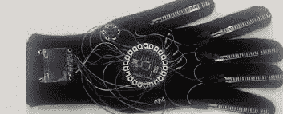
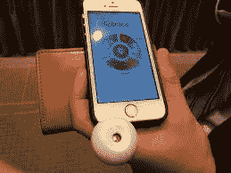
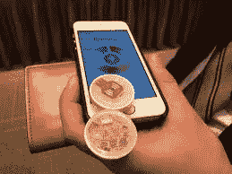

# 你必须知道的 5 个很酷的创新

> 原文：<https://medium.com/hackernoon/5-cool-innovations-you-must-know-of-5a4c880abde>

就在我们想到今天的技术有多先进的时候，在世界的某个地方，一些有创造力和才华的人，提出了另一个令人难以置信的发明。

我想分享 5 个非常酷的创新，它们是世界各地一些疯狂的想法的结果，是我不久前才知道的，肯定会让你惊叹。

1.  **强大的钱包**

一款性感时尚的钱包，内置手机充电器。MightyPurse 是 HButler 的一项创新，拥有一系列令人惊叹的女性钱包和手包，以及可用于 micro USB 智能手机和 iPhone 的充电器。

这项技术与时尚相融合，确实对市场产生了强烈的影响。中间的口袋里有充电线，你要做的就是插入里面的 usb 端口。钱包也需要充电，这样你就可以用它来给手机充电。它有一个 LED 电池电量指示器，当给钱包或钱包内的手机充电时，它会激活。HButler 还推出了他们的新智能产品——Orbit，一个类似圆形按钮的小物体，当它附着在任何物体上时，比如房子或汽车钥匙，可以帮助跟踪它，所以它不会丢失。

因此，如果你几乎一整天都在外面，并且没有真正在你附近找到充电点，当然还带着一部电池消耗非常快的智能手机，不要忘记，为了增加你的时尚商数，你现在知道该买什么了。

2.**智能手套**

沙特设计师兼媒体艺术家哈迪尔·阿尤布发明了一种智能手套，可以将手势转换成相关文本。到目前为止，她已经完成了三个原型，以及一个用于在小屏幕上显示签名单词和短语的计算机应用程序，并且在她的方法中取得了进展，每个都变得更薄、更轻、更快。她期待在她的下一个原型中添加更多功能，如与移动应用程序同步，这样它也可以用来发送电子邮件，并翻译成多种语言。她希望自己的发明能让全球任何地方的每个人都能使用 Wifi 功能。第四个原型估计花费大约 386 美元。

令人惊讶的是，她正致力于让世界变得更美好，让戴上智能手套的残疾人不再感到被冷落。

3.**隐形自行车头盔——赫夫丁**

我们不戴头盔的主要原因是因为它会损坏我们的头发，或者让我们看起来很丑。这项由两位瑞典女性 Teresa Alstin 和 Anna Haupt 发明的创新是可充气的，而且看起来非常实用。它看起来像围在脖子上的围巾，所以它看起来像衣服的另一部分，不会破坏我们的外观。在检测到通常发生在事故之前的异常颈部运动时，它会膨胀成一个安全气囊，并提供最佳的减震效果。所以，所有读到这篇文章的骑自行车的人，除了你的自行车技术，你们又有新的东西可以炫耀了。

霍丁是安全与时尚的完美结合。

4.**场景**

Scentee 是一款智能手机附件，与日本应用 Scentee 配合使用，旨在通过信息发送香味。外部装置包括用于各种气味的盒的槽。从花香和果香到汤、培根甚至咖喱，一系列的卡丁车都有。你也可以设置一种标志性的香味。该附件必须插入智能手机的耳机端口。如果你醒来时闻到一股味道，特别是熏肉或咖啡的味道，这就派上用场了。所以你可以为你的闹钟设置一种气味，或者给你的朋友发一条带有香味的短信。Scentee 应用程序在 playstore 以及日本和美国的 app store 上可用，附件也仅在这些国家可用。

这里有一个 youtube 链接，看看这个惊人的创新:【https://www.youtube.com/watch?v=xc8Uoxs6dKk 

5.**百合飞行相机**

这个是我最喜欢的。顾名思义，它会飞，所以你所要做的就是打开设备，把它扔向空中。它基本上是一个由可穿戴设备激活的小型四轴飞行器，可穿戴设备还可以控制其他动作。可以使用相同的移动应用程序。它重约 1.3 公斤，所以你可以把它放在背包里。当你把它扔向空中时，它的马达会自动启动。理想的飞行时间是 20 分钟。它有 4GB 的内部空间用于存储照片和视频，还有用于外部 microSD 卡的插槽。它有一个内置麦克风，可以在拍摄视频的同时播放音频。

查看更多百合飞行相机的规格:[http://www.cnet.com/products/lily-camera/](http://www.cnet.com/products/lily-camera/)

它也能浮在水面上。这是为了拍出完美的照片。对于那些经常去旅行和度假的人，以及手里拿着相机很难拍摄的地方非常有用。不可思议的产品，适合旅行爱好者和聚会人士，他们可以 360 度拍摄他们的疯狂。Lily 相机要到 2016 年 2 月才会开始发货。但在那之后，你肯定会成为一个骄傲的主人。

一定要看这个视频，它会让你爱上这个发明，你现在就想拥有一个百合相机:P

这是我遇到的 5 项创新，它们让我思考科技能给我们带来多大的惊喜。

另外，如果你知道任何其他最近的伟大创新，请在下面的回复部分与我们分享。

*如果你喜欢我写的东西，并且想保持更新，那么就在 Medium 上关注我。此外，您可以点击*订阅接收我的更多帖子的更新

> [黑客中午](http://bit.ly/Hackernoon)是黑客如何开始他们的下午。我们是 [@AMI](http://bit.ly/atAMIatAMI) 家庭的一员。我们现在[接受投稿](http://bit.ly/hackernoonsubmission)并乐意[讨论广告&赞助](mailto:partners@amipublications.com)机会。
> 
> 如果你喜欢这个故事，我们推荐你阅读我们的[最新科技故事](http://bit.ly/hackernoonlatestt)和[趋势科技故事](https://hackernoon.com/trending)。直到下一次，不要把世界的现实想当然！

