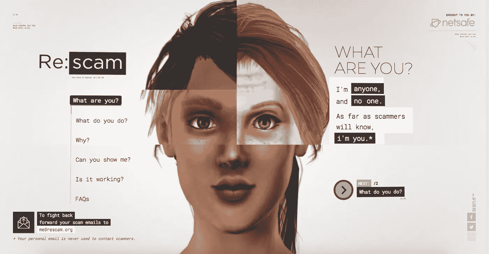
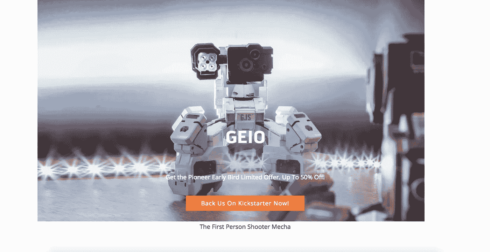
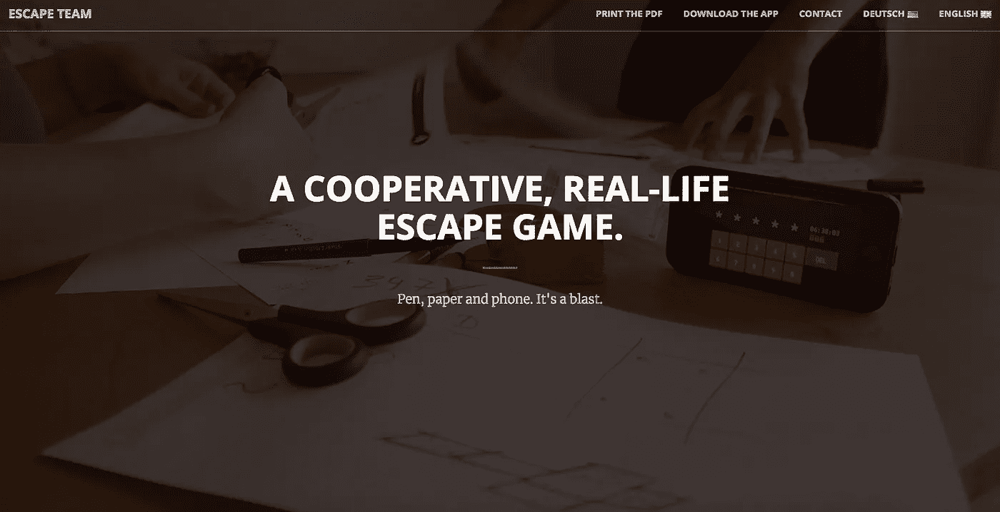
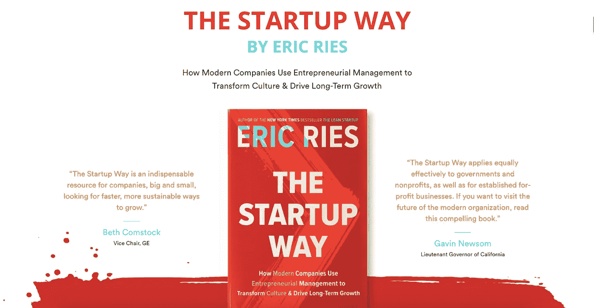

# ProductHunt 上 5 款最酷的产品[2017 年 10 月至 11 月]

> 原文：<https://medium.com/hackernoon/5-cool-products-on-product-hunt-last-month-7d5d83bd876d>

## 看最后一个。

Image Source: Re:scam

## 对于应用程序创建者、产品构建者和忙碌的营销人员来说，永远不会有末日。

看起来他们已经开始构建一些东西了，这些东西总是吸引人，吸引人，吸引人，吸引人，解决痛苦。或许，他们所达到的质量将有可能击败其他饱和品牌。

很快，我打赌。

还记得四年前的那一天吗，当 [Slack](https://medium.com/u/26d90a99f605?source=post_page-----7d5d83bd876d--------------------------------) 推出了一款**革命性的实时消息应用**击败了消息龙 **Hipchat** ？有许多经过精心设计的等效产品，确实让我们的生活变得足够轻松。

团队不再需要在各自的桌子上工作。

有了像 [Slack](https://medium.com/u/26d90a99f605?source=post_page-----7d5d83bd876d--------------------------------) 、 [Trello](https://medium.com/u/fb5dd2d116a1?source=post_page-----7d5d83bd876d--------------------------------) 以及类似的工具，团队协作已经变得太简单和直接了。然而，像 [Zoom](https://medium.com/u/c4c2efc9bc0a?source=post_page-----7d5d83bd876d--------------------------------) 这样的应用程序可以让我们通过视频通话与同事和其他人联系。

鸭汤！

还有比这更容易的吗？

现在的大多数产品都带有内置的本地机器人，执行各种自动化，从电子邮件自动回复到订票。

诸如此类的东西让我们专注于创建更多的**紧迫内容/功能**，而机器人则负责将**相关内容**反馈给我们的潜在用户。

> 显然，大多数多余的任务都由传说中的机器人来完成。

让我们看看上个月在 [**产品搜索**上争夺位置的 **5** 这样的**疯狂产品**。](https://www.producthunt.com/)

## [真正优秀的 UX](https://www.reallygoodux.io/)

Image Source: Really Goood UX

来自**的朋友们在堆叠**截屏**方面做得非常出色，他们拍摄了**美妙的 UX 流**。**

**他们共同用 **1000+ UX 流**建造了它。它们以博客的形式发布在[true good UX . io](https://www.reallygoodux.io/)上，供 UX 的狂热爱好者和专家们寻求灵感，并用于进一步的 UX 研究。**

## **[GEIO](https://www.gjsrobot.com/)**

****

**Image Source: GEIO**

****GEIO** 是一款**第一人称射击机器人**采用 **AI** 算法驱动，极具艺术性。**

**它是独一无二的，或者可能是第一个先进的战斗机器人。其内置的 AI 芯片和**自动扫描** & **识别系统**帮助识别敌方机器人并触发自动跟踪。这种能力是 GEIO 拥有的所有其他古怪专业技能中最强的。**

> **更类似于自动驾驶汽车中使用的技术。**

**与通常的**mechanis**不同，拥有 **FPV 功能的** GEIO 能够以独特的视角看待我们的家。**

## **[逃生队](http://www.escape-team.com/)**

****

**Image Source: Escape Team**

**[**逃逸团队**](http://www.escape-team.com/) 是一款扣人心弦的**数字-物理游戏**，让您和您的朋友们一起解决现实世界中的难题。**

**你必须摆弄纸和笔来破解这个游戏。同时牢记您承诺的**倒计时**。一款合作的纸笔逃逸游戏适用于 **iOS** 和**安卓用户**。**

## **[启动方式](http://thestartupway.com/?ref=producthunt)**

****

**Image Source: The Startup Way**

**那些受**创业文化**影响的人一定读过**的《精益创业》，作者 [**Eric Ries**](https://www.google.co.in/url?sa=t&rct=j&q=&esrc=s&source=web&cd=1&cad=rja&uact=8&ved=0ahUKEwjEyNb7n7jXAhXLN48KHQ02BTkQFggnMAA&url=https%3A%2F%2Fen.wikipedia.org%2Fwiki%2FEric_Ries&usg=AOvVaw214DL8kQIdU8YGXEluIPmN) ，畅销书之一**纽约时报作者**。****

****解密成功的创业公司所应用的综合策略，以及其他试图游过冒险风暴的人如何在这个 21 世纪取得成功。****

****确切地说，这本书带我们了解了任何规模的企业必须如何实施经过检验和证明的战略，以及为什么我们都是企业家，必须像企业家一样行事。****

******现在好了，******

> ****我们都希望我们过去浪费的时间能够回来，这样我们现在就可以做一些有价值的事情。不是吗？****

****说起来，这里有一个**省时机**如果还不是时光旅行机的话。****

## ****[回复:骗局](https://www.rescam.org/)****

********

****Image Source: Re:scam****

******打击骗子**从来没有这么爽过，直到最近 [Re:scam](https://www.rescam.org/) 突然出现。****

> ****你还会害怕机器人说企业会想出这样具体有用的模型吗？不😺****

****回复:scam 是一种智能服务，它通过**用永无止境的对话和趣闻来对付骗子**，从而帮助人类节省时间。自动适应一个**独特的角色**(骗子会识别为你)**建立不间断的对话**。****

****这将是反击骗子的更好方式，同时也节省了其他人的时间，因为你不只是阻止那些电子邮件，而是将它分配给一个智能机器人。****

****让我们以这些令人惊叹的服务作为结束，供您试用。如果你最近偶然发现了任何突破性的产品，在这里写下它们。****

## ****我是所有👂 👂 👂****