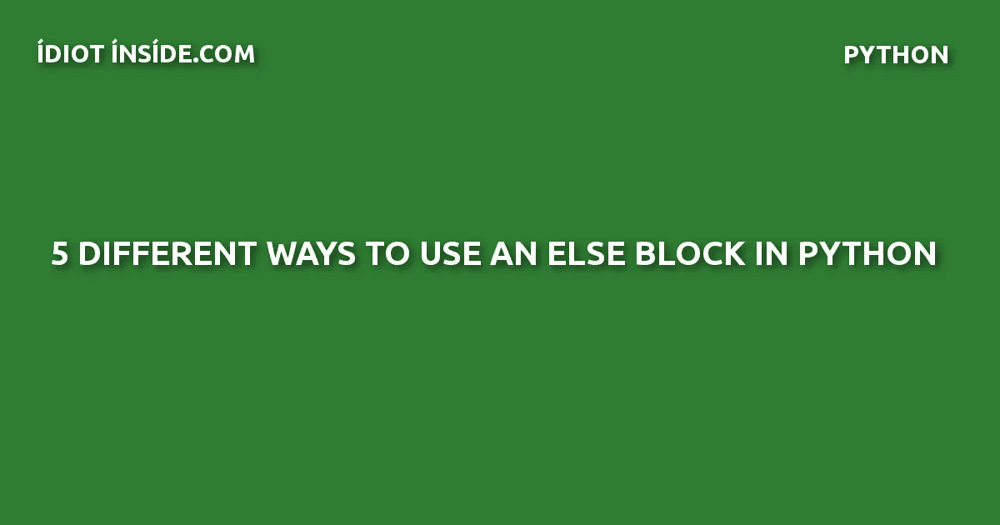
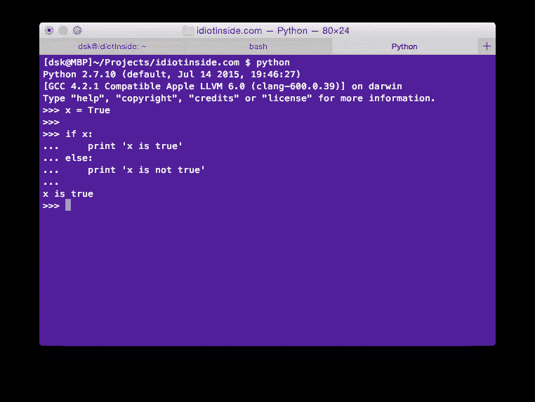
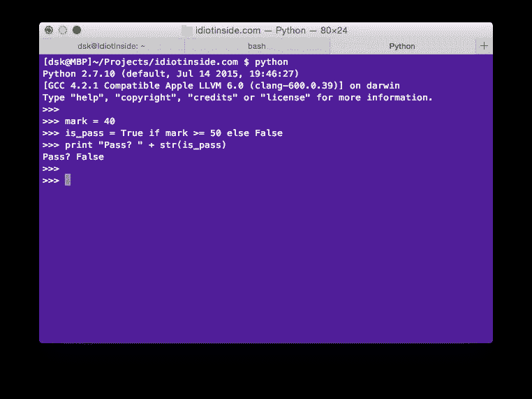
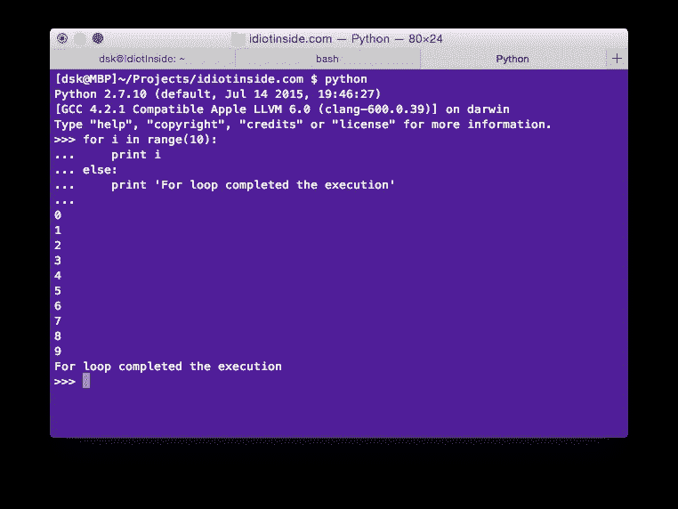
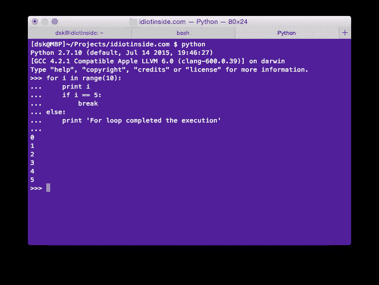
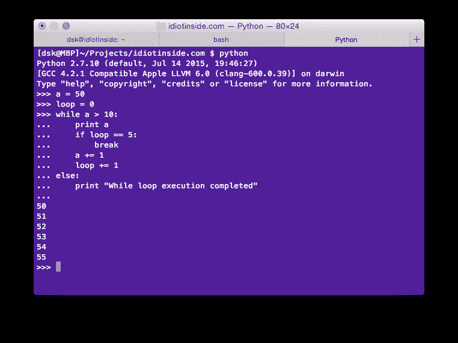
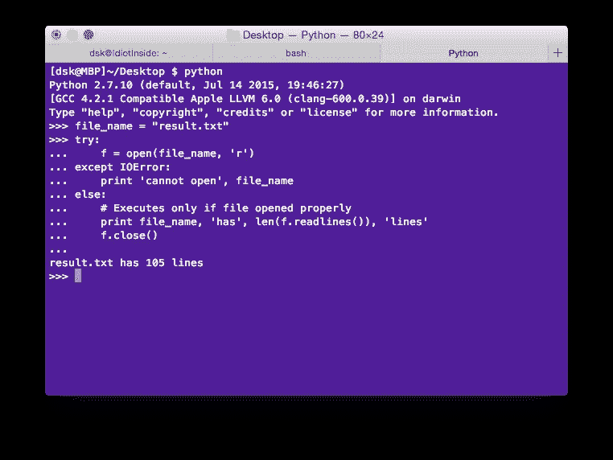

# 在 python 中使用 else 块的 5 种不同方法

> 原文：<https://medium.com/hackernoon/5-different-methods-to-use-an-else-block-in-python-5ab471b2c943>



# 1.否则

这是通常使用的 if else 块。如果条件为真，则执行 if 块，否则将执行块。

```
x = True

if x:
    print 'x is true'
else:
    print 'x is not true' 
```



output

# 2.否则速记

这个 if else 简写方法是 pythom if else 语句中的一个三元运算符等效方法。如果你查看代码，如果表达式 mark >= 50 为真，布尔值 True 将被赋给变量 is_pass，否则将被赋为 False。

```
mark = 40
is_pass = True if mark >= 50 else False
print "Pass? " + str(is_pass) 
```



output

# 3.for-else 循环

我们也可以在 for 循环中使用 else 块。只有当 for 循环完成其迭代而没有中断循环时，才会执行 else 块。

下面的 for 循环，将打印从 0 到 10，然后“for 循环完成执行”,因为它没有中断 For 循环。

```
 for i in range(10):
    print i
else:
    print 'For loop completed the execution' 
```



output

对于下面的循环，将从 0 到 5 打印，然后中断 for 循环，因此不会执行 else 块。

```
 for i in range(10):
    print i
    if i == 5:
        break
else:
    print 'For loop completed the execution' 
```



output

# 4.while-else 循环

我们也可以在 while 循环中使用 else 块，else 块只有在 while 循环完成执行而没有中断循环时才执行。

```
 a = 0
loop = 0
while a <= 10:
    print a
    loop += 1
    a += 1
else:
    print "While loop execution completed" 
```


output

```
 a = 50
loop = 0
while a > 10:
    print a
    if loop == 5:
        break
    a += 1
    loop += 1
else:
    print "While loop execution completed" 
```



output

# 5.其他尝试-除了

我们也可以在 try except 块上使用 else 块。这是大多数情况下不需要的类型。只有当 try 块没有抛出任何异常时，else 块才会被执行。

在这段代码中，如果文件打开操作没有抛出 i/o 异常，将执行 else 块。

```
 file_name = "result.txt"
try:
    f = open(file_name, 'r')
except IOError:
    print 'cannot open', file_name
else:
    # Executes only if file opened properly
    print file_name, 'has', len(f.readlines()), 'lines'
    f.close() 
```



output

最初发布于[http://www . idiotinside . com/2015/10/18/5-methods-to-use-else-block-in-python/](http://www.idiotinside.com/2015/10/18/5-methods-to-use-else-block-in-python/)