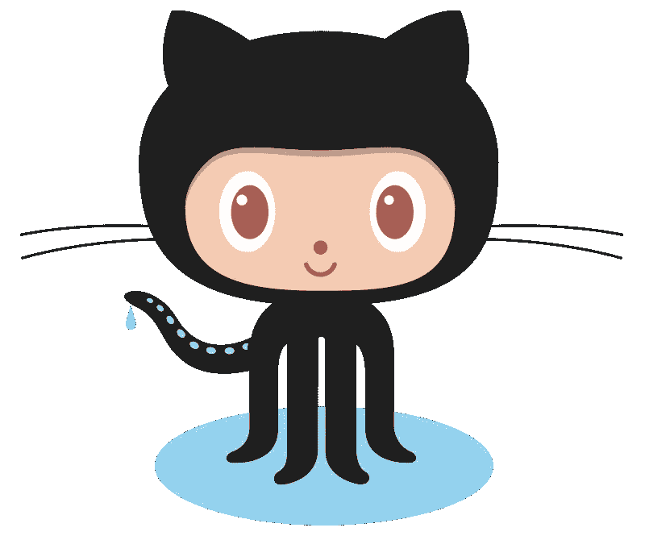

# 掌握网络开发的 5 个基本工具

> 原文：<https://medium.com/hackernoon/5-essential-tools-for-web-development-mastery-fe0c2a5b3c9f>

> “没有限制。只有高原，你不能停留在那里，你必须超越它们。”
> 
> ——李小龙

# **1。草图**

You CAN design (or at least get by)

**价格:99 美元**

对于许多开发人员来说，设计超出了舒适区。我曾经沾沾自喜地说“我不做设计”。但是开发者**是**设计师。即使是裁剪和调整图像大小以及创建粗糙模拟的基本能力也会帮助你和你的团队构建出好看的产品。我使用 [Sketch](https://sketchapp.com/) 并且相信它是最好的工具，即使仅仅是因为性能的原因。Photoshop 也不错(虽然我一直有崩溃的问题)，但是更精明的网络商店使用 Sketch。

> “打架不是靠一拳或一脚就能赢的。要么学会忍，要么雇个保镖。”
> 
> ——李小龙

# 2.原子或崇高

**价格:Atom 免费，最高 70 美元**

Sublime Text 是我选择的代码编辑器，这是一款我已经使用多年的优秀产品。我有点被锁定了，因为它已经按照我喜欢的方式设置好了。因此，尽管 Atom 在许多开发人员中很受欢迎，但我还没有遇到任何紧迫的问题来证明转换的合理性。

您将在这个应用程序上花费大量时间，所以请确保它是您喜欢使用的东西。

# **3。GitHub**

**价格:公共回购免费，私人回购 7 美元/月**

GitHub ，这个世界软件的水冷器，是绝对必要的。你可以通过迷失在不同的仓库中来学习任何编程语言。显然，学习 Git 是优先考虑的事情，我建议从命令行而不是 GUI 开始学习。这里有一个很好的资源来学习我使用的模式的基础知识: [Git Flow](https://www.atlassian.com/git/tutorials/comparing-workflows#gitflow-workflow) 。

> “就像水从裂缝中穿过一样。不要过于自信，而是要适应目标，你会找到绕过或穿过它的方法。”
> 
> ——李小龙

# 4.末端的

**价格:免费**

学习命令行对每个开发人员来说都是必不可少的。如果刚刚开始，这可能看起来势不可挡，但是如果你从几个命令开始，比如导航目录和文件/文件夹维护，你将有很大的优势。你真的可以用命令做一些令人惊奇的事情，随着你技能的提高，你会觉得自己拥有超能力。这里有一个很好的学习命令行艺术的资源。

> “我始终相信简单的方法才是正确的方法。”
> 
> ——李小龙

# 5.宇宙 JS

*声明:我是* [*宇宙 JS*](https://cosmicjs.com) *的 CEO，联合创始人。*

API-first Content Platform

**价格:免费和付费计划**

完成网站或应用程序的开发后，下一步是为最终用户提供管理内容的方法。有许多已安装的内容管理系统，但是旧的已安装的 CMS 方法不是为多种渠道和设备的现代需求而构建的。总的趋势是走向一种“去耦合”的方法(或者有些人也称之为“无头”这个词，我不同意或用来描述一个具有如此思想和远见的战略)。

您最好将您的应用程序连接到一个 API，该 API 可以将内容分发到不同的设备，而不用考虑编程语言。 [Cosmic JS 是一个 API 优先的 CMS](https://cosmicjs.com) ,用于以任何编程语言构建内容驱动的应用。它为开发人员构建应用程序提供了极大的自由度，并为内容编辑人员提供了直观的内容编辑体验。此外，它与您喜欢的所有工具集成良好，您可以在几分钟内部署您的 GitHub repos。

> “唯一的限制是你的想象力。”
> 
> —我以前的音乐老师

# **结论**

我希望你喜欢这份现代 web 开发人员可用的一些基本工具的列表，以及选择它们的理由。如果您有任何问题，请在 Twitter 上联系我。如果你认为我遗漏了任何工具，请在下面的评论中告诉我。

> [黑客中午](http://bit.ly/Hackernoon)是黑客如何开始他们的下午。我们是 [@AMI](http://bit.ly/atAMIatAMI) 家庭的一员。我们现在[接受投稿](http://bit.ly/hackernoonsubmission)，并乐意[讨论广告&赞助](mailto:partners@amipublications.com)机会。
> 
> 如果你喜欢这个故事，我们推荐你阅读我们的[最新科技故事](http://bit.ly/hackernoonlatestt)和[趋势科技故事](https://hackernoon.com/trending)。直到下一次，不要把世界的现实想当然！

