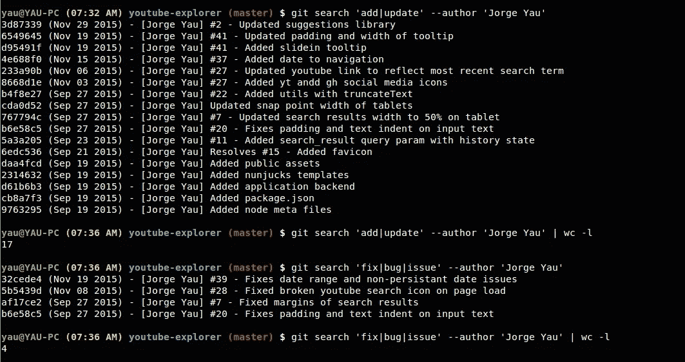

# 5 Git 基础知识

> 原文：<https://medium.com/hackernoon/5-git-fundamentals-ded819a34cfe>

我正在开始一个关于 g it 技巧和窍门的系列，这些技巧和窍门是我在使用 git 的五年时间里学到的。我们将跳过日常基础知识，从帮助您利用版本控制的真正力量和便利的基础知识开始。

让我们从在您的主目录中创建一个`**.gitconfig**`文件开始。这个文件是所有 git 配置、定制和别名的基础。如果你好奇，我在最后贴了一个我的链接。

```
[user]  
  email = email@gmail.com
  name = Jorge Yau[core]
  editor = vim
  ignorecase = false[push]
  default = simple[color "diff"]
  meta = yellow bold ul  
  frag = cyan bold ul
  old = red bold  
  new = green bold [color "status"]  
  added = green bold  
  changed = yellow bold  
  untracked = red bold[grep]
  break = true
  heading = true
  lineNumber = true[alias]
  g = grep --extended-regexp --break --heading --line-number
```

一旦文件存在，git 将预加载这些配置并将其用于所有进一步的命令。试着在回购中运行一个`git diff`，注意颜色是如何变化的。

我还包含了一个 **git 别名**，它基本上是一个命令的简写。在这种情况下，带有所有附加标志的`git grep`可以作为`git g`执行。

```
# This longer command:
$ git grep --extended-regexp --line-number --break --heading# Is the equivalent of:
$ git g
```

还要注意`[grep]`有一个**部分**——在这里您可以指定默认选项和参数，这些选项和参数将在您每次运行`git grep`时应用。如果您在别名中包含相同的选项，它将覆盖默认选项。最后，区段可以有子区段，例如`[section “subsection”]`

每个命令都有数百种设置，每一种都有大量的选项可以自定义——阅读官方 gitconfig 文档，了解可能的选项。

虽然 **gitignore** 文件无处不在，但是您知道吗，您可以通过在您的主目录中创建一个`**.gitignore_global**`文件并将其添加到您的`**.gitconfig**` 核心部分下来全局忽略文件模式。我建议把软件残余，IDE 和 OS 相关的文件放在这里。

```
.idea*
**~
.DS_Store
```

然后将这一行添加到您的`**.gitconfig**`文件中:

```
[core]
  excludesfile = ~/.gitignore_global
```

或者运行这个命令，它会自动将其附加到您的`.gitignore`

```
git config --global core.excludesfile ~/.gitignore_global
```

说到 grep，`**git grep**` 是我搜索代码库的首选，而不是 GNU grep 或 ack。它很快，自带 git，默认情况下忽略你的`**.gitignore**`中的文件。

```
# Here's how to use it with more options below.
$ git grep 'debugger' # Show the count of occurrences found for each file.
$ git grep --count 'debugger' # Ignore case sensitivity.
$ git grep --ignore-case 'debugger' # Search through untracked files.
$ git grep --untracked 'debugger' # Quiet mode. Exits 0 if match found. Useful for scripts and hooks.
$ git grep --quiet debugger
```

说到 grep， **git ls-files** 命令无疑是最有用的 git 命令之一。我经常将它与 **grep** 和 **sed** 一起使用，以执行批量查找和替换或代码修整——偶尔使用 regex 和捕获的组(将来会有更多关于这个主题的内容)。然而，我也想忽略第三方文件，如`**node_modules**`目录，它没有常规 grep 甚至 ack 那么性感。

```
$ grep -E debugger . -rl --exclude-dir={*components*,*node_modules*}$ ack debugger -l --ignore-dir={components,node_modules}
```

如果我需要存储库中所有文件的列表怎么办——没有简单的方法用常规的 bash 来实现这一点。还好，`**git ls-files**`会列出存储库中的所有文件，同时排除 gitignore 中的文件模式。

```
$ git ls-files .dockerignore
.eslintignore
.eslintrc.yml
.gitignore
.gitlab-ci.yml
.scss-lint.yml
Dockerfile
README.md
...
```

然后，您可以将结果传送到 grep 来过滤某些文件。在本例中，我过滤了我的存储库中的所有 JavaScript 文件——`$`是为了确保排除掉`.json`文件。

```
$ git ls-files | grep -E \.js$
```

在许多其他命令中，Git 和 grep 经常成对出现。如果您想搜索提交消息，可以使用`**git log --grep**`。从我所看到的提交消息中进行搜索是一个很少使用但非常有用的功能，可以用来跟踪 bug、跟踪功能开发和分析代码库。更多内容请见下文。

```
# Search for 'bug' in the git commit message history.
git log --grep 'bug'# I recommend using this flag to ignore merge commits.
git log --no-merges --grep 'bug'# Refine your searches to a particular author.
git log --grep 'bug' --author 'codenameyau'
```

我有一个别名来在一行中漂亮地打印缩短的提交散列、日期、作者和提交消息。你可以这样使用它:

```
# Put this inside your ~/.gitconfig
[alias]
  search = log --no-merges -i -E --pretty='%h (%ad) - [%an] %s %d' --date=format:'%b %d %Y' --grep # Then run the command like so:
$ git search 'bug'# Pipe it to wc to get the number of occurences for 'fix' or 'bug'.
$ git search 'fix|bug' | wc -l
```



Git search in action.

为了让`**git search**`有用，最好是上下文相关但简洁的提交消息，长度不超过 80 个字符。一个非常有用的约定是在发行号后面加上一个散列(#)。对于像 GitHub 这样的存储库管理人员来说，这将自动地将提交与问题联系起来，并且使得记录和调查问题更加可行。

```
$ git commit -m "#123 - Fix bug with useful git commit message"
```

额外提示:一旦你掌握了基本原理，一定要查看一下 **git-extras** 库。它是 git 的扩展，带有非常有用的命令(*我正在看着你涂掉)*。

[https://github.com/tj/git-extras/blob/master/Commands.md](https://github.com/tj/git-extras/blob/master/Commands.md)

如前所述，这是我的。 **gitconfig** 文件。

[](https://github.com/codenameyau/dotfiles/blob/master/shell/.gitconfig) [## codenameyau/dotfiles

### 点文件-我的点文件和文本编辑器配置

github.com](https://github.com/codenameyau/dotfiles/blob/master/shell/.gitconfig) 

如果你从这篇文章中学到了什么或者只是喜欢它，请推荐它。我将不胜感激！

这里是我的 **Git 基础**系列中的一些其他文章

*   [用一个命令更新多个 Git Repos】](/@codenameyau/updating-multiple-repos-with-one-command-9768c8cdfe46)

[](http://bit.ly/HackernoonFB)[](https://goo.gl/k7XYbx)[](https://goo.gl/4ofytp)

> [黑客中午](http://bit.ly/Hackernoon)是黑客如何开始他们的下午。我们是 [@AMI](http://bit.ly/atAMIatAMI) 家庭的一员。我们现在[接受投稿](http://bit.ly/hackernoonsubmission)并乐意[讨论广告&赞助](mailto:partners@amipublications.com)机会。
> 
> 如果你喜欢这个故事，我们推荐你阅读我们的[最新科技故事](http://bit.ly/hackernoonlatestt)和[趋势科技故事](https://hackernoon.com/trending)。直到下一次，不要把世界的现实想当然！

[](https://goo.gl/Ahtev1)