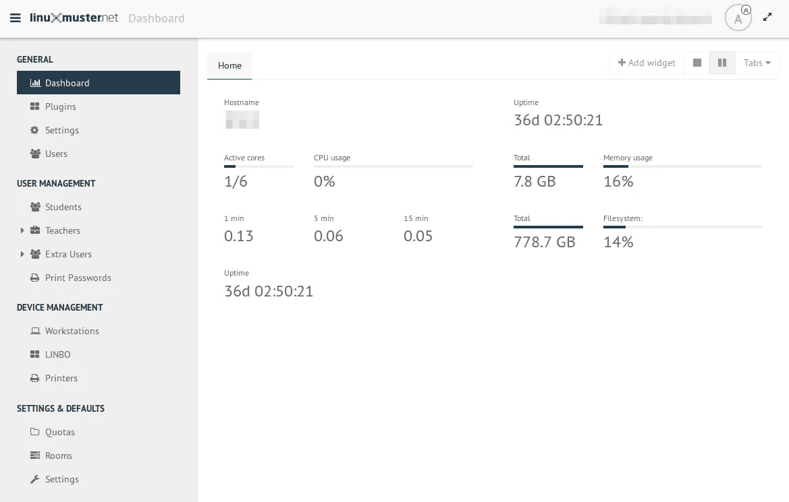
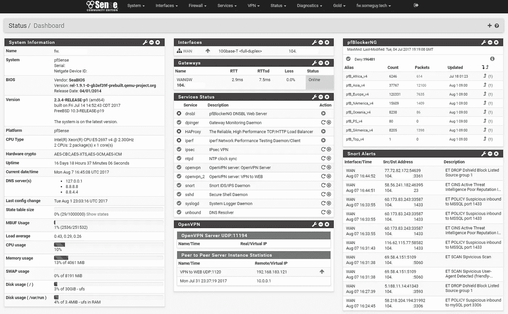
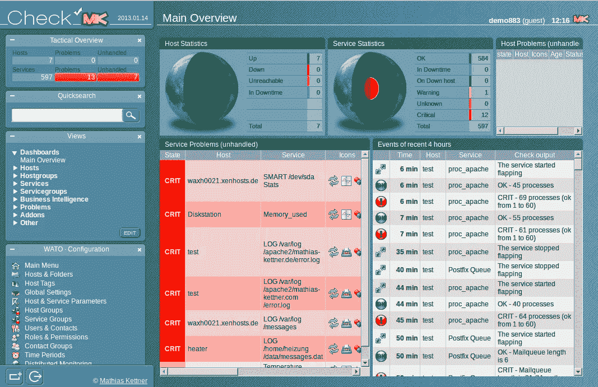
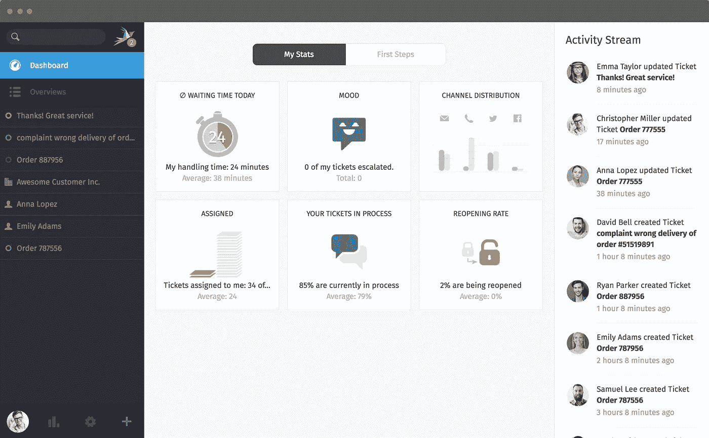
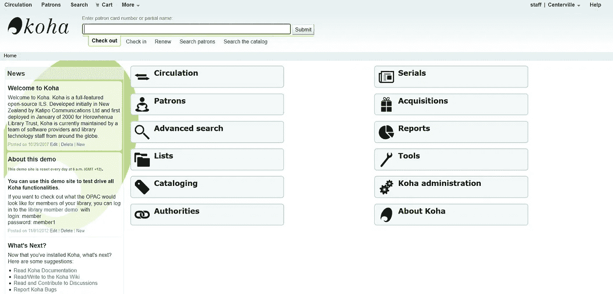

# 我们在学校使用的 5 个伟大的开源应用

> 原文：<https://medium.com/hackernoon/5-great-open-source-apps-we-use-in-our-school-6f277987222e>

从 1.5 年开始，我们学校几乎完全使用开源软件。这一步骤已经在这么短的时间内为我们节省了 5000 多€的许可费用。但这不是我们使用开源软件的主要原因。原因如下:

*   独立于供应商的自由
*   低管理工作量(Ubuntu 客户端与 Windows 10 客户端相比)
*   开放源代码程序的灵活性和集成能力，以适应我们现有的结构
*   还有一些(硬件可以用更久等等。)

今天我想介绍 5 个开源程序，它们让我们在学校的日常 IT 生活中变得更加轻松。

# Linuxmuster.net

在我看来，Linuxmuster.net 是目前学校可用的最好的免费样本解决方案。它构成了我们基础设施的核心(DNS、用于 LAN 的 DHCP、LDAP、Samba、RADIUS)。不仅是软件很棒，围绕这个项目的社区也很棒。我很少经历过这样一个友好和乐于助人的社区，你真的可以问关于*学校和 IT 的一切事情。*

Linuxmuster.net 的一部分是 LINBO，它是一种迷你操作系统，可以让你管理网络中的所有计算机。借助映像，您可以随时将所有计算机恢复到定义的状态(包括脱机状态)。LINBO 不仅支持 Linux，还支持 Windows。在 [postsync-scripts](http://docs.linuxmuster.net/en/latest/howtos/use-postsync/index.html) 的帮助下，你可以单独或逐个房间定制计算机，而不必维护 5 个不同的映像。例如，我们为教室中的教师计算机或学生计算机提供与计算机实验室中的计算机不同的配置。

网址:[https://linuxmuster.net](https://linuxmuster.net)
文档:[http://docs.linuxmuster.net](http://docs.linuxmuster.net)
社区:[https://ask.linuxmuster.net](https://ask.linuxmuster.net)

# pfSense

我们使用 [pfSense](https://pfsense.org) 作为我们的防火墙。这是一款非常可靠、稳定、易于配置的防火墙，具有许多(企业)功能:

*   带有 RADIUS 身份验证和凭证的强制网络门户
*   SNMP / check_mk 集成用于我们的监控
*   高可用性和硬件冗余
*   HAProxy(反向代理)将我们的子域分配到正确的服务器
*   Squid(网络过滤器，代理)

网址:[http://pfsense.org/](http://pfsense.org/)
文档:[https://doc.pfsense.org/index.php/Main_Page](https://doc.pfsense.org/index.php/Main_Page)社区:[https://www.pfsense.org/get-involved/](https://www.pfsense.org/get-involved/)

# OMD/检查 _mk

我们已经使用[开放式显示器分布](http://omdistro.org/)和 Check_mk 一年了。在界面上摸索需要一点时间，但是 Check_mk 非常强大，您可以用它来监控几乎任何东西。我们使用它来监控我们的整个网络基础设施(交换机、防火墙、UPS、接入点、无线控制器、打印机墨水量)以及我们的服务器和一些客户端(数字标牌)。此外，我们还使用了一个[插件](https://github.com/rmblake/check_mk-slack)，在出现问题时向我们的监控通道发送通知(目前我们仍在使用 Slack，但希望升级到 [Rocket.chat](http://rocket.chat/) 或 [Mattermost](http://mattermost.org/) )。

Check_mk Dashboard

网址:[http://omdistro.org/](http://omdistro.org/)文档:[https://mathias-kettner.de/cms.html](https://mathias-kettner.de/cms.html)

# 扎姆马德

我们最近才发现[扎马德](https://zammad.org)。这是我们梦寐以求的支持平台。开始时，我们使用 OSTicket，它也工作得很好，但是没有一个现代的、反应灵敏的用户界面。Zammad 提供我们想要的一切:

*   LDAP 支持
*   现代表面
*   许多集成/渠道(电子邮件、电报、网络等)

目前，我们仅将 Zammad 用于员工或教师的 IT 咨询。在我们学校，我们有其他形式的维修请求、班级旅行等。将来，我们希望将它们迁移到 Zammad。

网站:[http://zammad.org/](http://zammad.org/)
文档:管理文档和用户文档

# 科哈

从这个学年开始，我们一直用 Koha 来管理我们的学校和教材图书馆。我在过去的几个月里报道了这次迁移。Koha 是一个非常强大的管理图书馆的工具，但它并不容易上手，因为你必须处理像 Marc21 这样的主题和许多其他书目信息才能正确配置 Koha。但是，你可以很容易地简化整个事情，没有任何问题，这样你只使用其中的一些功能。

网址:【http://koha-community.org/T2
文档:[https://koha-community.org/documentation/](https://koha-community.org/documentation/)社区:[https://koha-community.org/support/community-support/](https://koha-community.org/support/community-support/)

# 结论

有很多很棒的开源项目，我还可以提到更多。一个学校，几乎 100%使用开源软件运行，如今已经不是问题了。世界范围内有很多这样的例子。我个人认为最大的障碍是说服员工和决策者，以及有能力的 IT 员工。

**你们学校或公司用的开源软件有哪些？**

*本文最早发表于*[*openschoolsolutions.org*](https://openschoolsolutions.org/5-great-open-source-apps-we-use-in-our-school/)*。*