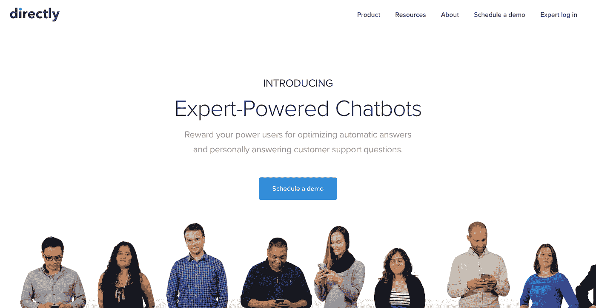
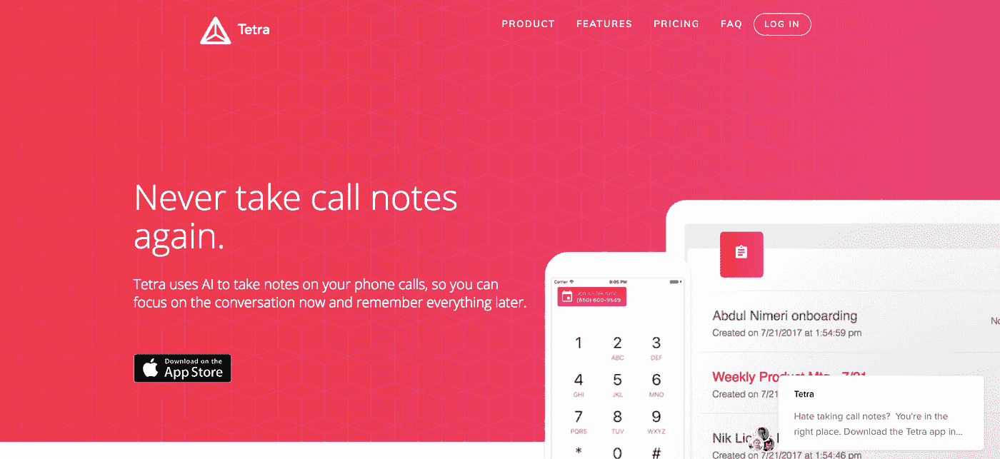
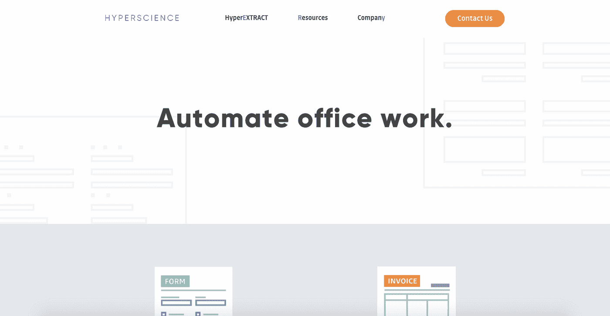
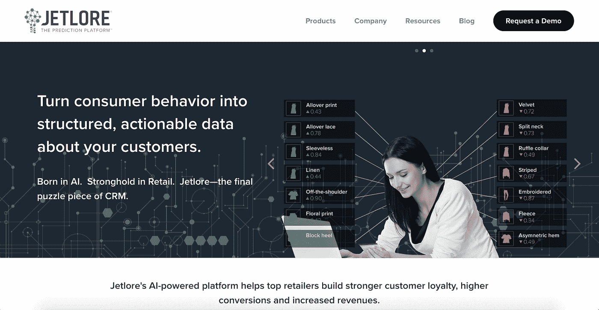
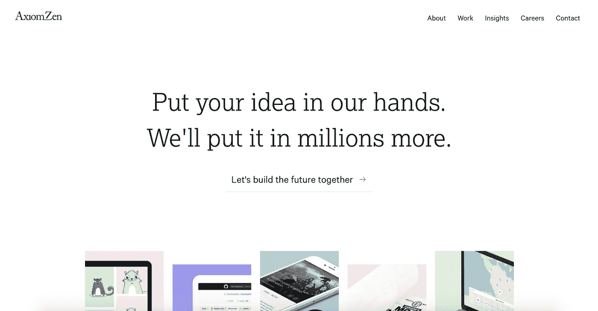

# 5 家无敌人工智能初创公司

> 原文：<https://medium.com/hackernoon/5-inspiring-ai-startups-c91bf6a4146>

Image Source: Unsplash by [Samuel Zeller](https://unsplash.com/@samuelzeller)

> “有人称之为人工智能，但事实是这项技术将增强我们的能力。因此，我认为我们应该增强我们的智能，而不是人工智能。”
> 
> — **吉尼·罗梅蒂**

## 咳咳！

创新领域的增长是疯狂的。选择一流的产品非常困难，因为每种产品的生产都是有原因的。为了达到某种目的。

> **知道是什么让我们活得更有人情味吗？**

我们关心的**情感**，我们庆祝的**关系**，我们积累的**知识**，以及最后这一切的**集体实践**。我们所做的事情是将所有这些放在一起，看看什么行得通，什么行不通，从而提出意想不到的解决方案。

追溯到交易者决定交换商品的时候(数量起了关键作用)，那是第一个交易创业开始的时候。大约在公元前 17000 年左右，就出现了活跃的商品交换。

The flag of The Dutch East India Company

谁真的想出了交换商品的主意，从而彻底改变了经济领域？资料显示，**荷兰东印度**公司建立了世界上第一家跨国公司。但说到创业，我们几乎不考虑非科技的举措。

也许是因为网络世界不可思议的奇怪，它不需要任何外部刺激或干预来执行操作。容易使用，容易赚钱，容易携带，整个想法可以放在一个编码软件中。

Larry Page and Sergey Brin — The prominent eggheads.

当拉里·佩奇和谢尔盖·布林在 1996 年第一次推动他们的谷歌项目时，我们就开始相信初创公司通常是技术驱动的项目。谷歌催化了科技领域的创业，也激发了在其他领域工作的企业家的创造力。这最终导致了我们现在所看到的！

> 创新项目日志之所以成为一个永无止境的列表。

与 90 年代消费者选择产品的余地很小的时期不同，现在真正的战斗是在供应商之间。将他们的资产树立为最有价值的资产。现在从事技术工作的人正在努力把一些**分析**和**决策**的技巧放在软件里面。

我根据**产品透明度**和**它们实际服务于社区的价值**选择了下面的**人工智能工具列表**。

## [**直接**](https://www.directly.com/)

最好的人工智能驱动的客户支持工具之一。它通过聊天机器人帮助其客户优化自动回答，以亲自回答他们的用户问题。这种自动化的客户支持流程大大减少了合同服务器的数量。

## [**四个**](https://asktetra.com/)

Tetra 可以让你与电话另一端的人进行干净、完整的对话，因为它会照顾到讨论中出现的所有细节。它使用人工智能生成详细的对话脚本，使用其**语音识别技术**。

## [**超科学**](https://www.hyperscience.com/)

[HyperScience](https://medium.com/u/29a3480358b6?source=post_page-----c91bf6a4146--------------------------------) 帮助其客户节省了从表格中手动提取数据所花费的大量时间，以及从**工资单**和**发票**中获取数据的繁琐过程。突出的一点是，即使数据被分割到不同的字段中，并且在文档之间以不同的名称存在，它们也是自然对齐的。

## [**捷豹**](http://www.jetlore.com/)

**Jetlore** *根据每个用户的行为以及他们对内容和产品语义属性的喜爱程度，为他们建立独特的用户档案*。然后，它利用用户档案向任何媒体上的每一个用户显示最相关和最有共鸣的内容。

## [**公理**](http://www.axiomzen.co/)

> 我是通过他们一个实习生写的非常感人的博客发现这家公司的。如果你想了解更多关于 AxiomZen 的知识，请看[。](/axiomzenteam/why-i-interned-at-a-startup-instead-of-a-tech-giant-the-myth-of-the-good-job-170b8e54c7d5)

AxiomZen 是一个疯狂的工作室，采用新兴技术以许多有趣的方式解决现实世界的问题。大多数时候，产品或小项目在推出时就已经成为一个独家品牌。他们通常获得业务的高增长率，目前正在处理**人工智能、增强现实和区块链**项目**。**