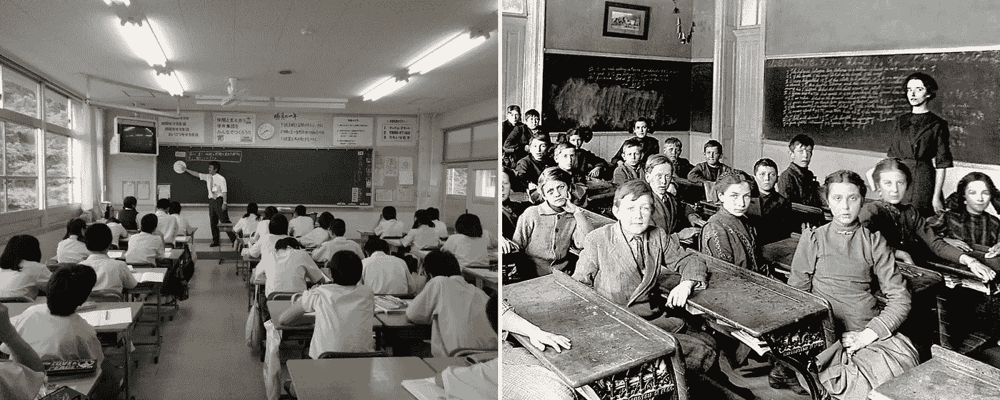

# 创业心态可以教会我们学习的 5 课

> 原文：<https://medium.com/hackernoon/5-lessons-a-startup-mentality-can-teach-us-about-learning-dd705825c02>

改进我们的学习方式，不管我们是谁或做什么。

在进入创业生活、读了一本书又一本书、看了一次又一次的采访、听了来自左翼、右翼和中间派创新人士的发言后，我相信学到的教训揭示了人类潜力的最大破坏；我们思考问题的方式。

这里有 5 个关键原因，让我觉得不论行业或专业，都可以利用“创业心态”来改善我们的学习方式。

> *就 craic 来说，我把它和传统的* [*学习*](https://hackernoon.com/tagged/learning) *过程联系起来。*

# 1)改善结果

*   **创业:错误是成功的根源**
*   **传统:必须减轻错误**

## 启动过程

失败是必不可少的。离开办公室。调查感兴趣的领域，建立假设，验证，试一试，看看会发生什么，从中学习，然后再试。

哦，尽可能快地做这个。

大卫·贝勒斯和泰德·奥兰进行的一项名为艺术与恐惧的研究表明，通过练习，你不仅可以完成更多的工作，而且质量也会提高。与那些简单地在工作中学习并很快失败的人相比，为“完美”的尝试建立方法论通常是一个低劣的过程。

> 成功来自于发展我们的优势，而不是减少我们的弱点。

## 传统工艺

传统的学习是阅读和反馈信息，并在几十年的评估中进行检查和评估，然后才能信任个人将这些信息应用于“现实世界”。

我知道有些工作需要学位来建立知识基础，比如科学或数学，但很多工作不需要。

虽然许多人认为大学是一个值得追求的目标，但 44%的毕业生从事不需要学位的工作。低工资(低于 25，000 美元)就业不足的应届毕业生的比例从 1990 年的 15%上升到今天的 20%以上。

*更多详情请点击此处—*

 [## 我们在拿我们孩子和我们自己的未来冒险吗？

### 教育至关重要；教育现在的作用不是。

medium.com](/@readersam71/were-risking-our-children-s-futures-and-our-own-the-conversation-no-one-seems-to-want-to-have-b2e2fd5733be) 

# 2)提高效率和生产力

*   **启动:即时学习**
*   传统:以防万一的学习

## 启动过程

初创企业必须采用一种*及时学习*的方法，而不是传统的*以防万一*的方法。

埃隆·马斯克(Elon Musk)把初创公司称为，

> “一边凝视着深渊(未知)，一边嚼着玻璃(做着不喜欢的事情)。”

创业公司不知道他们前面是什么(很像生活)，所以当他们遇到问题时，他们必须尽可能快速高效地解决问题。

创业公司的人必须运用他们的能力解决问题，坚持不懈，并创造性地克服摆在他们面前的障碍。这是关于解决迫在眉睫的未来存在的问题，而不是浪费时间预测太远，这是未知的。

信息的无处不在，其不可思议的可用性，以及我们在全球范围内即时联系和沟通的能力，意味着信息获取和传播的过程可以实时发生。

因此，在一个政治、经济和社会都充满不确定性的世界里，及时学习不仅有效，而且是为未来做准备的一种非常明智的方式。

> "现在，你比以往任何时候都更不能锁定未来."—乔纳森·菲尔兹
> 
> (《不确定性:将恐惧和怀疑转化为辉煌的燃料》一书的作者)

## 传统工艺

传统的方法遵循“以防万一”的学习风格。

让我们尽可能多地阅读和吸收我们认为对人类有益的东西，希望它最终对某个人有价值。哦，让我们根据这些人的记忆能力，对他们的价值进行评估和分级。

百年国际广告公司 Ogilvy & Mather's 的执行创意总监 Rory Sutherland 就教育的安慰剂效应提出了一个有趣的观点。

> “教育实际上并不是教你东西。它实际上是通过给你留下你受过良好教育的印象来起作用的，这给你一种无根据的自信的疯狂感，然后让你在以后的生活中非常非常成功。”—罗里·萨瑟兰

理解人类行为的有趣手表。

Manufacturing Perceived Value

# 3)提高创造力

*   **创业:我们能多好地应用信息？**
*   传统:我们能多好地保留信息？

## 启动过程

人类的大脑擅长创造和解决问题，而不是重复的过程。科技界有句谚语，如果某件事需要你不止一次的努力，那就让它自动化。

计算机科学和工程教授 Peder Domingos 在谷歌会议上谈论机器学习和人工智能。

Peder 探究了知识实际上是从哪里来的，并讨论了这些资源实际上是如何比之前的资源更快地发现信息的。

*   演变
*   经验
*   文化
*   计算机

这说明信息获取将被计算机超负荷运转，远远超过人类的处理能力。

为了进一步说明这一点:

> 在生物化学中有一种叫做激酶的酶。有超过 240，000 篇论文在他们的 Medline 摘要中提到了 500 多种已知人类激酶中的一种或多种。一个每天能够吸收 **10 篇论文的热心读者需要 70 年**才能通读完这些相关文献。

虽然佩德罗的假设可能看起来有点极端，但对我来说，人脑的作用将在解释它所呈现的信息和数据时得到最好的利用。我们利用这些信息来解决我们作为一个全球社会所面临的问题的能力，将是人类思维的真正价值。

> 智慧的真正标志不是知识，而是想象力。——阿尔伯特·爱因斯坦

## 传统工艺

*应该对人们记忆信息的能力进行评估，以便他们可以在不久的将来的一个活动中背诵这些信息，他们将有有限的时间来完成一系列随机问题，这些问题将决定他们的“未来”。*

他们对社会的价值将根据他们采用这些技术的能力进行分级和评估，我们应该向社会传达一个信息，这是确定他们“智力”的最佳方式。

有 9 种不同类型的智能，随着技术、机器学习和人工智能的出现，对“记忆”的需求可能会逐渐减少。

在现实中，传统的方法也被发现可以教会人们的创造力*——让他们害怕失败(学习的本质)。*

*你一定看过肯·罗宾逊著名的关于学校和创造力的 Ted 演讲！？但是如果你不相信肯爵士，那么读一读乔治·兰德关于创造力和儿童的纵向研究可能会揭示一些关于正规“教育”黑暗面的有趣观点。*

> *我们的价值不在于获取信息，而在于想象我们能用它做什么。*

# *4)改善团队合作*

*   *创业:团队合作让梦想成真*
*   ***传统:一起工作就是欺骗***

## *启动过程*

*在一家初创公司中，对自己的优势保持完全现实的态度，并寻求与在企业其他要素上表现出色的人在一起，这一点至关重要。*

*然而，企业只是为了共同的目的而聚集在一起的人们的组织。在人们聚集在一起创造价值的各行各业中，你都会发现这种安排:*

*   *足球队*
*   *外科手术室*
*   *住宅开发商*
*   *癌症研究人员*
*   *道路维护*
*   *等等，等等，等等*

*从本质上讲，人们团结起来为一个目标或目的而努力的能力是我们社会、我们国家以及最终我们人类进步的先锋。*

## *传统工艺*

*在学校里，聚在一起讨论并互相帮助的活动被称为作弊。*

**

*我想知道如果团队工作只是规范的一部分，会有什么样的可能性？*

*有[的证据表明](https://www.cmu.edu/teaching/designteach/design/instructionalstrategies/groupprojects/benefits.html)许多无形的品质是从团队学习中发展出来的，在团队学习中，学习通常会通过诸如多样化的视角和责任感等事情得到改善，讽刺的是，这也可能导致整体大学成功的改善。*

*甚至[把教室带到外面](http://journals.sagepub.com/doi/abs/10.1177/1053825916668899)也意味着它可以改善学生的学习体验。*

*虽然有了一些改善，但大多数教室已经有一段时间没有变化了。*

****21 世纪课堂 vs 19th 世纪课堂****

**

*Teacher at front, chalkboard, rows of desks and 30 young people*

**

*Shocking really*

# *5)加深理解*

*   ***启动:学习、遗忘和再学习***
*   ***传统:嗯，一直都是这样做的***

## *启动过程*

*作为一名营销出身的人，我知道在创造价值的过程中了解你的受众、客户和其他关键利益相关者是多么重要。*

*由于 IOT、通信改进和技术进步，我们现在生活在一个我们对人和问题的理解可以比以往任何时候都更丰富的方式量化和定性的时代。*

*发现和理解人类行为变得容易得多，但出于同样的原因，我们的生活也变得复杂得多。*

*正如高德纳公司的分析师阿维瓦·谭力描述的那样*

> *“问题是人类无法跟上他们创造的所有技术。它变得无法被人脑控制。我们最大的希望可能是，计算机最终会变得足够聪明，能够自我维护。”*

*对黑箱思维的需求从未像现在这样重要。*

*当我们生活在这样一个充满不确定性和复杂性的世界中时，重新学习我们所学知识的需要对于进步来说是必不可少的。*

*Matthew Syed 描述了黑盒思维的起源，以及它的产生是如何完美地描述了通过从过去的错误中学习来提高知识的过程。*

## *传统工艺*

*不愿意看到眼前的失败或问题，盲目接受已经发生的事情，将永远阻碍进步。*

*在政治领域，谎言和未经证实的逻辑决定着政策和议程；在医学领域，没有改革就没有效率和忽视。*

*正如 Matthew Syed 所描述的，医疗行业甚至还没有接近采用黑盒思维。这是一个如此需要改进的行业，以至于可避免的医疗差错成为继癌症和心脏病之后的第三大人类杀手[。](http://www.wired.co.uk/article/preventing-medical-error-deaths)*

> *美国每年有 40 万人死于可预防的医疗差错。*

*根据上面的叙述，我想强调的是，我永远感激我所生活的民主社会，它为我提供了一个公开进行这种讨论和挑战传统的平台。*

*我认为我们都有受教育的权利，教育提升社会的能力是一个不可思议的成就。我尊敬那些努力点燃年轻人激情和希望的老师，当谈到这个行业时，我主要想提出一个论点，建议教育的*角色*应该改变。它创建于 19 世纪，如果我们要进步，它必须改变其陈旧的模式。*

*我认为医疗系统(至少在英国)在整体上是一种模范服务，通常会导致死亡的疾病现在可以得到治疗和缓解。这是一个美好的概念和服务，应该培养和塑造，以服务更多的人。我再次向那些为了他人的利益和供给而长时间艰苦工作的人致以最崇高的敬意。*

*最终，我谦卑地坐在这里，作为一个全球社会中最有特权的成员之一打字，只是强调仍需完成的工作，并提出如何完成这些工作的建议。*

> *自由是我们质疑一切的权利。*

*让我知道你的感受。如果你觉得这个对话应该被更多的人看到，请在下面评论或讨论并点击绿色按钮。*

*我总是很想听听人们是如何追求自己的抱负和激情的。在[sam@mywondr.co](mailto:sam@mywondr.co)给我发电子邮件，让我们聊聊。*