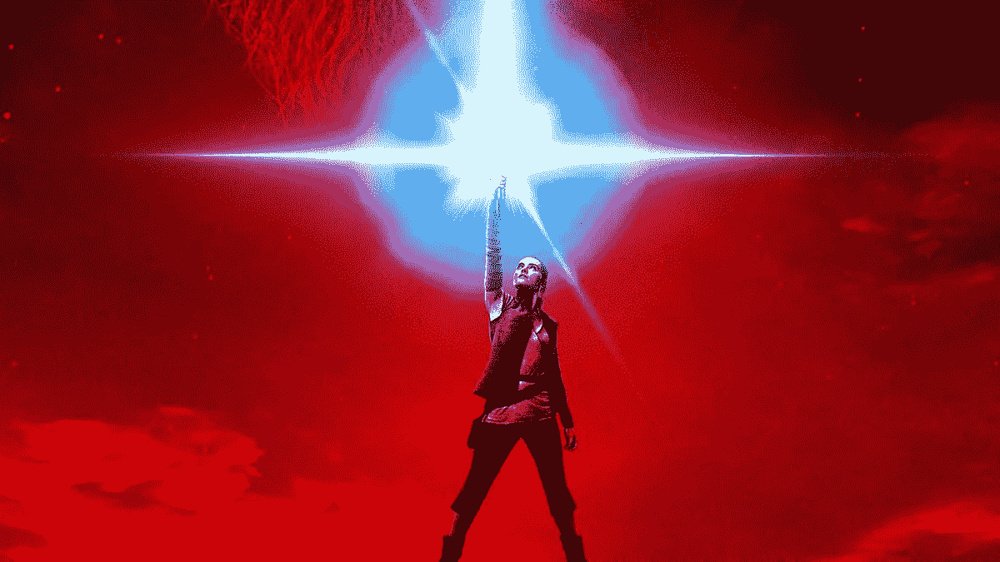

# 给创业公司和下一个绝地武士的 5 堂课

> 原文：<https://medium.com/hackernoon/5-lessons-for-startups-and-the-next-jedi-9936c47f0aec>

Star Wars | The Last Jedi

***《星球大战:最后的绝地*** 》，宇宙最伟大的故事的最新一集于上周末上映，出于对那些还没有看过它的人的尊重，这里没有剧透，但这里有给[初创公司](https://hackernoon.com/tagged/startups)或任何计划成为[下一个绝地](https://hackernoon.com/tagged/next-jedi)的人的 5 堂课。

*   **让过去的死去**——为了把*星球大战*带进未来，导演[莱恩·约翰逊](https://twitter.com/rianjohnson)带着凯洛·伦的台词严肃地穿越电影，有支线剧情，有人物，有曲折，有大惊喜。每个初创公司、科技或体育组织都在某种程度上面临这些挑战，如何平衡他们的目标和目标，改变他们的受众、用户、客户和品牌，或为未来承担风险。
*   **教练和导师是必不可少的**——不管你有多有才华，即使你是绝地武士、迈克尔·乔丹、谷歌创始人、金州勇士队、迈克尔·菲尔普斯或任何成功的运动队、初创公司、运动员、领导者或高管，你也会受益于他人的智慧、指导和诚实的反馈，让你比你自己做得更好。谁是你的尤达或欧比旺？
*   失败是旅程的一部分——失败对《最后的绝地武士》故事至关重要。我们很容易庆祝运动员、团队、企业家、初创公司的成功，却没有足够重视让成功成为可能的过程中的许多错误、失败、错失和失误。
*   **黑暗面强大，原力必然更强**——*星球大战*一再证明，无论你向它扔什么，黑暗面似乎总有力量。从体育运动中的兴奋剂，窃取商业秘密，不正当的性行为，人们经常采取容易的方式或剥削他人。这往往适得其反，所以如果你总是做正确的事情，你会发现在你最需要的时候力量总是更强大。
*   **机器人是我们的朋友**——*《星球大战》*已经与 R2-D2、C-3PO、BB-8、K-2SO 等机器人共存了几十年，而人类在现实生活中也赶上了机器人，这要归功于人工智能(AI)和机器学习(ML)。想象一下你没有计算器、地图应用或智能设备的生活，这就是机器人发展的现实。所以，对机器人好一点。他们会帮助你把事情做得更好，可能会救你的命。

并且，如果你已经看过*最后的绝地*，看看这两个不同的视角从 [M.G .西格勒](https://medium.com/u/5c6977d2a94f?source=post_page-----9936c47f0aec--------------------------------)T4 这里[阿尼尔达什](https://medium.com/u/a75df5e8a16c?source=post_page-----9936c47f0aec--------------------------------)T8 这里。

愿原力与你同在。

*转载自讲台最新快讯，您可以在这里***订阅。* [*讲台*](http://www.twitter.com/podiumvc) *是一家位于硅谷的体育、媒体和娱乐加速器、基金和社区。**