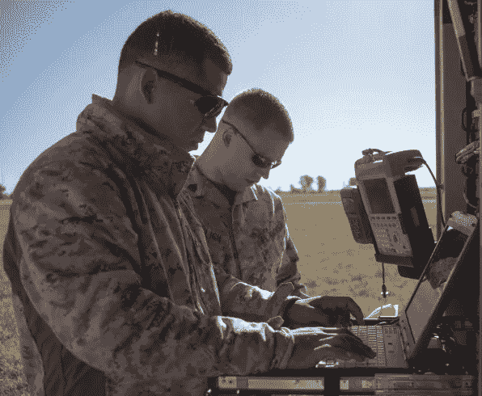
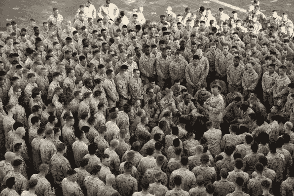
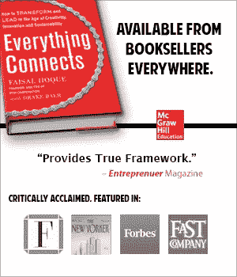

# 我们可以从海军陆战队学到的自我提升的 5 课

> 原文：<https://medium.com/hackernoon/5-lessons-in-self-improvement-we-can-learn-from-the-marines-60109a056b15>

[PHOTOS COURTESY OF THE [U.S. MARINES CORPS](http://www.marines.com/)]

## “让它发生”是海军陆战队信奉的一个常见咒语，是我们每个人都应该在日常生活中学习和应用的代码。

生活就是让它发生。美国海军陆战队信奉的一个共同口号是“让它发生”,当他们面临任何挑战性任务时，这一口号都可以指导部队:从开展人道主义和救灾行动，减轻菲律宾的苦难，到在索马里沿海抓获海盗。

像海军陆战队一样，我们也可以在日常生活中学习和应用行为准则，这样我们就可以直面挑战。

以下是[海军陆战队的五个基本价值观](http://www.marines.com/history-heritage/principles-values?nav=lp1)，无论我们在生活中做什么，它们都能推动我们前进，并帮助我们实现目标。

## 1.认识自己，寻求自我提升

一个海军陆战队的领导者会花时间去学习和反思自己的优点和缺点，并不知疲倦地工作以不断提高。领导者对自己完全诚实，并发展追求个人优势的能力，同时明白这永远不可能完全实现。

寻求自我完善的领导者会激励周围的人也这样做，从而提高生产率，这可能包括发展高绩效团队、提高个人和组织的幸福感，以及不管外人认为是不可能的目标都能够实现这一目标。

## 2.精通技术和战术

海军陆战队经常在世界各地动荡、不确定和复杂的环境中工作。当生命危在旦夕时，海军陆战队的领导者必须是他们工作领域的专家。

你的生活和工作场所可能不那么狂热，但同样的原则也适用。一个拥有“让它发生”心态的面包师，每天早上 6 点就能做出最好的纸杯蛋糕，她会不断寻求新的知识来磨练她的纸杯蛋糕烘焙技巧。她将把获得的知识付诸行动，通过某种方式综合所学的知识，也许会开发出一种独特的、与众不同的配方。

在海军陆战队，人们期望领导者在技术和战术上都很精通，并且他们会通过寻找正式和非正式的学习机会来保持和提高他们的能力。

## 3.培养责任感

如今，在任何团体或团队中，相互依赖都是成功的关键。当一个团体或团队的成员成功地尽了自己的职责或未能这样做时，我们都会受到正面和负面的影响。

海军陆战队通过了解下属的内在和外在需求来培养他们的责任感，并通过将他们的成就与组织的使命和宗旨相联系来找到满足这些需求的新方法，其中包括“首先为他人服务”的词语。

例如，如果您在医疗保健行业领导一个客户服务代表团队，并且您收到了客户的投诉，他们受到了不公正的对待，而不是通过约束团队来做出反应，作为领导者，您可以考虑与每个代表进行一对一的谈话，以寻求一种方法来将他们已知的内在需求与组织的使命和目的相匹配。

## 4.做出合理及时的决策

根据情况，尤其是在快节奏的工作环境中，领导者需要在有限的信息下做出决策。通过情景驱动的训练，海军陆战队被教导在常规的基础上，在有限的信息和不确定的环境中做出合理和及时的决定。

这种训练包括系统地思考一个问题，通过使用缩写“BAMCIS”来完成任务。它代表:

1.  开始计划
2.  安排侦察
3.  进行侦察
4.  完成规划
5.  发布命令
6.  管理

这个简单而有效的决策框架为海军陆战队评估问题并迅速做出合理及时的决策提供了基础。

## 5.树立榜样

海军陆战队军官候选学校的校训是 Ductos Exemplo，拉丁语意为“以身作则的 T2”。任何组织的领导者都将很好地运用海军陆战队的领导原则“树立榜样”

真正的领导者知道，当他们领导的团队，包括跨职能、跨学科的团队，开始以身作则时，他们正在做正确的事情。

支持和实践道德和负责任行为的领导者可能会激励其他人也这样做。一贯希望有所作为的海洋领袖将以身作则，在第一线发挥领导作用，同时将他人的需求放在首位。

*帽子提示:中校·拉斐尔·赫尔南德斯，海军陆战队征兵司令部的首席营销官，对这个故事的研究做出了贡献。*

***版权所有 2017 费萨尔·霍克。保留所有权利。***

我是一名[企业家和作者](http://faisalhoque.com/speaking/)。SHADOKA 等公司创始人。Shadoka 让抱负成为领导、创新和变革的动力。Shadoka 的加速器和解决方案汇集了管理框架、数字平台和思想领导力，以实现创新、转型、创业、增长和社会影响。

《“ [*《万物互联——如何在创意、创新和可持续发展的时代进行变革和领导》*](http://www.amazon.com/Everything-Connects-Creativity-Innovation-Sustainability/dp/0071830758/ref=sr_1_1?ie=UTF8&qid=1376488798&sr=8-1&keywords=everything+connects%2Bfaisal+hoque) 》(麦格劳·希尔)和《 [*《生存并茁壮成长:弹性企业家、创新者和领导者的 27 种实践*](http://survivetothrive.pub/) 》(励志出版社)的作者。在推特上关注我。*免费使用* [*万物互联*](http://app.everythingconnectsthebook.com/login.php) *领导力 app 和* [*生存茁壮*](http://app.survivetothrive.pub/login.php) *弹性 app。*