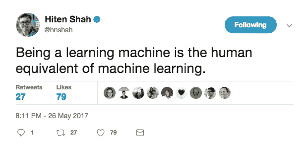
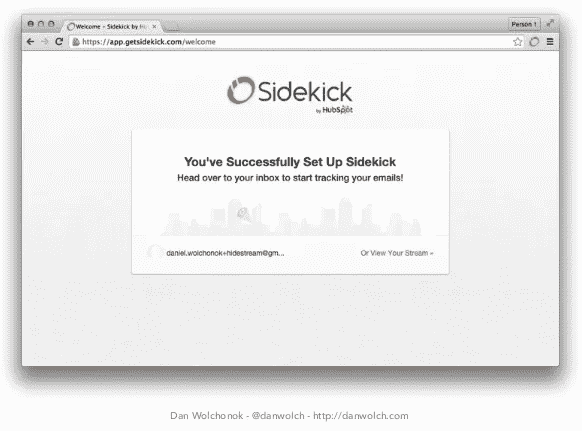
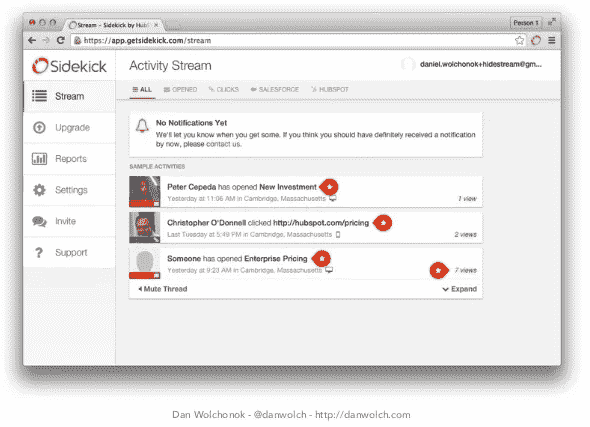
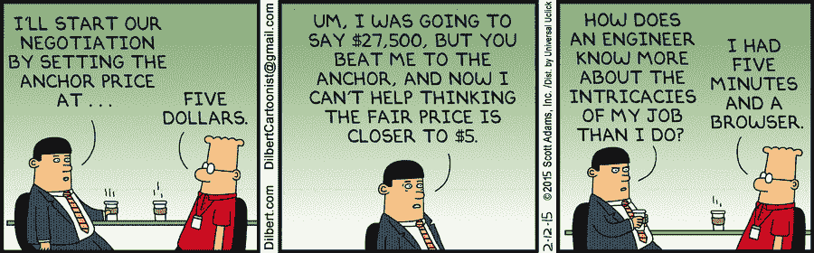
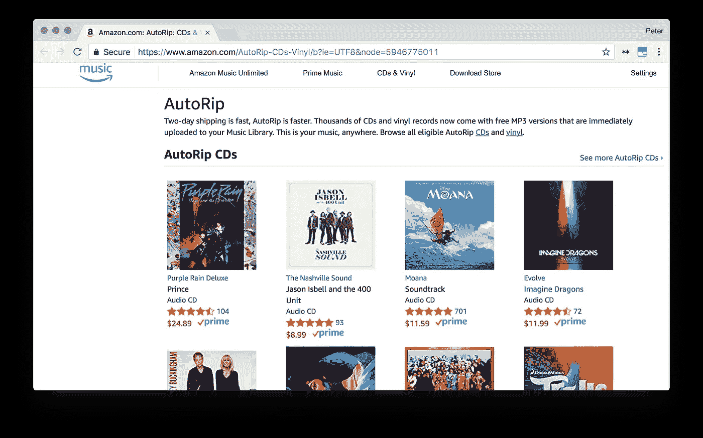

# 帮助产品经理获取和留住用户的 5 个心智模型

> 原文：<https://medium.com/hackernoon/5-mental-models-that-help-product-managers-acquire-and-retain-users-ef00e6f3d8a6>

我非常相信终身学习。我阅读我能拿到的所有东西，以两倍的速度听有声读物，并且依靠像 Blink 和 Audible 这样的产品学习得更快。每个人都有能力比他们想象的更快地学习，并增加他们对信息的日常消耗。

然而，要成为一台学习机器，你不能让自己信息超载。你必须将批判性思维运用到你所学的东西中。

我发现的最有帮助的[工具](https://hackernoon.com/tagged/tools)之一是培养对不同心智模式的理解。

麻省理工学院数字计算教授杰伊·福瑞斯特[将心智模型](https://www.google.com/url?sa=t&rct=j&q=&esrc=s&source=web&cd=1&ved=0ahUKEwjcg_KFuO3UAhVIFz4KHc1FDvkQFggpMAA&url=https%3A%2F%2Focw.mit.edu%2Fcourses%2Fsloan-school-of-management%2F15-988-system-dynamics-self-study-fall-1998-spring-1999%2Freadings%2Fbehavior.pdf&usg=AFQjCNF4wvV4EMVR5TpA5bkJkVCvOluTAg)定义为:

> 我们头脑中对周围世界的印象只是一个模型。在他的头脑中没有人想象整个世界，政府或国家。他只选择了一些概念和它们之间的关系，并用它们来代表真实的系统。

心智模型是我们用来做决定、解释概念或理解世界的框架。理解心智模型有助于你在你所想的和你为什么这么想背后的认知原则方面提高自我意识。

对于产品经理来说，这种做法尤为重要。产品经理不是开发人员、营销人员或销售人员。两者都有一点。项目经理不仅仅要理解并消除他们自己的偏见——他们还必须深入了解是什么让他们的用户产生兴趣。

下面，我列出了一些我认为对产品成长的每个阶段最有价值的心智模型，以及如何应用它们。

# 1.五个为什么

当你开始构建一个产品时，最明显的问题并不总是你应该解决的真正问题。深入理解根本问题有助于您在编写代码之前节省时间和金钱。

“五个为什么”是丰田公司的创始人丰田章男为解决这一问题而提出的一种思维模式。它只需要问五次“为什么”。

*   ***问题:*** *车辆无法启动*
*   ***1 号为什么？*** *—电池没电了。*
*   ***第二为什么？*** *—交流发电机不工作。*
*   ***3 号为什么？****——交流发电机皮带断了。*
*   ***第四为什么？*** *—交流发电机皮带远远超过了使用寿命，没有更换。*
*   ***5 号为什么？*** *—车辆未按照建议的保养计划进行保养。*

按照上面的模型，找到第一个“为什么”可能会让工程师得出电池坏了的结论，并试图修理电池。多次询问“为什么”会得出这样的结论:车辆维护是根本问题，而不是电池。这种心智模式是一种强大的方式，可以消除你对问题的内在偏见，以及更深层次的潜在问题。

# FogBugz 停机时间

早在 2008 年，Fog Creek Software 的 Joel Spolsky 和他的团队正在运行一个名为 FogBugz 的开发人员任务管理工具，突然，网站宕机了。

原来是一个系统管理员没有正确安装一个[网络](https://hackernoon.com/tagged/network)交换机——它工作了，直到有一天，它不工作了。对于像 FogBugz 这样的公司来说，停机时间是致命的。客户每天都使用 FogBugz 来帮助他们完成工作。如果 FogBugz 不可靠，人们就会停止使用它。

为了解决这个问题，一个系统管理员建议制定一个内部服务许可协议(SLA ),该协议定义了“正常运行时间”的百分比，以此为目标，并要求他们对此负责。这个想法是，一旦系统管理员团队知道目标的正常运行时间百分比，这将转化为日常实践。

这是对问题的一种常见的本能反应。当一个现有的过程失败时，通常认为解决方案是更多的过程。

然而，正如乔尔·斯波尔斯基在他关于《T21》的文章中指出的，SLA 的问题在于缺乏统计意义:

> 测量每年的停机时间并不能预测你下一年的停机时间。

使用“5 个为什么”技术，团队能够解决根本挑战:

*   ***问题:*** *我们到 Peer1 NY 的链接走了。*
*   ***为什么？*** *—我们的交换机似乎将端口置于故障状态。*
*   ***为什么？*** *—经过与 Peer1 NOC 的讨论，我们推测这很可能是由以太网速度/双工不匹配引起的。*
*   ***为什么？*** *—交换机接口设置为自动协商，而不是手动配置。*
*   ***为什么？*** *—我们早就充分意识到这样的问题，而且已经很多年了。但是—我们没有针对生产交换机配置的书面标准和验证流程。*
*   ***为什么？***

最终，它不是关于保证 99.999999%的可靠性——这将是难以置信的配置成本。根本问题不是缺乏正常运行时间的保证，而是首先缺乏关于如何安装交换机的文档。

# 2.倒置或向后工作

*“向前向后想——颠倒，总是颠倒”*——查理·芒格

倒置，或者说逆向工作，是一种有用的思维模式，可以把复杂的大问题分解成更小更简单的问题。当你用同样的方法解决这个问题 100 次后，更好的方法通常是把问题转过来。

正如伯克希尔·哈撒韦公司副主席查理·芒格所说:

> 复杂的适应性系统和心智结构的工作方式是，如果你把它们反过来，问题往往会变得更容易，我甚至可以说通常更容易解决。换句话说，如果你想帮助印度，你应该问的问题不是‘我怎样才能帮助印度？，‘是什么在印度造成了最严重的破坏？什么会自动造成最严重的损害，我如何避免它？

反演是一个心智模型，帮助你重新审视你的核心假设，并找到解决难题的新方法。

# 在 SideKick 入职

Brian Balfour 和 Sidekick 的团队，HubSpot 的免费电子邮件销售产品，正面临着客户流失的问题。人们会注册 Sidekick，并在第一周之后迅速离开。

为了提高保留率，团队专注于改善产品的入职体验。他们假设入职体验没有教会人们如何很好地使用 Sidekick。因为不了解如何使用 Sidekick，所以离开了 app。有了[正确的入职经验](https://www.appcues.com/blog/6-growth-experiments-sidekick-ran-to-improve-retention/?utm_source=community&utm_medium=growthhackers&utm_campaign=6-growth-experiments&utm_campaign=Submission&utm_medium=Community&utm_source=GrowthHackers.com)，团队相信他们可以解决 Sidekick 的流失问题。

他们试图…

**整理欢迎屏幕:**

**向欢迎屏幕添加样本数据:**

…以及另外五个实验。什么都没用。最后，团队又回到了起点。他们不得不颠倒问题，并重新思考他们关于如何解决问题的假设。

正如布莱恩·鲍尔弗所说:

> 不是为了改善产品的登陆体验，而是为了改善产品本身的体验。也就是说，我们在登录页面上宣传一款关于您的电子邮件的产品，我们让您在电子邮件中安装该产品，然后您的第一次体验基本上就是 web 应用程序中的这个网页。

问题不在于人们不了解 Sidekick 的产品或它是如何工作的。问题是人们想更快地开始使用 Sidekick。为了解决保留问题，团队必须转化问题，重新思考他们解决问题的假设。

最终，最终起作用的是移除 Sidekick 的 web 应用程序的欢迎屏幕。相反，在安装了 Sidekick 之后，他们被直接带到了收件箱:

# 3.问题假设

当你在开发或生产一个产品时，你会有很多好主意。采取严格、科学的方法来验证这些想法，这是你如何创造人们真正关心的东西。

“问题假设”是一个心智模型，用于提取你的伟大想法，并围绕一个可以测试和验证的问题重新构建它。

例如，如果你有一个关于[开发一个在社交媒体](https://blog.bufferapp.com/idea-to-paying-customers-in-7-weeks-how-we-did-it)上发布推文的产品的想法，你的问题假设可能是:

*人们希望在社交媒体上分享，但他们很难单独安排推文。*

当你提出一个问题假设时，你必须小心翼翼地客观测试和分析数据。操纵数据来讲述你想听的故事是很容易的——这就是为什么你需要对你的假设以及你如何检验它保持严谨。

# 用户反馈的问题

当我们为我的网络分析公司 KISSmetrics 做客户开发时，我们注意到我们的客户面临的一个常见问题是从他们的客户那里获得反馈。

虽然这个问题与我们在 KISSmetrics 所做的事情没有直接关系，但我们经常听到有人重复这个问题，因此我们认为有必要围绕这个问题做点什么。

但是在写代码之前，我们想通过创建一个假设来测试和验证我们的想法。那是:

产品经理在快速/有效/频繁地进行客户调查方面存在问题。

为了检验我们的假设，我们从了解更多开始。我们想知道:

*   客户现在在做什么？
*   还有哪些工具可用？
*   谁参与了？
*   疼痛有多频繁/严重？
*   顾客还在抱怨什么？

我们通过电话对客户进行了大约 20 次采访，并用纸质原型进行了三次面对面的用户测试。我们了解到，因为人们很难获得客户研究，所以他们没有做客户研究。他们使用现有的调查工具，如 SurveyMonkey，这使得很难获得快速、即时的反馈。客户研究是一个持续的难题，需要解决。

这不足以 100%证明我们的问题假设，但这些早期数据足够令人信服，我们制造了一个初始产品。几个月内，我们有超过 1121 个网站使用 kiss insights——这一切都始于一个问题假设。

# 4.锚定偏差

到目前为止，我们已经讨论了心智模型，它有助于理清你的思路，以构建更好的产品。但是心智模型也是更好地理解用户的有力工具。“锚定”是以用户为中心的心智模型的一个很好的例子。锚定解释了人类倾向于严重依赖接收到的第一条信息来做出后续假设。

锚定效应的一个常见例子发生在谈判过程中。假设你在一个古董市场，看到一把你喜欢的椅子。你问它多少钱，卖主回答说“50 美元。”你还价 25 美元，卖家还价 30 美元，你买了这把椅子。这把椅子可能值 25 美元——但是你可以围绕这个主持人或者最初的 50 美元报价进行谈判。一旦锚定，人们倾向于围绕最初的信息做出决定。

在构建产品的背景下，理解锚定是如何工作的非常重要。用户最初接触你的产品的语言和方式决定了他们可能会如何思考和使用它(或不使用它)。

# 如何通过改变一个行动号召获得 4600 万用户

十多年前，James Currier 开发了一个在线照片产品，帮助人们在互联网上存储他们的照片。问题是人们不上钩。随着在线照片分享网站的竞争日益激烈，Currier 很难获得新用户。

在接受 Reforge 采访时，Currier 指出:

> *我们说，‘既然你有了数码照片，你可以在这里储存你的照片’，这引发了人们的保护欲，Currier 说，因为“储存”这个词激发了用户保护和收集的动机。*

问题是“商店”这个词对人们认为产品的可能性有锚定效应。存储导致用户认为该产品的使用案例有限——在线备份和收集他们的照片。事实上，你可以用照片产品做很多事情。

通过与他们的用户交谈，测试和迭代注册行动号召，Currier 遇到了一个更强大的锚词，它将挖掘用户尝试该产品的不同动机。他们没有告诉用户他们可以“存储照片”，而是将号召改为“分享你的照片”

“分享”将产品锚定在一个完全不同的环境中:新用户不再只是被动地存储他们的照片，而是通过向他人展示他们的照片来锚定他们对产品的理解。“分享你的照片”并没有试图鼓励用户在网上存储他们的照片，而是挖掘了将照片传递给朋友和爱人的更强大的动机。

# 5.损失厌恶

厌恶损失是一个心理学原理，它表明人们更喜欢避免损失而不是获得同等的收益。我们宁愿*不要*损失 5 美元，也不要获得 5 美元。

为了衡量你对损失的厌恶程度，问问你自己，“我需要赚多少才能平衡损失 100 美元的机会？”

根据行为心理学家丹尼尔·卡内曼的说法，对大多数人来说，答案是 200 美元[，是损失金额的两倍](https://www.amazon.com/Thinking-Fast-Slow-Daniel-Kahneman/dp/0374533555/ref=sr_1_1?ie=UTF8&qid=1498857920&sr=8-1&keywords=thinking+fast+and+slow)。从心理学上来说，我们对输赢的决定会有情绪反应。对失败的恐惧通常会压倒对胜利的期望。

在建筑产品中，损失厌恶是一把双刃剑。规避损失可以帮助你在应用中创造一种进步感，从而留住用户。但它也可能在一开始就对采用你的产品产生摩擦。

# 理解损失如何帮助亚马逊减少摩擦

当你推出新产品时，规避损失可能是获得用户的最大摩擦来源之一。新产品通常会取代旧产品，这意味着转换产品会导致某种类型的损失。

这正是亚马逊音乐的情况。亚马逊音乐是亚马逊的音乐流媒体产品，类似于 Spotify 或 Apple Music。当亚马逊音乐在 2013 年首次推出时，亚马逊的一些客户已经通过亚马逊购买了相当于数百美元的 CD。看到购买数字音乐的选项引发了他们对损失的厌恶。转向数字音乐意味着要么失去他们在 CD 上投资的所有钱，要么花费大量的时间和精力一张一张地翻录 CD。

因此，亚马逊的产品团队推出了“AutoRip”产品，向人们提供他们已经购买的 CD 的数字版本。这有助于减少采用亚马逊音乐产品的摩擦。正如亚马逊音乐的产品负责人之一 Kintan Brahbhatt 所言，[解释道](http://firstround.com/review/amazons-friction-killing-tactics-to-make-products-more-seamless/)“客户非常兴奋，我们通过一次产品发布消除了两个焦虑的原因——决策和损失。”

为了获得这样的见解，Brahbhatt 建议产品经理“列出客户为了完成产品中的一项任务而需要做出的所有决定。然后每一个都质疑。”

就亚马逊音乐而言，你可能会认为转向数字音乐的决定是显而易见的——客户不必处理进口 CD，可以在他们的设备上播放音乐，等等。但通过深入挖掘并试图理解客户决策背后的损失厌恶心理模型，亚马逊的团队能够减少采用新产品的摩擦。

# 更多心智模型

当你在处理产品或用户问题时，你很可能会信息过载。并不是所有的都是有用的。心智模型可以帮助你理清头绪并切入问题的核心。然后你可以制定解决方案，解决更深层次的问题，防止这些问题再次发生。

这里有更多的心智模型，可以帮助你提高对自己思维的意识，更聪明地解决问题:

*   [我发现反复有用的心智模型](/@yegg/mental-models-i-find-repeatedly-useful-936f1cc405d)——181+心智模型列表
*   [我从查理·芒格那里学到了十几件关于心智模型的事情——这是微软的特伦·格里芬整理的清单](https://25iq.com/2015/08/22/a-dozen-things-ive-learned-from-charlie-munger-about-mental-models-and-worldly-wisdom/)
*   罗伯特·恰尔迪尼博士的经典著作《影响力:说服心理学》

识别和塑造你的思维方式是提高学习能力的最直接的方法之一。随着公司的发展，利用心智模型有助于你继续磨练解决问题的技能。

**你应该注册我的免费邮件简讯，** [**产品习惯**](https://producthabits.com) — *我每周都会分享最好的产品开发和商业内容。*