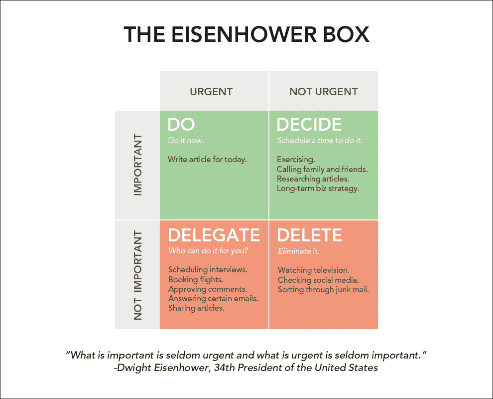
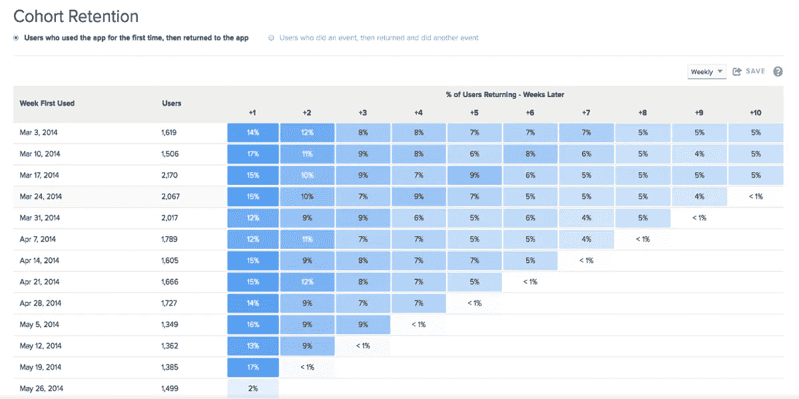
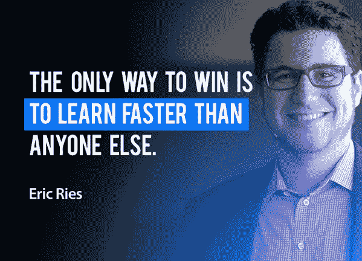

# 打造更好产品的 5 个周一习惯

> 原文：<https://medium.com/hackernoon/5-monday-habits-to-build-better-products-2672ddd81dc>

当构建数字产品时，有许多事情需要我们注意。如果你是产品经理或以某种方式领导产品开发，可能**你可能面临的最大问题之一**是似乎有源源不断的“紧急”事情需要你的关注。这很快就会导致你把其他重要的*的事情丢下不管。*

**

*我非常相信习惯的力量。因此，按照艾森豪威尔的建议，我每周一早上安排时间做这 5 件我想确定要做的事情:*

# *1.分析统计数据和 KPI*

*我想说这可能是一种日常习惯。我想我不需要强调它的重要性。套用德鲁克的话，**不度量，就不管理**。*

*即使你每天都在查看你的 KPI，在周一花一些额外的时间也有两个目的:*

*   *有特定的日期和时间用于*周与周*的比较*
*   ***探索行为**:也许你的日常评估的一部分包括你产品的主要 KPI。但是这不会给你任何关于行为的见解…是什么在驱动这些 KPI？(这实际上对产品决策更有用)。探索行为并获得这些见解是以行动开始美好一周的好方法。*

## *个人例子:*

*在从事一项电子商务工作时，我在一个周一的早上花了一些额外的时间探索与过滤器使用相关的“买家”群体的行为。虽然过滤器的使用率很低，但使用它们的人购买的可能性是普通人的两倍。这是一个很好的视角，可以探索让滤镜更加可见是否可以提高转化率。*

# *2.浏览您的产品*

*这听起来也是显而易见的，但令我惊讶的是，有多少产品人不这么做。*

*在我的情况下，这曾经是在随机的时间和做随机的任务。*

*当我把它作为一种习惯时，我创建了一个**小的核心用例集，我试图不断地查看它们**。*

*但是我注意到我也想最终浏览产品中不在那些核心任务中的部分。所以我创建了一个我最终想要回顾的任务的小*“待办事项”,并开始每周一挑选其中的一些，尝试体验用户做那项任务的体验(类似于我在可用性测试中要求用户做的事情)。**

## *个人例子:*

*前一段时间在一家社交游戏公司工作时，我确实每天用这个产品(玩游戏:D)5-10 分钟。*

*但是我很快注意到我没有足够频繁地经历入职经历。根据产品生命周期的不同阶段，我们每个月有 20%到 80%的新用户，所以在任何时候，这都是一个很大的数字。*

*这就是为什么我强迫自己每两周体验一次，因为这个习惯，我认识到新功能会对新用户的体验产生怎样的影响。*

# *3.检查竞争对手和相关产品*

*我相信任何从事数码产品工作的人都会检查其竞争对手。*

*但是和我自己的产品类似，在我养成这个习惯之前，我确实检查过竞争对手，但是是在**随机的时刻，带着随机的目的**。这当然导致了很多重要的内容没有被访问，或者重要的特性没有被检查。*

*现在我有了一个竞争对手的名单，我想确保我定期检查，并且我每周轮换我看到的人。*

*我还在列表中列出了一些伟大的非竞争对手公司，它们可能是灵感的来源。我最明显的例子是亚马逊。基于他们提供的良好体验，我该如何改进我的结账方式？*

*我有几个常规用例，但是我倾向于包括我在习惯#2 中使用的任务，以确保我不会总是检查相同的部分或特性。*

*在最后一个例子的基础上，我开始经常检查直接竞争对手的入职体验，以及现阶段已知很棒的相关产品。*

# *4.这周你想回答什么问题？*

*很可能在任何时候，你都会提出 ***假设和想法*** ，很可能很多人会提出更多的假设和想法，并说服你将它们添加到你的列表中。*

*周一早上是整理它们的好时机。就我而言，刚刚经历了 KPI 分析、产品审查和基准测试的其他习惯，**我有了新的见解，可以用来优先考虑**我需要尽快回答的问题。*

*无论你有一个“想法积压”，一个[机会-解决方案树](https://www.producttalk.org/2016/08/opportunity-solution-tree/)，或者一个你正在做的假设列表，我建议在周一早上选择一个来集中注意力，并提出一个你想围绕它回答的问题。*

## *个人例子:*

**

*回到我在社交游戏中的经历，我们有一个新游戏的 alpha 版本，在第一次会议中显示出高流失率。按照习惯#1，我们发现了一个模式:我们发现一旦人们达到“第五级”，他们的记忆力会更好。所以那一周我想回答的机会/假设/问题很简单: ***什么会让更多的人达到 5 级？****

*我将在下一个习惯中跟进这个例子。*

*请记住**要回答的问题可能与产品的许多方面**相关。这个例子是一个优化的例子。你可能会有面向研究的问题。我们解决的问题对吗？)或更多与价值主张相关的。有人想要这个功能吗？).有很多选择。关键是要捕捉到一些你想要的信息，以便做出产品决策。*

# *5.构思一个实验/客户联系*

*在本周选择了一个你想了解更多的假设或问题后，下一步是**想出一个答案**。*

*通常，这将变成:*

*   **实验*:一个假门或登陆页面来测试一个价值主张，一个门房解决方案，或者任何你可以快速运行来了解你计划建造的东西的可能结果的东西。*
*   **面试/可用性测试*:牢记这个特定的学习目标，在直接对话中面对客户以了解更多信息(无论是关于你现有的产品还是新想法的原型)。*

## *个人示例:*

*遵循习惯#4 的“第 5 级”例子，我们使用 UserTesting.com 快速雇佣了 5 个用户，4 个任务是让他们在早期玩游戏。*

***2 天后，我们有 5 个 1 小时的视频**展示了人们使用游戏的情况。*

*我们发现了两个机会:*

1.  *一个普通的可用性问题:教程的某个特定步骤不清楚，所以我们尝试改变文本来提供更清晰的内容*
2.  *第二个观点需要更多的背景:游戏有一个特殊的“能量机制”，随着时间的推移会耗尽，玩家必须等到充电后才能继续玩(或者付钱来获得更多的能量)。这是社交游戏的一个非常标准的机制，非常像 Candy Crash lives，提供了一个流行的例子。
    我们发现这种能量在达到 5 级之前就已经耗尽了。因此，我们建立的新假设是:“也许如果玩家可以在没有能量限制的情况下继续他们的游戏，直到 5 级，他们中的更多人会到达那里，提高整体记忆力”。*

*回到原来的目标 ***上，我们得到了更多关于那一周问题的信息，也为接下来的一周提供了一个非常明确的学习目标*** ，这样我们可以很容易地进行 A/B 测试。*

# *为什么是星期一？*

**

*对我来说，开始一周的这些重要活动感觉特别好。感觉就像**急了就杀不了重要的**。它也给你一个视角去关注什么，并明确本周的下一步行动:*如果你能每周做一次实验****，你肯定会比大多数公司做得更好🙂****

*你每周的习惯是什么？我应该在列表中添加什么？*

*我希望这能帮助人们制造更好的产品🙂*

**最初发表于*[*【leanexperimentation.com】*](http://leanexperimentation.com/5-monday-habits-to-build-better-products/)*。如果您喜欢它，并希望获得更多关于产品开发的工具&提示，您可以通过* [***订阅此处***](//my.leadpages.net/serve-leadbox/1440c1173f72a2:111de60b7f46dc) *加入数百名产品人。**