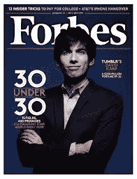

# 5 个新年决心

> 原文：<https://medium.com/hackernoon/5-new-years-resolutions-337426f4ea5d>

# 为了你的生意和我的生意

山姆·詹克斯

2017.它在纸上看起来和在我耳朵里听起来一样好。

日历在变，第一季度开始了，世界各地的企业都在盘算如何在 2017 年“粉碎它”。

如果没有新年决心，新的一年会是什么样子呢？起源于古罗马或巴比伦的古老传统；这场辩论仍悬而未决，相当不为人知。

关于这个传统，有一件事是肯定的，那就是全世界的人都会制定新年决心，然后打破新年决心。明天，迈克尔将再次开始吸烟，两周后，贾妮斯将在一袋雷的原味上崩溃，到 2017 年 12 月 31 日，我也将打破我的新年决心。

独自一人很难坚持真实。如果我们想在个人生活和工作中实现自己的目标，我们都需要他人的支持。

因此有了本周的帖子！

5 个新年决心:为了你我的生意。

**我们会检查我们的来源。**

脸书艰难地发现，在他们的网站上发布未被强烈引用的、可能是虚假的信息，通常不会以正面宣传而告终。

脸书仍在负面新闻中挣扎，并想方设法抹黑所有对他们的指控(【inc.com】)。

你的公司可能会发布博客、文章、白页和/或年度报告。无论您发布内容是为了吸引客户、获得曝光率还是为利益相关者报告结果；确保你的消息来源是可信的。

我们不会试图成为“酷公司”。

室内篮球场、水疗日，以及供员工和客户在你公司的“酷办公室”享受的 LoveSac 豆袋都是浮华和魅力，但投资回报率在哪里？

Source: Inspirationfeed

在 2017 年，提前预算购买玩具和小玩意可能不是最好的第一步，尤其是作为一家初创公司。“虽然创业的乐趣之一是建立一个让你自豪的办公室，但昂贵的装饰已经让许多企业在起步前就倒闭了”([smetoolkit.org 2016](http://www.smetoolkit.org/smetoolkit/en/content/en/100/Common-Startup-Mistakes))

把额外的一万美元投资在广告预算上，而不是乒乓球台。

**我们将停止对那些“愿意学习更多技术”的人的投资。**

抱歉，婴儿潮一代和 X 一代；不是你们所有人，而是你们中的一些人。技术和精通技术的个人正在主宰商业世界。

Source: Forbes

这是在海啸般的网络浪潮中突然而迅速地发生的。如果你不愿意或者不能够掌握当今的技术同化，那么很有可能你会失业或者寻找一份已经不存在的工作。

> “有一个很好的论点是，技术更青睐年轻人。首轮投资组合为这一论点提供了证据。平均年龄不到 25 岁(第一轮投资时)的创始团队的表现比平均投资高出近 30%。所有第一轮投资支持的创始人的平均年龄是 34.5 岁，而前十大投资的平均年龄是 31.9 岁。在技术领域，年轻的企业家似乎是成功的关键因素”([hbr.org 2016](https://hbr.org/2016/05/4-factors-that-predict-startup-success-and-one-that-doesnt))

**我们将追随芬兰人。**

尤其是芬兰及其首都赫尔辛基，已经成为创业和成功的中心。

Source: visithelsinki

这座首都城市见证了以广博知识著称的高科技企业的激增。这种规模的创新之所以成为可能，很大程度上是由于赫尔辛基居民的教育水平。“这座城市[……]拥有教育程度最高的劳动力之一”(赫尔辛基商业中心，2016 年；NewCo 赫尔辛基 2016)。这类统计数据进一步证明了这个概念；创新源于教育。[人群中有 Kiosked、Enevo 和 Smarp](http://www.geektime.com/2015/02/26/20-finnish-startups-you-should-know-about-check-out-suomis-best/) 等公司。如果你不知道他们，你可能很快就会知道了。

更多关于创业成功、生态系统和规划的信息，请阅读来自 Haaga-Helia 应用科技大学的 Addou Babet 在“[赫尔辛基创业城市指南](http://www.theseus.fi/bitstream/handle/10024/113530/Babet_Addou.pdf?sequence=1)”中撰写的研究。

我们将不再试图独自完成这一切。

承认失败。

创始人、企业家、投资者和高管最糟糕的噩梦都源于经历这种情绪低落。底线是，有时外包给顾问，使用广告代理或整合 SaaS 解决方案是最好的选择。

没有他们的一点点帮助，我们不可能成为最好的自己。

最好放在一个 [Kodiak 社区](http://www.kodiakrating.com)的帖子里，标出 4 个供应链趋势:现在和以后，

> 接受你的公司需要外部应用程序的帮助并不是承认失败。相反，伙伴关系和服务关系创造了一个充满活力的商业实践生态系统，我们都必须谦虚地接受[…]( [Jenks 2016](/@KODIAKRating/4-trends-in-the-supply-chain-now-and-hereafter-bf6010c8a147#.pe9kthwyp) )。

直到下周。

> [黑客中午](http://bit.ly/Hackernoon)是黑客如何开始他们的下午。我们是 [@AMI](http://bit.ly/atAMIatAMI) 家庭的一员。我们现在[接受投稿](http://bit.ly/hackernoonsubmission)并乐意[讨论广告&赞助](mailto:partners@amipublications.com)机会。
> 
> 如果你喜欢这个故事，我们推荐你阅读我们的[最新科技故事](http://bit.ly/hackernoonlatestt)和[趋势科技故事](https://hackernoon.com/trending)。直到下一次，不要把世界的现实想当然！

