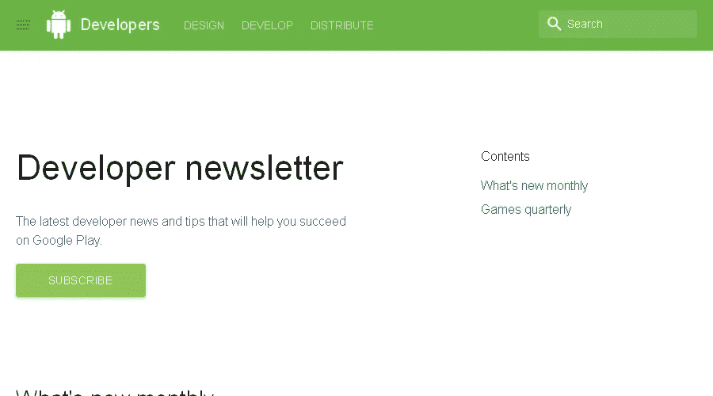
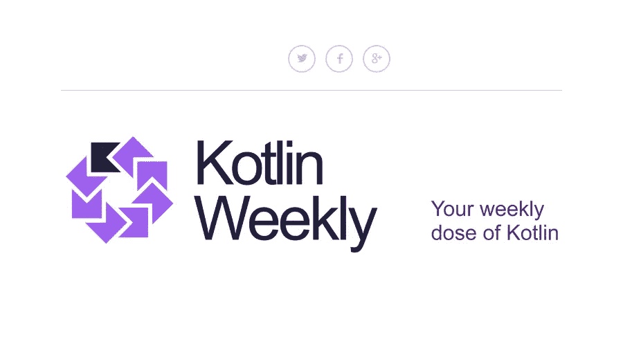
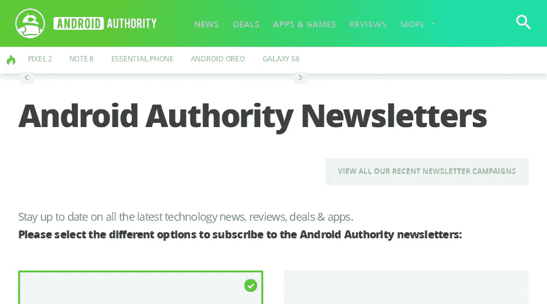

# 每个 Android 开发者都应该订阅的 5 份时事通讯

> 原文：<https://medium.com/hackernoon/5-newsletters-every-android-dev-should-subscribe-to-4f7057de8c6c>

# [#AndroidDev 文摘](https://storage.googleapis.com/hotlinks-f6004.appspot.com/add.png)

#AndroidDev Digest 是一份每周时事通讯，介绍 Android 世界中所有有趣的事情。关于新技术、最佳实践和教程以及新库、工作和最新新闻的有见地的 dev 文章。

# [安卓周刊](http://inboxreads.co/n/Android-Weekly)

Android Weekly 收集了最好的文章、教程、工作、图书馆、视频、播客…基本上所有与 Android 开发相关的东西你都能在这里找到。

# [Google Play 开发者简讯](http://inboxreads.co/n/Google-Play-Developer-Newsletter)

这份月度时事通讯直接来自 Google，通常包含让您的应用在 Google Play 上获得成功的技巧以及新的 Android dev 相关发布和公告。

# [科特林周刊](http://inboxreads.co/n/Kotlin-Weekly)

Kotlin 似乎是 Android 开发的未来。有了 Android Studio 的一流支持和将现有 Java 代码转换为 Kotlin 的简单选项，很明显大量的 Android 开发将在未来朝着这个方向发展。这份时事通讯是了解教程、新闻和所有与 Kotlin 相关的主要发展的好方法。

# [安卓权威](http://inboxreads.co/n/Android-Authority-Weekly)

当然，作为一名 Android 开发者，你需要了解所有与 Android 相关的新闻和设备。Android Authority 提供了各种简讯，你可以订阅并获得你感兴趣的内容。

## 想要更多吗？

你可以在 InboxReads.co[网站](http://inboxreads.co/tags/android)找到更多优秀的 Android 开发简讯，以及你感兴趣的其他主题的简讯。